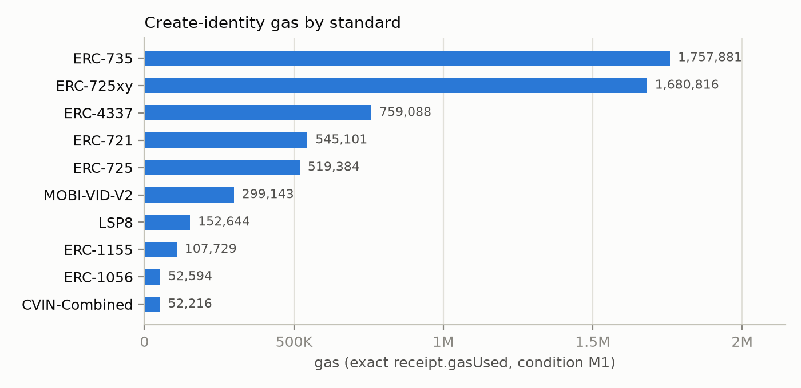
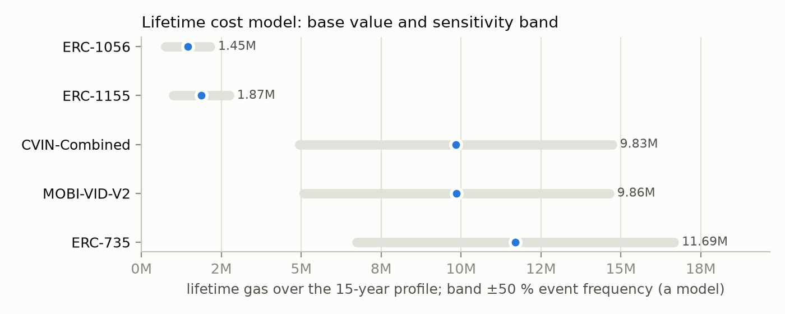
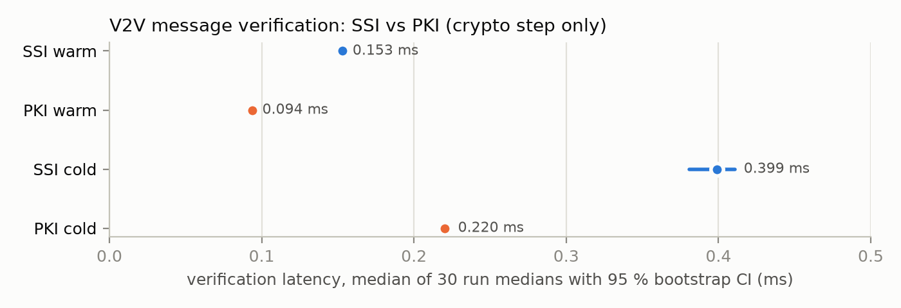
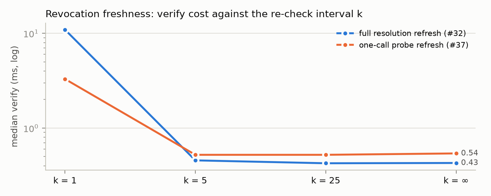
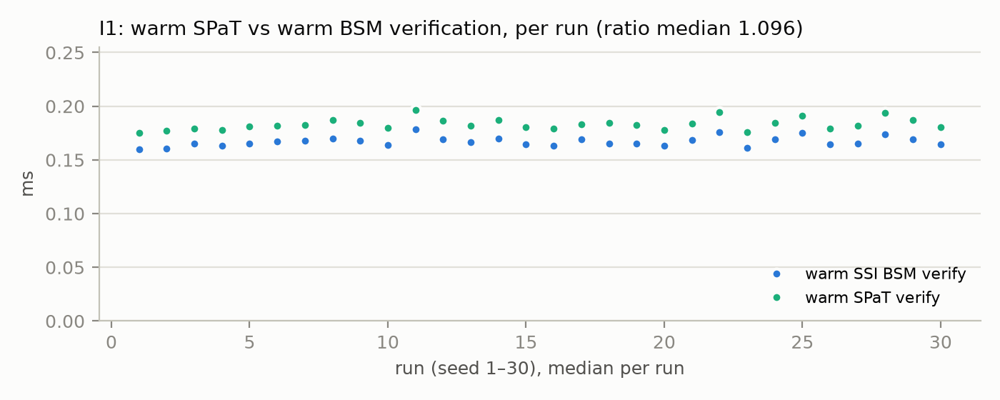
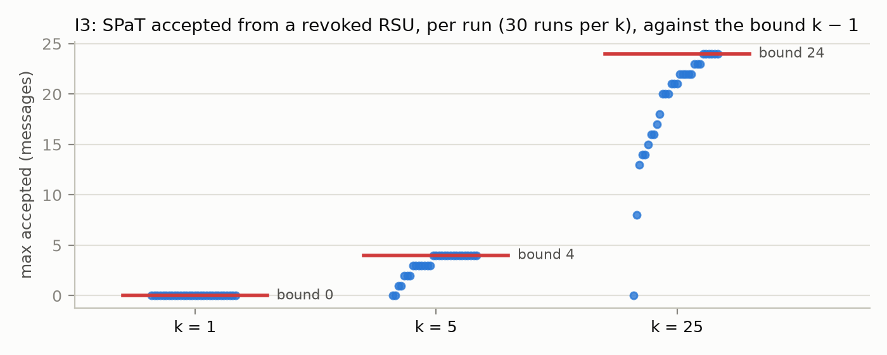
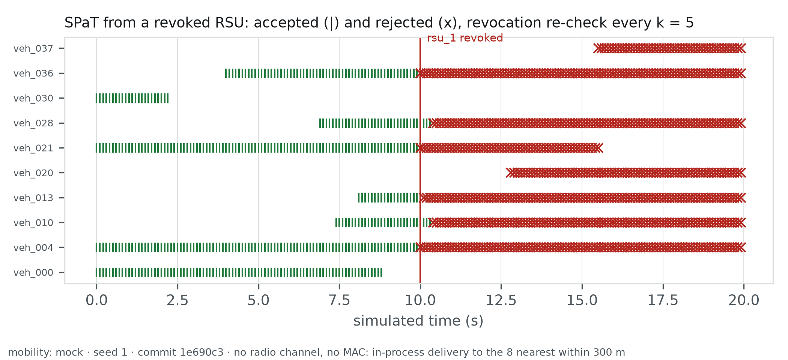
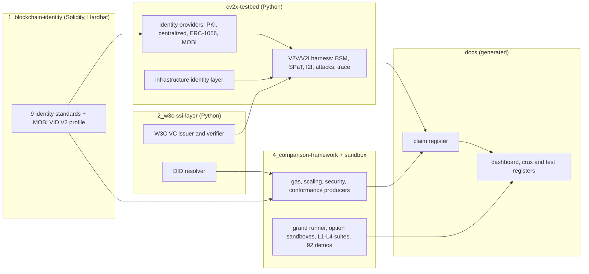
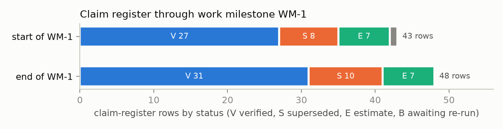
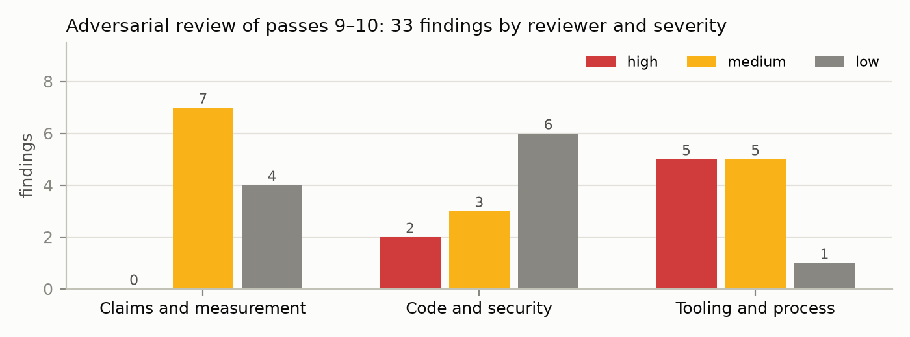

# Self-Sovereign Identity for Connected Vehicles — Results, Work and Implementation

**Presentation report, draft 1.** Author: Nikhil Prakash (MASc, UBC ECE). Generated from committed data at snapshot commit `601e1de` by `docs/presentation/make_presentation.py`; every result below is read from the results of record and carries its claim-register row (`docs/MEASUREMENT_CONDITIONS.md`). What draft 2 adds is in `docs/presentation/EXPANSION_PLAN_DRAFT2.md`.

> Scope of every number: smart-contract gas is exact `receipt.gasUsed` on a local Hardhat chain (condition M1); latency is in-process cryptography with simulated mobility and no radio (condition M0). Nothing here was measured on a public network or a real road.

## 1. At a glance

| Question | Answer (measured) | Register |
|---|---|---|
| How many identity standards were implemented and measured? | 10 (nine base standards and the MOBI VID V2 profile) | #25 |
| How far apart is the cost of creating an identity? | 33.7× (CVIN-Combined 52,216 gas to ERC-735 1,757,881) | #25 |
| Does identity verification fit a V2V message budget? | SSI warm verify 0.153 ms [0.151, 0.154], N = 30 runs; budget 100 ms | #27 |
| Do the identities meet W3C DID / VC? | internal checker 94.3 % (41 pass, 1 partial, 2 fail of 44); external DID suite 335/336 | #4, #24 |
| Are the identity contracts attack-resistant? | 43 of 43 applicable attack cells defended (11 not applicable), strict harness | #28 |
| Can infrastructure (RSUs, controllers) use the same identity layer? | I1 PASS (SPaT/BSM warm ratio 1.096), I2 PASS (13 attacks), I3 PASS (revocation within k − 1 messages) | #44–#46 |
| How large is the test and evidence base? | 536 Hardhat tests, 291 Python-layer tests, 92 feature demos (1,752 steps); 30 verified register rows | grand report |

## 2. Research questions and hypotheses

| Hypothesis | Statement | Verdict | Evidence |
|---|---|---|---|
| H1 | minimal-state identity standards are cheaper to create than heavyweight account standards | Supported | §3.1, #6, #25 |
| H2 | a blockchain identity layer can reach ≥90 % W3C compliance | Supported | §3.5, #4, #24 |
| H3 | off-chain credential verification fits the V2V latency budget | Supported (verification-step scope) | §3.6, #27 |
| H4 | MOBI VID is realisable across blockchain backends | Supported (fidelity gradient) | §3.3 |
| H5 | the hybrid sits on the cost/capability frontier | Supported | §3.9, #26, #36 |
*Verdicts as stated in chapter 5 §5.7 (`docs/thesis/chapter5-results/README.md`); statements from the snapshot.*

| Crux | State | V evidence rows | Open gaps |
|---|---|---|---|
| C1 CAV identity substrate | partial | 7 | 2 |
| C2 Secure V2V messaging | partial | 4 | 2 |
| C3 Infrastructure messaging (V2I and infrastructure-to-infrastructure) | partial | 5 | 5 |
| C4 Revocation freshness | partial | 2 | 2 |
| C5 W3C conformance | partial | 2 | 2 |
| C6 MOBI VID lifecycle | partial | 2 | 1 |
| C7 Privacy and linkability | partial | 1 | 1 |
| C8 Veracity versus automation asymmetry | partial | 3 | 1 |
*The eight cruxes the thesis must answer (`docs/thesis/CRUX_REGISTER.md`): none is a gap, none is fully evidenced.*

## 3. Results

### 3.1 Gas: what each standard costs (register #25)

| Standard | deploy | create | update | update via 4337 | delegate / claim | revoke | transfer |
|---|---|---|---|---|---|---|---|
| ERC-1056 | 958,726 | 52,594 | 35,494 | — | 54,831 | 35,046 | 51,754 |
| ERC-721 | 2,787,288 | 545,101 | 119,737 | — | 48,302 | 27,677 | 174,670 |
| ERC-725 | — | 519,384 | 137,096 | — | 119,996 | 43,388 | 28,390 |
| ERC-725xy | — | 1,680,816 | 49,937 | — | — | — | 28,834 |
| ERC-735 | — | 1,757,881 | 83,341 | — | 298,358 | 72,195 | 28,812 |
| ERC-1155 | 2,871,435 | 107,729 | 51,199 | — | 80,131 | 33,049 | 86,298 |
| ERC-4337 | 456,294 | 759,088 | 49,343 | 96,173 | 47,557 | 25,429 | 28,539 |
| LSP8 | 1,670,271 | 152,644 | 55,133 | — | — | 42,116 | 80,568 |
| MOBI-VID-V2 | 4,225,285 | 299,143 | 307,210 | — | 35,321 | 75,382 | 200,089 |
| CVIN-Combined | 1,531,487 | 52,216 | 35,116 | — | 291,977 | 73,248 | 51,747 |
*Exact gas, condition M1 (`4_comparison-framework/results/gas_benchmark.json`). — = operation not offered by the standard.*

*Figure 1. Create-identity gas, sorted. CVIN-Combined is cheapest, ERC-735 heaviest: a 33.7× spread.*

### 3.2 Lifetime cost (register #26)

| Standard | Lifetime gas (base) | Low | High |
|---|---|---|---|
| ERC-1056 | 1,450,146 | 751,370 | 2,148,922 |
| ERC-1155 | 1,865,183 | 986,456 | 2,743,910 |
| CVIN-Combined | 9,831,477 | 4,941,847 | 14,721,108 |
| MOBI-VID-V2 | 9,856,260 | 5,077,702 | 14,634,819 |
| ERC-735 | 11,692,092 | 6,724,987 | 16,659,198 |
*A model over an assumed 15-year event profile, not a measurement; band ±50 % event frequency.*

*Figure 2. Lifetime cost ranking with its sensitivity band.*

### 3.3 MOBI VID across backends (H4)

| Backend | Birth attestation gas | Lifecycle event gas | Third-party attestation gas (native?) | Fidelity |
|---|---|---|---|---|
| ERC-1056 | 51,944 | 34,928 | 61,501 (emulated) | 3/5 |
| ERC-735 | 295,242 | 295,277 | 295,289 (native) | 5/5 |
| ERC-1155 | 107,729 | 80,131 | 63,031 (emulated) | 3/5 |
| CVIN-Combined | 51,766 | 34,690 | 336,896 (native) | 5/5 |
| MOBI-VID-V2 | 299,143 | 307,210 | 192,749 (native) | 5/5 |
*`4_comparison-framework/results/mobi_vid_backends.json`.*

### 3.4 Security (register #28)

| Standard | Defended | Not applicable |
|---|---|---|
| ERC-1056 | 5 | 1 |
| ERC-721 | 5 | 1 |
| ERC-725 | 4 | 2 |
| ERC-735 | 5 | 1 |
| ERC-1155 | 5 | 1 |
| ERC-4337 | 5 | 1 |
| LSP8 | 4 | 2 |
| MOBI-VID-V2 | 5 | 1 |
| CVIN-Combined | 5 | 1 |
*Strict harness: an attack counts as defended only when the revert matches the documented reason. Total 43 defended, 11 not applicable.*

### 3.5 W3C conformance (registers #4, #24)

| Instrument | Result |
|---|---|
| Internal executable checker | 94.3 % over 44 executed checks (41 pass, 1 partial, 2 fail) |
| External W3C DID test suite, fixture DID | 335/336 |
| External W3C DID test suite, registry-minted DID | 335/336 |
|   suite: did-consumption | 3/3 |
|   suite: did-core-properties | 88/88 |
|   suite: did-identifier | 3/3 |
|   suite: did-production | 48/48 |
|   suite: did-resolution | 193/194 |

### 3.6 V2V message verification (register #27)

| Path | Sign (ms) | Cold verify (ms) | Warm verify (ms) |
|---|---|---|---|
| SSI (blockchain credential) | 0.224 [0.221, 0.227] | 0.399 [0.381, 0.411] | 0.153 [0.151, 0.154] |
| PKI (IEEE 1609.2-style) | 0.078 [0.075, 0.078] | 0.220 [0.218, 0.223] | 0.094 [0.093, 0.095] |
*Median of 30 seeded-run medians, 95 % bootstrap CI; 50 vehicles; 1,650,318 verifications; 150 failures, all injected attacks. Condition: M0, simulated mobility, real cryptography.*

*Figure 3. Verification latency with confidence intervals. The CIs do not overlap, so the SSI–PKI difference is resolved; both are far inside the budget.*

### 3.7 Revocation freshness (registers #32, #37)

| k | Full refresh median (ms) | Full refresh p95 | Probe refresh median (ms) | Probe refresh p95 |
|---|---|---|---|---|
| 1 | 10.946 | 16.153 | 3.298 | 5.769 |
| 5 | 0.456 | 10.479 | 0.522 | 3.875 |
| 25 | 0.425 | 0.764 | 0.522 | 1.260 |
| ∞ | 0.428 | 0.631 | 0.540 | 0.975 |
*A cached verifier re-checks the chain every k-th message; k trades revocation staleness (k − 1 messages) for latency. Two runs on one host type; host-dependence is an open item (crux C4).*

*Figure 4. Verify cost falls steeply from k = 1 to k = 5; the one-call probe cuts the k = 1 cost.*

### 3.8 Pre-registered comparisons reported as they fell (registers #33, #38)

| Experiment | Pre-registered claim | Verdict | Measured |
|---|---|---|---|
| M4 lifecycle parity: birth | centralized >= 10x faster (median) | PASS | ratio 4,862.289 |
| M4 lifecycle parity: lifecycle_event | centralized >= 10x faster (median) | PASS | ratio 1,636.209 |
| M4 lifecycle parity: ownership_transfer | centralized >= 10x faster (median) | PASS | ratio 6,044.237 |
| M4 lifecycle parity: history_query_cached | equal once cached (median ratio in [0.5, 2.0]) | FAIL | ratio 0.041 |
| M4 lifecycle parity: history_query | reported, no pre-registered verdict | (outside band) | ratio 434.831 |
| M4 lifecycle parity: history_query_cached_validated | reported, no pre-registered verdict | (outside band) | ratio 58.636 |
| M4 lifecycle parity: history_query_cached vs centralized unserialised (post-hoc diagnostic) | post-hoc diagnostic, no verdict | (outside band) | ratio 16.670 |
| M5 pseudonym pool: gas | ≈ 1,444,380 gas per epoch (±10 %) | FAIL | 1,113,456, 1,096,368, 1,096,368 |
| M5 pseudonym pool: linkability | delegate pool fully linkable from chain data | PASS | linkable |
*Failed and out-of-band verdicts are shown, not hidden.*

### 3.9 Cost/capability frontier (metrics harness, registers #34–#36)

| Criteria set | Options on the frontier |
|---|---|
| cost | erc1056, erc1056w |
| costRead | erc1056, erc1056w, erc1155, erc725xy |
| all | erc1056, erc1056w, erc721, erc1155, erc725xy, erc4337 |
*Run of record `2026-10-09T02-09-36Z_7a9a996`; criteria: Lifetime gas, Zero→nonzero SSTOREs, R3 RPC calls at h=50, R3 median ms after lifecycle, Core ops supported, O(1) on-chain credential check (view).*

### 3.10 Infrastructure messaging, V2I and I2I (registers #44–#48)

Roadside units (RSUs), signal controllers and a traffic-management centre (TMC) are `did:ethr` identities holding road-authority credentials. RSUs sign SPaT (signal phase and timing) messages; controllers and the TMC sign infrastructure-to-infrastructure messages. The five experiments were pre-registered before any code; the verifier was hardened after an adversarial review and every experiment re-run (amendment A4).

| Exp. | Question | Result | Verdict |
|---|---|---|---|
| I1 | Does a warm SPaT verify cost what a warm BSM verify does? | ratio 1.096 [1.091, 1.101]; SPaT 0.182 ms vs BSM 0.166 ms | PASS |
| I2 | Are registered attacks rejected for the right reason? | 13 checks, 30/30 runs | PASS |
| I3 | How long is a revoked RSU trusted by a cached verifier? | k=1: 0 (≤ 0) · k=5: 4 (≤ 4) · k=25: 24 (≤ 24) · k=inf: 100 messages | PASS |
| I4 | What does an RSU identity cost on chain? | key anchor 52,558–52,606 gas; hand to authority 51,742–51,754 | reported |
| I5 | What do the I2I operations add? | 0.886 ms, a sum of operation costs (not a path latency) | reported |

| I2 check | Expected rejection reason |
|---|---|
| i2a_unsigned_spat | unsigned |
| i2b_wrong_key_spat | wrong_key |
| i2c_map_only_rsu_spat | not_permitted |
| i2d_vehicle_signed_spat | credential_invalid |
| i2e_untrusted_authority_rsu | credential_invalid |
| i2f_stale_spat | stale |
| i2g_forged_controller_update | wrong_key |
| i2h_cross_intersection_spat | binding |
| i2i_replayed_spat | replay |
| i2j_future_spat | future |
| i2b_w_wrong_key_spat_warm | wrong_key |
| i2c_w_not_permitted_warm | not_permitted |
| i2f_w_stale_spat_warm | stale |

*Figure 5. I1 per run: the hardened SPaT path sits about 10 % above the BSM path in every run.*

*Figure 6. I3: per-run maxima never exceed the pre-registered bound k − 1; it is reached in the worst runs.*

*Figure 7. One run (seed 1, k = 5) from the trace of record: SPaT from the revoked RSU accepted (|) and rejected (x) per vehicle.*

## 4. Implementation

*Figure 8. How the layers depend on each other and where the results of record come from.*

| Layer | What it contains | How it is tested |
|---|---|---|
| Contracts | ERC-1056, ERC-721, ERC-725, ERC-725xy, ERC-735, ERC-1155, ERC-4337, LSP8, CVIN-Combined; MOBI VID V2 profile | 536 Hardhat tests (L1 mechanisms, L2 system, security harness) |
| W3C SSI layer | VC issuance and verification, DID resolution, MOBI VID I/II | Python layers (291 tests: L3, L4 and the SSI-layer suites); external DID suite 335/336 |
| V2X testbed | identity providers, message-path harness, infrastructure layer, trace and renderers | seeded 30-run statistics; no-change gates; 31 infrastructure tests |
| Comparison and sandbox | producers of the results of record; per-option sandboxes with adapters and demos | grand runner; 92 demos, 1,752 steps |
| Documents | claim register, defect log, crux register, test register, dashboard, stale-figure check | regenerated and compared in CI |

## 5. The work: work milestone WM-1

| Measure | Value | Source |
|---|---|---|
| Passes / commits | 8–11 / 27 (`db6c381..291bbca`) | git log db6c381..291bbca |
| Files changed | 175 | git diff --shortstat db6c381 291bbca |
| Plan items: done / changed / partial / deferred / not done | 15 / 3 / 4 / 1 / 2 | docs/PLAN_2026-10-09.md §5 |
| Python-layer tests, start → end | 260 → 291 | docs/milestones/WM-1_REPORT.md §0; sandbox/grand/report/GRAND_REPORT.md |
| Infrastructure tests; layer mutants killed | 16 → 31; 13/17 → 26/26 | docs/AFTER_ACTION_REPORT_11.md §3, §4 |
| Result files fully stamped | 11/25 → 20/29 | docs/AFTER_ACTION_REPORT_09.md; docs/testing/STAMP_INVENTORY.md |
| Superseded figures found by the generators | 82 in 12 documents; 5 self-contradicting register rows | docs/AFTER_ACTION_REPORT_09.md §2 |
| Review findings: confirmed / accepted / rejected | 32 / 1 / 0 | docs/AFTER_ACTION_REPORT_11.md §4; docs/milestones/WM-1_REPORT.md §5.2 |

*Figure 9. The claim register over WM-1: five new verified rows (infrastructure), one row re-run from B to V, two rows superseded.*

*Figure 10. What the adversarial review found, by reviewer and severity. Two high findings were security holes in the first infrastructure verifier; five were guards that could pass while wrong.*

| Severity | Fixed | Partly fixed | Open |
|---|---|---|---|
| High | 15 | 1 | 0 |
| Medium | 10 | 4 | 11 |
| Low | 5 | 0 | 5 |
*Defect log D1–D36 by severity and status (`docs/DEFECT_LOG.md`). Open items wait for author decisions (§C).*

## 6. Rigour: how the numbers are kept honest

| Mechanism | What it guarantees | Shown to fail on a broken input? |
|---|---|---|
| Claim register with status letters | a number enters a chapter only with a V row | — |
| Pre-registration with dated amendments | verdict rules fixed before the run; departures visible | — |
| Generated dashboard, crux and test registers (`--check`) | no hand-typed number in those documents | page check: yes (tampering test) |
| Stale-figure checker (87 files) | no superseded figure cited as current | yes (formatting variants, range arrows) |
| Run-identity probe | the clean-code flag fires on producing code and ignores results | yes (fails on the pre-fix code) |
| Mutation testing of the infrastructure verifier | each check is needed by a test | 26 of 26 mutants killed |
| Adversarial review on a different model | findings outside the author's blind spots | 33 findings, none rejected |

## 7. Limitations

| Limitation | Effect | Where recorded |
|---|---|---|
| Simulated mobility; no radio, MAC or network stack | latency is the cryptographic step only | §3.6, SC-22 |
| Local Hardhat chain only | gas is exact but no public-network witness | N-11 (Sepolia) |
| One host type for latency | absolute values not portable; ratios within runs are | guide rule 1.1.7 |
| In-process revocation registry | I3 bounds messages, not time; no propagation delay | #46 |
| Gas of random inputs varies by ±12 | I4 reported as ranges | #47, N-18 |
| Reviewers steered by the orchestrator | independence is partial | N-22 |

## 8. What comes next

Work milestone WM-2 (`docs/PLAN_WM-2.md`): a results pipeline of record (stamped producers, promote step, machine-readable claims), deterministic gas or ranges by rule, the review-2 carried fixes (chain-reading resolver, restricted `attestEvent`, freshness re-runs on one host), chapter checks, and draft 2 of this report.

## Appendix: sources and regeneration

| Data | File |
|---|---|
| Snapshot of all results | `docs/figures/dashboard_snapshot.json` |
| Infrastructure per-run data | `cv2x-testbed/sumo/results/infrastructure_stats.json`, `infrastructure_revocation.json` |
| Process counts | `docs/presentation/data/process_metrics.yaml` |
| Claim register | `docs/MEASUREMENT_CONDITIONS.md` |

Regenerate: `python3 docs/figures/make_dashboard_data.py && python3 docs/presentation/make_presentation.py`.
