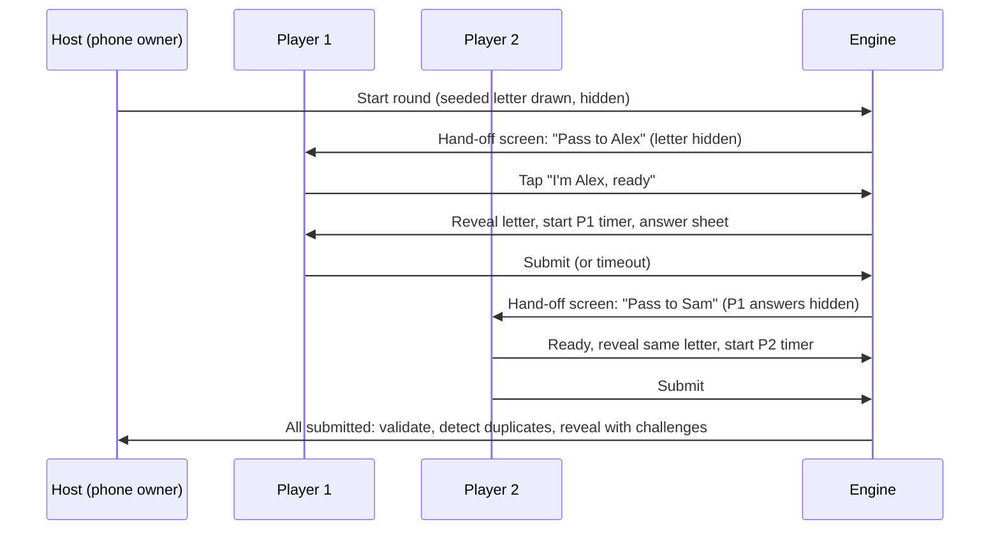

# Inkwell: Game Design Specification (NPAT and Word Chain)

**Document status:** Draft v0.1, 2026-10-04, owner persona: **[GAME — Game Designer, "Kenji Watanabe"]**. Heavy contributions from **[DATA]** and **[ARCH]**; comments from JOBS, DESIGN, IOS, QA, KIDS.

**Read this if...** you are implementing the game engine, the dictionary, the validation pipeline, the multiplayer turn structure or any screen that shows a rule, a timer, a score or a dispute. This is the formal rules document. Where the product brief says "two games done perfectly", this document says exactly what "the game" is, down to what happens when someone types "The Hague" for a Place starting with H, and whether a word ending in X ends a Word Chain game.

## Table of contents

1. Design pillars
2. NPAT: formal rules
3. Word Chain: formal rules
4. Modes and turn structures
5. Scoring tables
6. Letter selection algorithm
7. Timer and length presets
8. House-rules matrix
9. Answer validation pipeline
10. Duplicate detection rules
11. Word Chain specifics (categories, edge letters, lives, bots)
12. Anti-cheese and fairness
13. Feedback loops and juice moments
14. Tutorial design
15. Edge cases (35)
16. Team debate: dictionary auto-judge vs. player vote
17. Decisions and open questions

---

## 1. Design pillars

1. **The paper game is the spec.** When in doubt, do what a sensible group of friends would do at a kitchen table. The app is a referee and a scorekeeper with excellent handwriting, not a new game.
2. **Fair before fast.** Letter draws are weighted, duplicates are detected consistently, and disputes have a path. Speed is the second priority and it is a close second.
3. **Every rule is a toggle, every default is opinionated.** House rules are first-class in the engine, but the default game needs zero configuration.
4. **The engine is deterministic.** Given the same seed and the same inputs, every device computes the same letter, the same validation and the same score. This is what makes nearby and online play possible without a server deciding anything.
5. **Validation is a conversation, not a verdict.** The dictionary is confident where it can be and humble where it cannot. Humans always get the last word.

> **[ARCH]** Pillar 4 is the architectural contract. The GameEngine package is a pure state machine: `State + Event -> State + [Effect]`, seeded random, no clocks inside. Timers, network and UI are effects handled outside. Every rule in this document must be expressible as an event or a reducer branch.

> **[JOBS]** Pillar 3 is the one I will fight about in every design review. Toggles exist. They are not on the first screen, the second screen or the third.

## 2. NPAT: formal rules

### 2.1 Components

- A **category set**: ordered list of 3 to 8 categories. Default (Classic): Name, Place, Animal, Thing.
- A **letter pool**: the 26 Latin letters, minus any excluded letters (default exclusion: none in Classic; see Section 6).
- A **round**: one letter, one timer, one answer sheet per player.
- A **game**: an agreed number of rounds (default 5) or a target score.

### 2.2 Round procedure

1. The engine draws a letter from the pool (Section 6). The letter is revealed to all players simultaneously (in pass-and-play, revealed to each player at the start of their turn, same letter).
2. The timer starts (default 60 s). Each player fills one answer per category. Answers must begin with the drawn letter after normalization (Section 9.1).
3. The round ends when the timer expires, or when every player has submitted, or (house rule "Stop!") when the first player submits and the grace period (default 5 s) elapses.
4. Answers are validated (Section 9), duplicates are detected across players (Section 10), and scores are computed (Section 5).
5. The scoring reveal is shown. Disputed answers can be challenged during the reveal window (default 20 s, or until all players tap "Done").
6. The round is committed to the game ledger. The letter is removed from the pool for the rest of the game (no-repeat rule, default on).

### 2.3 Game end

- After N rounds (default 5; presets in Section 7), the player with the highest total wins. Ties are shared unless house rule "Tiebreak round" is on, which plays one extra round among tied players only.
- In solo mode, the "game" is a fixed set of rounds against the clock, scored as a personal best per preset and per category set.

### 2.4 Validity of an answer (summary; detail in Section 9)

An answer is **valid** if, after normalization, it (a) is non-empty, (b) begins with the round letter, (c) is accepted for the category by the validation pipeline (dictionary accept, player accept, or unchallenged by other players when the dictionary is unsure), and (d) is not disqualified by a house rule (e.g., minimum length).

An answer is **invalid** if it fails (a) or (b), is rejected by the dictionary with high confidence and not overturned by a vote, or is rejected by a successful challenge.

## 3. Word Chain: formal rules

### 3.1 Components

- A **category**: one list (Countries, Cities, Animals, Foods, Movies, etc.). Default: Animals.
- A **chain**: ordered sequence of accepted words. The first word starts with a drawn letter (or is a free start; house rule).
- **Players**: 1 to 8 humans, plus 0 or 1 bot in solo.

### 3.2 Turn procedure

1. The active player must submit a word that (a) begins with the **link letter** (the last letter of the previous accepted word, after normalization and edge-letter rules in Section 11.2), (b) is valid for the category, and (c) has not appeared earlier in the chain (duplicate rules, Section 10).
2. If a per-turn timer is on, the player must submit before it expires.
3. A failed turn (timeout, invalid, duplicate, or "pass") costs the player a life (Lives mode) or eliminates them (Elimination mode), or scores zero for that turn (Points mode). The link letter does not change after a failed turn; the next player must answer the same letter.
4. On a successful turn, the chain grows, the link letter updates, and play passes to the next player (clockwise order fixed at game start; in solo, to the bot).

### 3.3 Game end

- **Elimination:** last player standing wins. Solo: game ends when the human is eliminated; score is chain length contributed.
- **Lives:** each player starts with L lives (default 3); last player with lives wins.
- **Points:** fixed number of turns per player (default 10); points per word per Section 5.2; highest total wins.
- **Solo vs. bot:** the human plays against a bot of a chosen difficulty tier (Section 11.4). The human's score is the number of successful turns before losing all lives. The bot does not "win"; it is the clock with a face.

## 4. Modes and turn structures

| Mode | Players | Devices | Network | Who computes? | v1? |
|---|---|---|---|---|---|
| Solo vs. clock (NPAT) | 1 | 1 | None | Local engine | Yes |
| Solo vs. bot (Word Chain) | 1 + bot | 1 | None | Local engine | Yes |
| Pass-and-play | 2 to 8 | 1 | None | Local engine | Yes |
| Nearby | 2 to 8 | 2 to 8 | Local wireless (MultipeerConnectivity; peer-to-peer Wi-Fi and Bluetooth, no router needed) | Host device engine is authoritative; peers run the same engine for prediction | Yes (Pro) |
| Online async | 2 to 6 | 2 to 6 | Game Center turn-based | Each device runs the engine over the shared match data; deterministic, so results agree | Yes (Pro), see delivery plan debate |
| Online real-time | 2 to 8 | 2 to 8 | Game Center real-time or custom backend | Host-authoritative or server-authoritative | Deferred |

Docs: MultipeerConnectivity official root https://developer.apple.com/documentation/multipeerconnectivity ; Game Center turn-based https://developer.apple.com/documentation/gamekit/starting-turn-based-matches-and-passing-turns-between-players

### 4.1 Solo vs. clock (NPAT)

```
[Draw letter] -> [60 s round] -> [Auto-validate] -> [Score reveal] -> [Next round | End]
                                      |
                              (unsure answers are
                               marked "?" and
                               self-adjudicated:
                               "Count it" / "Nope")
```

Solo validation has no opponent to challenge, so unsure answers are self-judged. We record self-judged answers separately so personal bests show "clean" vs. "self-judged" totals.

> **[GAME]** Honesty in solo is the player's business. We just make the honest path the pretty one: a clean round gets a gold-ink stamp, a self-judged round gets a plain one.

### 4.2 Pass-and-play (one device)



Rules specific to pass-and-play:
- The letter is the same for all players in a round, revealed only when each player taps ready, so the first player cannot think during others' turns beyond what they would at a table. House rule "Simultaneous paper" instead reveals the letter to everyone at once and every player uses their own paper, with the phone only as timer and scorer (the "paper companion" mode from the product brief).
- Previous players' answers are never visible on the hand-off screen.
- A player may be skipped (left the room) by a long-press on the hand-off screen; their round scores zero.

### 4.3 Nearby (MultipeerConnectivity)

```mermaid
stateDiagram-v2
    [*] --> Lobby: Host taps "Nearby"
    Lobby --> Lobby: Peers discovered, join by tap, host accepts
    Lobby --> RoundStart: Host taps Start (seed broadcast)
    RoundStart --> Answering: All devices draw same letter from seed
    Answering --> Collecting: Timer ends locally; each device sends sealed answers
    Collecting --> Reveal: Host receives all (or grace timeout), broadcasts combined sheet
    Reveal --> Challenge: Any device raises a challenge
    Challenge --> Reveal: Votes resolved by host
    Reveal --> RoundStart: Host taps Next
    Reveal --> [*]: Game over
```



- The host is authoritative for ordering and for the timer's end. Each device shows its own countdown driven by the shared start timestamp with a small tolerance; the host's "round over" message is final.
- Answers are sent as a sealed blob at submit time; the host reveals all at once so nobody sees others' answers early.
- If the host disconnects, the game pauses for 30 s with a "Waiting for host" sheet; after that the lobby offers "Continue on this phone as pass-and-play" with the scores preserved.

> **[ARCH]** Deterministic engine plus host-ordered events is the whole design. We do not need consensus; we need one ordering. Peers can render locally and reconcile on the host's broadcast. The engine replays cleanly from the event log because there are no clocks inside it.

> **[IOS]** MultipeerConnectivity is a mature framework, and it is also notoriously flaky in crowded RF environments and when the app backgrounds. We budget a spike (see delivery plan) and we design every nearby screen to degrade to "continue as pass-and-play" without losing a point.

### 4.4 Online async (Game Center turn-based)

NPAT is not naturally turn-based (everyone answers at once), so we model a round as a set of parallel "turns" within a match:

```
Round r:  creator draws letter (seeded from match id + r) and plays their sheet
          -> match data appended: {round r, letter, player A sealed answers}
          -> each other participant is notified; plays the same letter against their own 60 s timer
          -> when all have submitted (or 48 h deadline), the engine on any device reveals and scores
          -> challenge window: 24 h; votes recorded in match data; majority rules (Section 9.5)
          -> next round
```

Word Chain is naturally turn-based and maps directly: one GKTurnBasedMatch turn per chain word, with a configurable turn deadline (default 24 h; "blitz async" 1 h).

- Deadlines are enforced by the engine on whichever device opens the match next; Game Center supports turn timeouts natively for the current participant.
- Everything is computed from match data; there is no server logic. This keeps infrastructure cost at zero.

### 4.5 Online real-time (deferred)

Documented for completeness: a host-authoritative room with sub-second answer collection, voice optional. Deferred to post-launch; see the delivery plan debate. The engine design does not need to change; only the transport does.

## 5. Scoring tables

### 5.1 NPAT scoring

| Scheme | Unique valid | Duplicate valid (2+ players same answer) | Invalid or blank | Notes | Default? |
|---|---|---|---|---|---|
| **Classic** | 10 | 5 | 0 | The schoolyard rule from the brief. | **Yes** |
| **Strict** | 10 | 0 | 0 | Duplicates score nothing; rewards originality. | Toggle |
| **Scattered** | 1 point per answer | 0 | 0 | One point per unique, zero for shared; low-number scoring like the Hasbro game. | Toggle |
| **Length bonus** | 10 + (letters beyond 6, max +5) | 5 + half the bonus (rounded down) | 0 | House rule "Long words". | Toggle |
| **Alliteration bonus** | 10, +5 if every word in a multi-word answer starts with the letter ("Peter Parker") | 5, +2 | 0 | Classic Scattergories-style house rule. | Toggle |
| **Speed bonus** | +3 to the first player to submit a fully valid sheet | n/a | n/a | Only with "Stop!" rule. | Toggle |
| **Perfect sheet** | +10 if every category is unique and valid | n/a | n/a | Encourages completing all lines. | Toggle (default off) |

Duplicate scoring applies per category: if Alex and Sam both wrote "Lion" for Animal, each gets 5 for Animal; their other answers are scored independently.

### 5.2 Word Chain scoring (Points mode)

| Component | Points | Notes |
|---|---|---|
| Valid word | 1 | Base. |
| Word length bonus | +1 per letter above 6, max +4 | Optional toggle "Long words". |
| Rare link bonus | +2 when the word you had to answer began with a hard link letter (Q, X, Z, J, K, V, Y in Animals; per-category rarity table from DATA) | Rewards digging out of a hard spot. |
| Trap bonus | +1 when your word ends with a hard link letter for the next player | Encourages tactical play; toggle, default on in Points mode. |
| Failed turn | 0 | And lose a life if Lives is also on. |

### 5.3 Rounding and ties

All scores are integers. Ties in NPAT share the rank; "Tiebreak round" house rule plays a one-round sudden death among tied players, Classic scoring, no duplicates possible to score with others outside the tie group.

## 6. Letter selection algorithm

### 6.1 Goals

- Fair: no player should get a letter on which the category set is nearly unanswerable, unless the group opted in to hard letters.
- Varied: no repeat within a game; avoid "vowel then vowel then vowel" streaks.
- Deterministic: same seed, same sequence, on every device.
- Explainable: a player can see why a letter was excluded.

### 6.2 Inputs

- `pool`: 26 letters minus excluded letters (user exclusions and difficulty preset exclusions).
- `used`: letters already drawn in this game (no-repeat, default on; when the pool is exhausted, it resets with a visible "fresh alphabet" note).
- `availability[letter]`: a per-category-set weight from DATA, derived from the count of valid dictionary entries for each category beginning with that letter, combined across the set with the geometric mean (so one empty category drags a letter down hard).
- `difficulty`: Gentle, Classic, Hard.

### 6.3 Weighting

```
weight(letter) = availability[letter] ^ k(difficulty)
   Gentle:  k = 1.0  and letters with availability below 0.15 are excluded
   Classic: k = 0.5  (square root flattens, so common letters are favored but not dominant)
   Hard:    k = 0.0  (uniform over the pool; X, Q, Z all live)
```

Then sample without replacement from `pool \ used` proportional to `weight`, using the game seed advanced by round index. A soft "variety" rule: if the last two letters were both vowels, the vowel weights are halved for this draw (reversible toggle, default on).

### 6.4 Default exclusions by preset

| Preset | Excluded from pool | Reason |
|---|---|---|
| Classic NPAT | None, but X, Q, Z have low weight via availability | Faithful to the paper game where you can draw anything. |
| Gentle | Q, X, Z and any letter with availability under 0.15 for the chosen categories (U and Y often fall here for Names) | Family and classroom. |
| Hard | None; uniform | For people who enjoy "Xenops" and "Xalapa". |
| Custom | User picks | Shown as a tappable alphabet grid, excluded letters inked out. |

> **[DATA]** Availability is computed offline when the dictionary is built and shipped as a tiny table per category. For Classic NPAT (Name, Place, Animal, Thing), the geometric mean makes X approximately 0.04, Q about 0.08 and Z about 0.12 on our current lists; S, M, B, C, P are near 1.0. Custom categories without a dictionary get a flat availability of 0.5 so they neither help nor hurt.

> **[GAME]** I want the exclusion visible in the draw itself: excluded tiles are inked out on the wheel, so when someone says "why did we never get X" the answer is on screen.

> **[JOBS]** Fine, as long as the wheel is still beautiful with letters missing. DESIGN to show both states.

## 7. Timer and length presets

### 7.1 NPAT round timer

| Preset | Seconds | Warning at | Audience |
|---|---|---|---|
| Relaxed | 120 | 20 | Classroom, family with young kids |
| Classic | 60 | 10 | **Default** |
| Quick | 45 | 10 | Experienced groups |
| Blitz | 30 | 5 | Bar crowd, solo sprint |
| Custom | 15 to 300 | 1/6 of total, min 5 | Toggle |
| Off | None | n/a | "Stop!" rule only, or paper companion mode |

Timer behavior: in solo and nearby, the timer is per round. In pass-and-play, each player gets the full timer for their own turn. The warning phase changes the ink color and begins a per-second haptic (Reduce Motion and silent profiles keep the haptic unless haptics are off).

### 7.2 Word Chain per-turn timer

| Preset | Seconds per turn | Notes |
|---|---|---|
| Off | None | Relaxed family or classroom; "pass" is the only way to lose a life |
| Relaxed | 30 | **Default** for pass-and-play |
| Standard | 15 | **Default** for solo vs. bot |
| Blitz | 7 | Fast and brutal |
| Async | 24 h (1 h "blitz async") | Online only |

### 7.3 Game length presets

| Preset | NPAT rounds | Word Chain turns per player (Points) / lives (Lives) | Typical duration |
|---|---|---|---|
| Quick | 3 | 6 / 2 | 4 to 6 min |
| Classic | 5 | 10 / 3 | **Default**; 8 to 12 min |
| Long | 8 | 15 / 4 | 15 to 20 min |
| Marathon | 13 (half the alphabet) | 26 / 5 | Road trip |
| Until score | First to 150 | n/a | Toggle |

## 8. House-rules matrix

| Rule | Game | Default | Options | Interactions |
|---|---|---|---|---|
| No repeat letters in a game | Both | On | On / Off | Off allows the same letter twice; "fresh alphabet" reset when pool is exhausted. |
| Letter difficulty preset | NPAT | Classic | Gentle / Classic / Hard / Custom | Custom shows alphabet grid. |
| Scoring scheme | NPAT | Classic 10/5/0 | Classic / Strict / Scattered | Bonuses layer on top. |
| Long-word bonus | Both | Off | Off / On | See 5.1 and 5.2. |
| Alliteration bonus | NPAT | Off | Off / On | Multi-word answers only. |
| Perfect-sheet bonus | NPAT | Off | Off / On | |
| "Stop!" rule | NPAT | Off | Off / On with grace 0, 5, 10 s | Timer still runs as the maximum; speed bonus available. |
| Minimum answer length | NPAT | 2 letters | 1 to 4 | Allows single-letter names like "O" if set to 1. |
| Proper nouns allowed in Thing | NPAT | Off | Off / On | Brands like "Xbox" become valid Things when on. |
| Multi-word answers | NPAT | On | On / Off | "New York" for N. First word must start with the letter. |
| Articles ignored | NPAT | On | On / Off | "The Hague" counts for H. See Section 10. |
| Plurals count as duplicates | NPAT | On | On / Off | "Lion" and "Lions" are the same answer. |
| Challenge mode | Both | Vote | Vote / Dictionary only / Honor system | See Section 16. |
| Challenge window | NPAT | 20 s or all Done | 10 / 20 / 45 s / Until Done | Async: 24 h. |
| Tiebreak round | NPAT | Off | Off / On | |
| Lives per player | Word Chain | 3 | 1 to 5 | Lives mode only. |
| Elimination vs. Lives vs. Points | Word Chain | Lives (multi), Lives (solo) | Any | |
| Edge-letter rule for words ending in X, Q, Z | Word Chain | Reroll | Reroll / Use letter / Last vowel | See 11.2. |
| Pass allowed | Word Chain | On (costs a life) | On / Off | |
| Trap bonus | Word Chain | On in Points | On / Off | |
| Bot difficulty | Word Chain solo | Casual | Casual / Clever / Ruthless | 11.4 |
| Family-safe dictionary | Both | On | On / Off (adult opt-in, device-level) | DATA profile. |
| Hand-off privacy screen | Pass-and-play | On | On / Off | Off for trusted families who want speed. |

> **[JOBS]** Twenty-four toggles. I counted. They live on one screen called "House rules", reached from a small link, and the default game never shows it. If a rule cannot be explained in one sentence next to its toggle, it does not ship.

> **[GAME]** Every row above has a one-sentence explanation already written in the strings file. I accept the challenge.

**DECISION:** House rules are stored per "table" (a named group of players) so a family's rules persist across sessions without configuration.

## 9. Answer validation pipeline

### 9.1 Normalization (always, deterministic, identical on all devices)

1. Unicode NFKC normalize; strip leading and trailing whitespace; collapse internal whitespace to single spaces.
2. Lowercase using locale-independent folding.
3. Strip diacritics for comparison purposes only (`é -> e`, `ñ -> n`); the original is kept for display.
4. Remove punctuation except internal hyphens and apostrophes (`O'Brien`, `Jack-in-the-box`).
5. If "Articles ignored" is on, drop a leading `the`, `a`, `an` for the purpose of the first-letter check and duplicate check (`The Hague -> hague`).
6. First-letter check against the round letter (NPAT) or the link letter (Word Chain).

### 9.2 Lookup

```
normalized answer
   |-- exact match in category list?            -> ACCEPT (confidence HIGH)
   |-- match in category list after plural fold? -> ACCEPT (HIGH), display as typed
   |-- match in general dictionary (ENABLE/SCOWL/WordNet) but not category list?
   |        Thing:   -> ACCEPT (MEDIUM): a noun is a Thing
   |        Animal:  -> UNSURE (ask)
   |        Place/Name: -> see proper-noun handling
   |-- fuzzy match (edit distance 1, or 2 for length >= 8) to a category entry?
   |        -> UNSURE with suggestion ("Did you mean Giraffe?")
   |-- no match -> UNSURE (Names, Places, custom categories) or REJECT (Animal, Thing with HIGH confidence only if the general dictionary also has no entry)
```

Confidence levels drive the UI: HIGH accept is a check stamp; MEDIUM accept is a lighter check; UNSURE is a "?" that invites a challenge or a self-judgment; REJECT is a strike-through that the group can overturn by vote.

> **[DATA]** Source lists and licenses (all permissive): ENABLE word list (public domain) for general English; SCOWL for frequency tiers (http://wordlist.aspell.net/); WordNet for noun sense checks (https://wordnet.princeton.edu/license-and-commercial-use); Wiktionary category extracts for Animals, Foods, etc. under CC BY-SA, with attribution in the app's licenses screen (https://en.wiktionary.org/wiki/Wiktionary:Copyrights); GeoNames for Places (CC BY 4.0, https://www.geonames.org/) filtered to populated places above a population threshold plus countries, regions, rivers, mountains and well-known landmarks. Names come from a curated first-name list across many cultures, which is the hardest list to get right and the one I most want to be humble about.

> **[ARCH]** All lists ship on device, compressed, as a perfect-hash or FST per category. Target under 12 MB total for English. No network call is ever required to validate. Online modes only share results, never lookups.

### 9.3 Proper-noun handling for Names and Places

- **Names**: the curated list accepts common given names and surnames across cultures, plus well-known fictional and historical figures ("Zorro", "Zeus"). Anything not on the list is UNSURE, never REJECT, because names are infinite and culturally specific. Rejecting someone's cousin's name is the fastest way to lose a family.
- **Places**: countries, capitals, cities above a threshold, states and provinces, well-known landmarks and geographic features. Unlisted answers are UNSURE. Fictional places ("Narnia") are UNSURE by default and ACCEPT if the house rule "Fictional places" is on.
- Both categories display the "?" on reveal with a one-tap "Looks right to me" for all players; if nobody objects within the window, it is accepted (Section 9.5).

### 9.4 Fuzzy and typo tolerance (toggle: Off / Gentle / Standard)

- **Off**: exact match only (Hard mode, competitive groups).
- **Gentle** (default in family contexts and Kids): edit distance 1 for words of 5+ letters, with the first letter fixed; accepted silently and displayed corrected with a tiny "fixed" mark.
- **Standard** (default): same as Gentle, but the correction is proposed, not applied; player taps to accept within the reveal. In timed modes, the proposal appears in the reveal, not during typing (no help during the round).

### 9.5 Challenge (player-vote) flow

```
Reveal shows answer with state {ACCEPT, UNSURE, REJECT}
  Any player (not the author) taps the answer -> "Challenge?"
     -> Author gets 10 s to add a one-line justification (optional; e.g. "it's a town in Wales")
     -> All non-author players vote: Count it / Nope
     -> Majority of non-authors decides; tie -> dictionary state stands (UNSURE counts as accept in a tie, REJECT stands in a tie)
     -> Result is recorded in the ledger with the vote tally
Solo: author self-judges UNSURE answers (Count it / Nope); recorded as self-judged
Two players: the challenger alone decides; to prevent abuse, a player who loses three challenges in a game loses challenge rights for that game ("boy who cried wolf")
```

In async online, the challenge window is 24 h and votes are collected in match data; unresolved challenges default to the dictionary state.

### 9.6 Offline behavior

Everything in 9.1 to 9.5 is on-device. There is no degraded offline mode because there is no online validation. Dictionary updates arrive via app updates (and, post-launch, optional on-demand resource packs via Apple's On-Demand Resources or a signed download).

## 10. Duplicate detection rules

Two answers in the same category and round are duplicates if their **duplicate keys** match. The duplicate key is computed from the normalized form (9.1) with these further folds:

| Fold | Example | Default | Toggle |
|---|---|---|---|
| Case | `lion` = `LION` | Always | n/a |
| Diacritics | `Zoë` = `Zoe` | Always | n/a |
| Leading articles | `The Hague` = `Hague` | On | "Articles ignored" |
| Plurals (English rules: -s, -es, -ies -> -y, irregulars from a table: mice/mouse, geese/goose) | `Lions` = `Lion`, `Geese` = `Goose` | On | "Plurals count as duplicates" |
| Whitespace and hyphens | `Ice-cream` = `Ice cream` = `Icecream` | Always | n/a |
| Possessives | `Zara's` = `Zara` | Always | n/a |
| Known synonyms within a category (small curated table) | `Puma` = `Cougar` = `Mountain lion` | Off | "Synonyms are duplicates" |
| Abbreviations | `USA` = `United States` | Off | "Abbreviations are duplicates" |

Duplicates are detected before validation outcome is final, so two players who both wrote an invalid word are both invalid (0), not duplicate (5). If one of a duplicate pair is challenged and rejected, the surviving answer is re-scored as unique.

> **[QA]** The re-score after a challenge is where bugs will live. I want a property test: for any set of answers and any sequence of challenge outcomes, total points equal the sum of per-answer points under the final states, and the ledger replays to the same total.

> **[DATA]** The synonym table is deliberately tiny (under 200 pairs for Animals, under 100 for Foods) and off by default. People at a table decide if "Soda" and "Pop" are the same; we do not.

## 11. Word Chain specifics

### 11.1 Category lists for v1

| Category | Approx. entries | Source | Hard link letters | Notes |
|---|---|---|---|---|
| Animals | 4,000 | Wiktionary + WordNet, curated | X, Q, Z, J, V, Y | **Default.** Includes common names only; no Latin binomials. |
| Countries | 195 + 50 territories | ISO 3166 + curated | Q (none start with Q except Qatar), X (none), Z (Zambia, Zimbabwe) | Small list, so repeats run out fast; great for Lives mode. |
| Cities | 6,000 | GeoNames, population over 100k plus capitals | X (Xi'an, Xalapa), Q (Quito, Quebec), Z (Zurich, Zagreb) | |
| Foods | 3,500 | Wiktionary + curated | X (none practical), Q (quinoa, quiche), Z (zucchini, ziti) | Dishes and ingredients both count. |
| Movies | 8,000 | Curated from public lists; titles normalized, leading articles ignored | X (X-Men), Q (Quiz Show) | Titles are proper nouns; fuzzy tolerance recommended. |
| Fruits and vegetables | 600 | Curated | Most letters hard | Kids favorite; small list. |
| Any English word | 170,000 | ENABLE | None | Classic Shiritori feel; longest games. |
| Custom | User-typed | None | Unknown | Validation is UNSURE for everything; honor system. |

### 11.2 Letter-ending edge cases

| Situation | Rule options | Default |
|---|---|---|
| Word ends in a letter with no valid continuations in the category (e.g., Animals ending in X: "Fox", "Lynx", "Ibex", "Ox") | **Reroll**: the engine draws a new random link letter with availability weighting and shows "X has no animals. New letter: M". **Use letter**: next player must answer it (brutal). **Last vowel**: link letter becomes the last vowel of the word ("Fox" -> O). | Reroll |
| Word ends in a space, hyphen or apostrophe after normalization | Impossible after 9.1; link is the last alphabetic character | n/a |
| Word ends in a diacritic letter ("Café") | Link letter is the folded letter (E) | Always |
| Word ends in a digit or symbol ("Se7en", "Up!") | Link is the last alphabetic character ("N", "P") | Always |
| Word ends in "S" and the plural fold changes it | The link letter is from the word **as typed** ("Lions" -> S), since the player chose the plural | Always; house rule "Singular link" uses the singular |
| Movie titles with leading article at the end of the chain ("Up") | Normal | n/a |
| Free start (first word) | Drawn letter via Section 6 with the category's availability table; house rule "Free start" lets the first player pick any word | Drawn |

### 11.3 Lives vs. elimination vs. points

- **Lives (default):** forgiving; a stumble is not fatal; the "last life" state gets its own ink color and heartbeat haptic.
- **Elimination:** classic Shiritori; brutal and fast; best for 4+ players and bar crowds.
- **Points:** best for groups with mixed skill; nobody sits out; "Trap bonus" adds tactics.

### 11.4 Bot opponent

The bot exists only in solo. It never cheats: it uses the same category list the human is validated against, honors duplicates, and can "lose" (fail to find a word) by design.

| Tier | Vocabulary slice | Response delay | Failure model | Tactics |
|---|---|---|---|---|
| **Casual** | Top 30 percent by frequency (SCOWL tiers) | 1.5 to 3.5 s, human-like | Fails 12 percent of turns randomly, more often on hard letters | Prefers words ending in common letters (gives the human easy links) |
| **Clever** | Top 70 percent | 1.0 to 2.5 s | Fails 5 percent; always fails on letters with under 3 remaining options | Neutral |
| **Ruthless** | Full list | 0.6 to 1.5 s | Fails only when no word exists | Prefers words ending in the hardest link letters for the human (Trap tactic); tracks remaining options per letter and steers the chain toward exhaustion |

Word choice: filter by link letter, remove used words, weight by frequency tier for the chosen slice, then apply the tactic weight (ending-letter difficulty for the human, computed from remaining options). Sample with the game seed so a replay is identical. The bot's "thinking" time is an effect outside the engine, so tests run instantly.

> **[GAME]** Ruthless should be beatable, but barely, and only by playing traps back. The signature move: on "Animals", Ruthless answers "Fox" whenever it can, forcing a reroll or a nightmare depending on the house rule. That is the kind of personality I want.

> **[KIDS]** For App 2, Casual is still too mean. Note that the Kids app will need a "Buddy" tier that deliberately feeds easy links and never traps. The tier table should be data, not code, so we can add it.

> **[ARCH]** Agreed: tiers are a data struct (slice, delay range, failure rate, tactic weight) in the shared GameEngine package. Adding Buddy is a row.

## 12. Anti-cheese and fairness

| Threat | Mitigation | Default |
|---|---|---|
| Autocorrect and predictive text completing words | Text fields disable autocorrection, spell checking and the predictive bar during rounds (UIKit `autocorrectionType = .no`, `spellCheckingType = .no`, SwiftUI `.autocorrectionDisabled()` and `textInputAutocapitalization`) | Always |
| Paste from clipboard | Paste is disabled in answer fields during a timed round; detected paste attempts show a small "no pasting, pencil only" ink note | Always in timed modes; allowed in Off-timer modes |
| Dictionary peeking (switching apps mid-round) | Timer keeps running in the background using wall-clock time; on return, elapsed time is deducted; if the round expired while away, the sheet is auto-submitted. A "left the table" mark appears on the player's sheet if they backgrounded for more than 5 s during a round (visible to others, no penalty by default; house rule "Away penalty" scores the round 0) | Mark on; penalty off |
| Hardware keyboard or external text expansion | Allowed (accessibility), but text replacement shortcuts are disabled by setting the field's input traits | Always |
| Siri dictation | Dictation remains available for accessibility, but is treated like typing; no special block | Always |
| Timer manipulation by changing the device clock | Round timing uses a monotonic clock (`ContinuousClock`), not wall-clock; nearby and async use the host's or match's timestamps | Always |
| Host cheating in nearby (seeing answers early) | Answers are sealed (hashed commitment sent at submit, content sent at reveal); the host app cannot show them because the engine does not expose them until the reveal event | Always |
| Challenge abuse | Three lost challenges in a game removes challenge rights for that game | Always |
| Vote brigading in async with strangers | Not applicable in v1 (invite-only online) | n/a |
| Screenshot of the letter to a friend before the round | Nothing to be done; it is a party game | n/a |
| Rapid-fire "Stop!" with blank sheet | "Stop!" requires every field non-empty; an invalid stop does nothing | Always |

> **[IOS]** Disabling paste on a text field is doable with a custom `UITextField` subclass (`canPerformAction`) or by intercepting in SwiftUI via a UIViewRepresentable. The predictive bar is controlled by `autocorrectionType`. We should verify behavior with third-party keyboards; some ignore traits. QA to include a third-party keyboard in the device matrix.

> **[QA]** Added: Gboard and SwiftKey on the matrix. Also hardware keyboard on iPad.

## 13. Feedback loops and juice moments

What should feel great, and when. Each item names the moment, the feeling, the mechanics, and the Reduce Motion alternative.

| Moment | Feeling | Mechanics (motion, sound, haptic) | Reduce Motion alternative |
|---|---|---|---|
| Letter draw | Ceremony, anticipation | Alphabet tiles roll like a wheel, decelerate with ease-out, land with a stamp; ink spreads from the letter for 300 ms; `.heavy` impact haptic; nib-scratch then stamp sound | Crossfade to the letter with the same stamp haptic and sound |
| First keystroke of the round | Flow, "I'm in" | Ink appears with a slight bleed; `.light` haptic per committed field (not per key) | Same, no bleed |
| Field confirmed (Return) | Progress | The line "dries" (darkens), the next line's baseline glows briefly | Darken only |
| Last 10 seconds | Urgency, not panic | Ink line turns darker, pulses once per second with a `.soft` haptic; sound is a soft ticking only if sound is on | Haptic only; color change static |
| Timeout | Relief, no punishment | The paper lifts like a page turning (no modal, no buzzer) | Crossfade |
| Scoring reveal | Theater | Each answer is checked in sequence, 220 ms apart, with a stamp; +10 floats up in ink; duplicates get a wink animation and a "same!" tag that connects the two players' lines; total lands with a `.rigid` haptic | Sequential appearance without motion; same haptics |
| Perfect sheet | Pride | A gold-ink stamp sweeps across the sheet; one `.success` notification haptic | Static gold stamp |
| Challenge raised | Drama, fun | The challenged word gets a red ink circle; a "?" stamp; a short drumroll if sound on | Circle appears |
| Challenge resolved | Justice | "Counts!" or "Nope" stamped; points re-tally with a flip animation | Stamps appear |
| Personal best (solo) | Growth | The previous best is crossed out in ink and the new one written above it | Same without stroke animation |
| Word Chain successful link | Momentum | The new word slides in and its first letter "links" to the previous word's last letter with a short ink stroke | Appear |
| Word Chain trap set (ends in a hard letter) | Mischief | The ending letter wobbles; a tiny "ha" stamp | Static mark |
| Word Chain last life | Tension | Paper edge darkens; heartbeat haptic every 2 s during your turn | Haptic only |
| Elimination | Dignified exit | Player's name is struck through with one ink stroke, not an explosion | Strike-through appears |
| Game over | Satisfaction | Final ledger is written line by line; winner's name underlined twice | Appear |
| Hand-off (pass-and-play) | Clarity | Big name, big "Ready" button; the paper is blank; a short page-flip sound | Same |
| Nearby peer joins | Delight | Their name is "written" onto the lobby page with a scratch sound | Appear |

> **[DESIGN]** Every row here maps to a motion token in the design system (durations, curves, ink bleed radius) so IOS can implement once. The stamp sound and the scratch sound are the two sounds that carry the brand; both must be exquisite and both must be optional.

> **[JOBS]** The scoring reveal is the product. If we run out of time, we cut anything else before we cut one frame of the reveal.

> **[IOS]** Haptics via Core Haptics custom patterns for the stamp and heartbeat; UIFeedbackGenerator for the simple ones. We will respect the system "Reduce Motion" and "Prefer Cross-Fade Transitions" settings, and ship our own "Motion: Full / Reduced / Minimal" setting because some players want less without changing the system.

## 14. Tutorial design

Principle: **the first round is the tutorial.** No carousel, no video.

1. **Home card** carries a one-line description per game: "A letter, four categories, sixty seconds." and "Each word starts with the last letter of the one before."
2. **First round, NPAT**: the first time a player sees the answer sheet, the four lines carry faint example placeholders for a different letter ("e.g. Maria, Madrid, Mouse, Mirror" when the letter is not M). The placeholder fades on first keystroke. The timer line has a one-time label "time" that fades after 3 s.
3. **First scoring reveal**: inline captions appear once: "Unique: 10", "Same as Sam: 5", "Not valid: 0", with a tap to dismiss. Never shown again on that device unless the player opens "How to play".
4. **First challenge**: the first time an UNSURE "?" appears, a one-line caption says "Not sure about this one. Tap to challenge, or let it stand."
5. **First Word Chain turn**: the link letter is highlighted with an arrow drawn in ink from the previous word; caption "Start with this letter" once.
6. **"How to play" sheet**: one screen per game, text and one looping diagram, under 120 words each. Reachable from the home card and from the House rules screen.

> **[KIDS]** This is also exactly right for children, which tells you it is right for everyone. In App 2 the captions will be read aloud and persist longer.

> **[QA]** First-run captions must be gated by a per-device flag and must be reset by a hidden "reset onboarding" in Settings for testing. I will also test that captions never appear during a nearby game for a returning player.

## 15. Edge cases

1. Player types the letter but nothing else ("M"): invalid (below minimum length), shown as blank.
2. Player types an answer not starting with the letter: invalid, shown struck-through with the letter highlighted.
3. Answer begins with the letter only because of "The": "The Hague" for H is valid when "Articles ignored" is on; for T it is invalid when on, valid when off.
4. Answer begins with a lowercase letter: fine; normalization handles case.
5. Answer begins with an accented letter ("Émile" for E): valid after diacritic fold.
6. Answer is "Mc Donald" vs. "McDonald": normalized whitespace fold makes them duplicates.
7. Two players type "Lion" and "Lions": duplicate (5 each) by default.
8. Two players type "Mouse" and "Mice": duplicate via the irregular plurals table.
9. One of a duplicate pair is challenged and rejected: survivor becomes unique (10).
10. Both of a duplicate pair are invalid: both score 0, no duplicate credit.
11. Player submits an empty sheet: all 0; no perfect-sheet bonus obviously; round still counts toward the game length.
12. Player backgrounds the app with 20 s left and returns after 60 s: sheet auto-submitted at the expiry time with whatever was typed; "left the table" mark.
13. Phone call interrupts a pass-and-play round: round pauses for the active player only if the house rule "Pause on interruption" is on (default on for pass-and-play; off for nearby, where it auto-submits).
14. Device clock changes mid-round: no effect (monotonic clock).
15. Letter pool exhausted in a Marathon game with exclusions: "fresh alphabet" reset announced on screen.
16. All letters excluded by a custom exclusion: Start button disabled with the message "Leave at least 8 letters in."
17. Custom category with no dictionary: all answers UNSURE; solo self-judges; groups vote; a note in the lobby says so.
18. Custom category named identically to a built-in ("Animals"): the built-in dictionary is used and the player is told.
19. Word Chain word ends in X in Animals with "Reroll": new letter drawn and announced; with "Use letter": next player likely fails; with "Last vowel": O.
20. Word Chain word ends in a digit ("Se7en" in Movies ends in N): N is the link.
21. Word Chain player repeats a word with different case or plural: duplicate; life lost.
22. Word Chain player submits the same word the bot just played: duplicate.
23. Word Chain category exhausted (Countries, long game): the engine detects fewer than 1 remaining option for the link letter and either rerolls or, if the whole list is used, ends the game as a draw among survivors with a "you emptied the atlas" message.
24. Bot has no legal word (list exhausted on a letter): bot loses a life or is eliminated; the human sees "Bot is stumped" and gets a point.
25. Nearby host loses connection: 30 s pause, then "continue as pass-and-play" with ledger preserved.
26. Nearby peer loses connection mid-round: their sheet is treated as submitted with what the host last received (sealed commitment only means blank); they can rejoin for the next round.
27. Two nearby sessions with the same table name in the same room: sessions are identified by host device id, and the lobby shows the host's name, not the table name.
28. Async match: a participant never plays within 48 h: their round is scored as blank; the match proceeds; after two consecutive timeouts they are auto-skipped for the rest of the match.
29. Async match: participant deletes the app and reinstalls: Game Center restores the match list; the local ledger is rebuilt from match data (deterministic engine).
30. Async match: two participants open the match simultaneously and both compute the reveal: identical results by determinism; the first to write wins the write, the second re-reads and finds no diff.
31. Player with VoiceOver on in a timed round: timer announcements at 30, 10 and 5 s via accessibility notifications; the first field is focused on round start.
32. Dynamic Type at the largest accessibility size: the answer sheet scrolls; the timer remains pinned; categories never truncate (they wrap).
33. Right-to-left system language with English game content (App 3 prep): layout mirrors chrome, not the answer sheet, which stays left-to-right for Latin letters.
34. Player enters a profane word: validated as any other word for scoring (it is their table), but never suggested, never displayed in shared leaderboards or share images, and masked in the share sheet unless the adult explicit toggle is on.
35. Player's name contains an emoji or is 40 characters long: names are capped at 16 grapheme clusters; emoji allowed; the ink rendering uses the system font fallback.
36. The same person plays twice in pass-and-play by adding their name twice: allowed, with a wink ("Two Sams at the table").
37. Pro entitlement lapses on a guest device mid-session (refund): the session continues (host-pays model); the guest's next hosted session requires Pro.

## 16. Team debate: should a dictionary auto-judge, or should players vote?

> **[DATA]** Let me frame the real problem. For Thing and Animal in English, I can be right 97 percent of the time with ENABLE plus WordNet plus a curated animal list. For Place, maybe 90 percent with GeoNames. For Name, I am guessing. Any list of names is a list of someone's culture. If the dictionary is the sole judge, we will reject "Oluwaseun" and accept "Olivia", and we will deserve the one-star review that follows.

> **[GAME]** And if players are the sole judge, we have recreated the paper game's biggest fight, except now a phone is watching. Votes with four people work. Votes with two people are a staring contest. Votes in solo do not exist.

> **[JOBS]** I do not want a settings screen for epistemology. One default. What is it?

> **[ARCH]** The engine does not care; both are events. What I care about is that the decision is recorded and replayable, so that an async match that resolves a challenge produces the same ledger on every device. That is true of either design.

> **[DESIGN]** From an interface standpoint, three states are the maximum a reveal can carry without becoming a spreadsheet: a check, a question mark, a strike. Confidence beyond that is invisible to players anyway.

> **[QA]** The dictionary-only design is far easier to test. The vote design has timing windows, quorum rules and tie-breaks across three network conditions. I can do it, but it is twice the test surface. If we do votes, I want them fully specified (which Section 9.5 now does).

> **[KIDS]** In App 2, voting among children is a bad idea; the dictionary must be the kind, forgiving judge, and an adult can override. So whatever App 1 decides, the engine must support "dictionary with override by a designated judge."

> **[GAME]** That gives me the answer. The dictionary judges where it is confident. Where it is not, it says so with a question mark and defers to the table. Humans can always overturn the dictionary by vote, and the "judge" role can be a designated person (teacher, parent) instead of a vote. Three settings: Vote (default for groups), Dictionary only (competitive or lazy groups), Honor system (every UNSURE is accepted, nothing is challengeable).

> **[JOBS]** The default must never make a two-person game awkward. Two players: the challenger decides, with the three-strikes rule. Fine. Ship it.

**DECISION:** Hybrid. Dictionary auto-judges with three visible states (accept, unsure, reject). Any non-author may challenge any answer during the reveal window. Majority of non-authors decides; ties fall back to the dictionary state; two-player games let the challenger decide with a three-lost-challenges limit. Solo self-judges unsure answers and records it. "Challenge mode" house rule offers Vote (default), Dictionary only, Honor system, and a "Designated judge" option whose implementation is shared with App 2.

**OPEN:** Should a successful overturn of a dictionary REJECT be fed back as a signal to DATA (opt-in, anonymized, on-device aggregation only)? ARCH says it is cheap; JOBS says not in v1 unless it is completely silent.

**OPEN:** Whether "Designated judge" ships in App 1 v1 or only in App 2. GAME wants it for the classroom persona; JOBS wants a demo first.

## 17. Decisions and open questions (consolidated)

**DECISIONS**

1. GameEngine is a pure, seeded, deterministic state machine; timers, network and UI are effects.
2. Classic NPAT scoring 10/5/0 is the default; alternates are toggles.
3. Letter draw is availability-weighted with no repeats; Classic uses square-root flattening; exclusions are visible on the wheel.
4. Default timers: NPAT 60 s; Word Chain 30 s pass-and-play, 15 s solo; Off is allowed.
5. House rules are stored per table and never appear in the default flow.
6. Validation is fully on-device; three visible states; hybrid dictionary-plus-vote adjudication.
7. Duplicate detection folds case, diacritics, whitespace, possessives and (by default) plurals and leading articles.
8. Word Chain default is Lives mode with Reroll on dead-end letters; bot tiers are data.
9. Autocorrect, predictive text and paste are disabled in timed rounds; timing uses a monotonic clock.
10. The scoring reveal is the protected "juice" moment; it is never cut.

**OPEN**

1. Feedback of overturned rejects to DATA (silent, on-device only).
2. Designated-judge mode in App 1 v1.
3. Whether "Any English word" Word Chain category should be free or Pro (large list, large download).
4. Final size budget for on-device dictionaries (ARCH target 12 MB; DATA wants 18 MB for Movies and Cities).
5. Whether the "Stop!" rule should be on by default for Blitz timer presets.

---

### Sources

- Apple, MultipeerConnectivity (official docs root): https://developer.apple.com/documentation/multipeerconnectivity
- Apple, Starting turn-based matches and passing turns between players: https://developer.apple.com/documentation/gamekit/starting-turn-based-matches-and-passing-turns-between-players
- Apple, GKTurnBasedMatch: https://developer.apple.com/documentation/gamekit/gkturnbasedmatch
- Apple, Human Interface Guidelines (motion, haptics, accessibility; root): https://developer.apple.com/design/human-interface-guidelines/
- SCOWL and the ENABLE word list resources: http://wordlist.aspell.net/
- WordNet license: https://wordnet.princeton.edu/license-and-commercial-use
- Wiktionary copyright terms (CC BY-SA): https://en.wiktionary.org/wiki/Wiktionary:Copyrights
- GeoNames (CC BY 4.0): https://www.geonames.org/
- Fanatee, Stop (reference for "five categories, one letter, 60 seconds" convention): https://apps.apple.com/us/app/stop-categories-word-game/id687877464
- Word Chain - Shiritori (reference for timed vs. open battle types): https://play.google.com/store/apps/details?id=kr.co.neoandroid.neoshiritori
