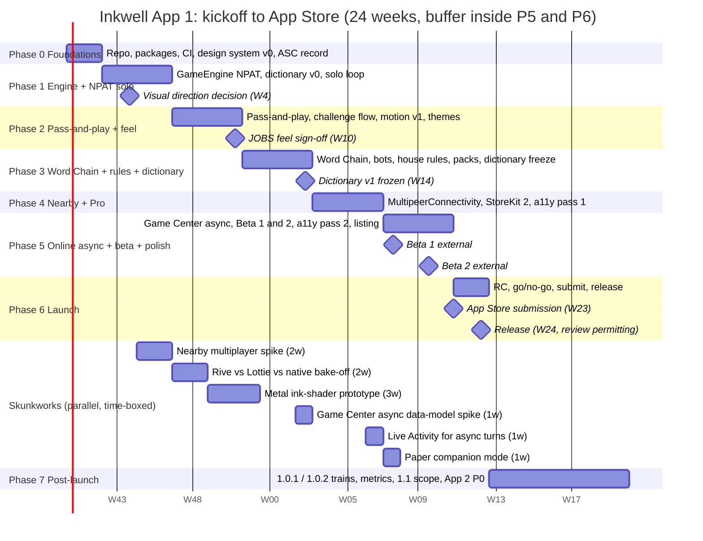

# Inkwell: Phased Delivery Plan (Phase 0 to Phase 7)

**Document status:** Draft v0.1, 2026-10-04, owner persona: **[ARCH — Principal Architect, "Priya Raman"]**, co-owned by **[JOBS]** (scope and demos) and **[QA]** (exit criteria, release). Contributions from IOS, DESIGN, GAME, DATA, KIDS.

**Read this if...** you need to know what gets built in what order, how long it takes with one to two engineers and a designer, what "done" means for each phase, what we demo every Friday, what we cut if we slip, and what has to be true before we press Submit in App Store Connect. This is the operating plan for App 1. The product brief says what and why; the game design spec says the rules; this document says when and in what order.

## Table of contents

1. Assumptions
2. Planning principles
3. Phase overview and milestone table
4. Phase 0: Foundations
5. Phase 1: Core engine and NPAT solo
6. Phase 2: Pass-and-play and the feel
7. Phase 3: Word Chain, house rules, dictionary hardening
8. Phase 4: Nearby multiplayer and Pro
9. Phase 5: Online async, TestFlight beta, polish
10. Phase 6: Launch
11. Phase 7: Post-launch
12. Gantt timeline
13. Skunkworks track
14. Risk register
15. RACI ownership table
16. Definition of done for a release
17. Go/no-go checklist for App Store submission
18. What we cut if we slip
19. Team debates
20. Decisions and open questions

---

## 1. Assumptions

| Assumption | Value | Notes |
|---|---|---|
| Engineers | 1 full-time iOS engineer (IOS) from Phase 0; a second engineer (ARCH, hands-on) at roughly 60 percent from Phase 1 to Phase 5, 100 percent in Phases 4 and 5 | Estimates are in engineer-weeks (EW). One EW is one engineer for one week of focused work, about 32 productive hours. |
| Designer | 1 designer (DESIGN) at 80 percent from Phase 0 to Phase 3, 50 percent after | Design runs one phase ahead of engineering. |
| Founder / product | JOBS part-time, roughly 8 hours per week, plus every Friday demo | JOBS owns scope decisions and the kill list. |
| Game design, content, QA | GAME, DATA and QA are part-time roles shared with the founder and engineers (small team reality). QA ramps to a dedicated 50 percent in Phases 5 and 6. | Estimates include their time where it lands on the critical path. |
| Platform | iOS 17.0 minimum (see debate in Section 19), SwiftUI-first, Swift 6 language mode, Xcode 16 or later; iPhone primary, iPad "runs well" | iOS 18 is a stretch evaluation. |
| Calendar | 24 weeks from kickoff to App Store submission, with a 2-week buffer baked into Phase 5 and Phase 6 | Range 20 to 26 weeks depending on second-engineer availability and review outcome. |
| Infrastructure | Zero servers in v1. Game Center for online async, MultipeerConnectivity for nearby, on-device dictionaries | Infra cost target: $0/month beyond the Apple Developer Program fee. |
| Working cadence | Two-week sprints; Friday demo every week regardless | "JOBS demands a demo every Friday." A demo is a build on a phone, not a slide. |

> **[JOBS]** Two things are fixed: the Friday demo and the submission date. Everything else is negotiable, and the way it gets negotiated is the cut list in Section 18.

> **[ARCH]** With one and a bit engineers, the critical path is the iOS engineer. Every phase is shaped so that the second engineer can work on engine, dictionary and networking packages in parallel without touching the UI layer. That is the point of the package split.

## 2. Planning principles

1. **Vertical slices, not layers.** Every phase ends with something playable end to end, even if ugly.
2. **The feel is a feature with a schedule.** Phase 2 exists solely to make the game feel right before we widen scope.
3. **Engine before transport.** Pass-and-play proves the multi-player engine; nearby proves the transport; async proves persistence. Each layer reuses the one before.
4. **One phase of buffer, spent deliberately.** The buffer sits in Phases 5 and 6 and is spent only via the cut list.
5. **Skunkworks run alongside, time-boxed, never on the critical path.** Results are demos, not promises.
6. **Exit criteria are tests, not opinions.** Where possible, a phase exits because an automated test or a measured number passes.

## 3. Phase overview and milestone table

| Phase | Name | Weeks (calendar) | Estimate (EW) | Milestone | Exit gate owner |
|---|---|---|---|---|---|
| 0 | Foundations | W1 to W2 | 3 | M0: Repo, packages, CI, design system v0, App Store record reserved | ARCH |
| 1 | Core engine and NPAT solo | W3 to W6 | 7 | M1: Playable NPAT solo vs. clock, on-device dictionary, first-60-seconds in budget | GAME + QA |
| 2 | Pass-and-play and the feel | W7 to W10 | 7 | M2: Pass-and-play with scoring reveal, challenge flow, motion and haptics v1, themes light and dark | JOBS + DESIGN |
| 3 | Word Chain, house rules, dictionary hardening | W11 to W14 | 8 | M3: Word Chain solo with bot and pass-and-play; house rules screen; dictionary v1 frozen | GAME + DATA |
| 4 | Nearby multiplayer and Pro | W15 to W18 | 8 | M4: Nearby 2 to 8 devices, StoreKit 2 Pro, accessibility pass 1 | IOS + ARCH |
| 5 | Online async, beta, polish | W19 to W22 | 8 | M5: Game Center async for both games; TestFlight external beta; accessibility pass 2; performance budgets green | QA + IOS |
| 6 | Launch | W23 to W24 | 3 | M6: App Store submission, approval, release | JOBS + QA |
| 7 | Post-launch | W25 onward | ongoing | M7: 1.0.1 hotfix train; 1.1 planning | ARCH |
| | **Total to submission** | **24 weeks** | **44 EW** | | |

Capacity check: IOS full time for 24 weeks is 24 EW; ARCH at an average of roughly 70 percent is about 17 EW; design and content work that lands on the engineering critical path adds about 3 EW. Total capacity about 44 EW against a 44 EW plan, which is why the buffer lives inside Phases 5 and 6 rather than as a separate line. Any phase overrun comes out of the cut list.

> **[QA]** A plan with zero slack on paper and buffer "inside" two phases is a plan with about two weeks of slack. I can live with that if the cut list is honored on the day we slip, not two weeks later.

## 4. Phase 0: Foundations (W1 to W2, 3 EW)

**Goal:** Everything that is boring and blocking is done before any feature work starts, so Phase 1 is pure building.

**Scope in**
- Xcode project with the app target and the nine Swift Packages named in the architecture document (04): `IWCore`, `IWRules`, `IWContent`, `IWDesignSystem`, `IWPersistence`, `IWMultiplayer`, `IWAnalytics` (first-party), `IWFeatureFlags`, `IWFeatures`. (The brief's short names map as GameEngine = `IWCore` + `IWRules`, Dictionary = `IWContent`, Networking = `IWMultiplayer`; there is no separate umbrella package, App 2 links the `IW*` packages directly.)
- Swift 6 language mode on, strict concurrency enabled in the packages.
- CI: Xcode Cloud or GitHub Actions running unit tests on every PR, UI tests nightly on a simulator matrix, a TestFlight internal build on every merge to main.
- Design system v0 in Figma and in code: paper textures (two), ink palette, type scale (Dynamic Type mapped), spacing, motion tokens, haptic tokens, component inventory.
- App Store Connect: app record created with the working name (checks name availability), bundle id, Game Center capability, in-app purchase product for Pro created in sandbox.
- Trademark clearance request sent for "Inkwell" and two fallbacks (product brief Section 8).
- Privacy manifest drafted; no third-party SDKs.
- Device lab: iPhone SE (2nd gen, A13, oldest iOS 17 device class), iPhone 12, iPhone 15 or newer, one iPad; two of them for nearby testing.

**Scope out:** Any game screen. Any animation beyond tokens.

**Deliverables:** Repo with passing CI; a "hello paper" app showing the design system; App Store record; packages compile with placeholder public APIs and tests.

**Entry criteria:** Product brief and game design spec at v0.1; team personas agreed.

**Exit criteria / acceptance**
- CI green on a PR that touches every package.
- Internal TestFlight build installed on all lab devices.
- Design tokens consumed by at least one SwiftUI view in both light and dark.
- App name reservation outcome known (or fallback chosen).

**Friday demos:** W1: the repo builds on a phone and shows paper. W2: the design-system sampler scrolls through type, color and the stamp haptic on an iPhone SE.

**Risks:** Name reservation fails (fallback list ready); Xcode Cloud quota or flakiness (GitHub Actions as fallback).

> **[IOS]** Two weeks for foundations is tight but right. The thing that usually slips is CI on real devices. We will run UI tests on simulators in CI and on real devices manually each Friday.

> **[DESIGN]** I need Phase 0 for the design system or Phase 2 cannot be a "feel" phase. I will also run two parallel visual passes (see the design document) so JOBS can pick a direction by W4.

## 5. Phase 1: Core engine and NPAT solo (W3 to W6, 7 EW)

**Goal:** A deterministic engine and a playable NPAT solo loop that already meets the first-60-seconds budget.

**Scope in**
- `IWCore` and `IWRules`: NPAT state machine (lobby, round, answering, reveal, challenge, committed), seeded letter draw with availability weighting and exclusions, Classic scoring, duplicate keys, ledger with replay.
- `IWContent` v0: ENABLE plus curated Animal list, GeoNames Place list (filtered), Name list v0; normalization pipeline; three-state validation; FST or perfect-hash storage; under 12 MB target.
- Home screen, who's-playing (solo default), letter draw (functional animation, not final), answer sheet with keyboard handling, timer, scoring reveal (functional), self-judge for unsure answers, personal bests per preset.
- First-party analytics events (round started, round completed, second round started) stored locally; no upload yet.
- Performance harness: cold launch to interactive measured on the SE.

**Scope out:** Challenge voting (needs 2+ players), nearby, online, Pro, Word Chain, final motion.

**Deliverables:** TestFlight build "NPAT Solo"; engine test suite (property tests for scoring and duplicates, golden replays); dictionary build pipeline (scripts in repo) with license attributions.

**Entry criteria:** M0.

**Exit criteria / acceptance**
- 100 consecutive solo rounds on the SE with no crash and no dropped keystroke.
- Cold launch to interactive p90 under 1.5 s on the SE.
- Engine replay test: 1,000 random games replay to identical ledgers.
- Letter distribution test: over 10,000 Classic draws, X, Q, Z each under 2 percent; no letter repeats within a game.
- Dictionary spot check: DATA's 500-answer golden set yields at least 95 percent correct state (accept/unsure/reject) for Thing and Animal, at least 85 percent for Place, and zero false REJECTs for Name.
- JOBS plays five rounds without instruction and asks for a sixth.

**Friday demos:** W3: letter draw and timer on device. W4: full solo round with scoring, plus DESIGN's two visual directions side by side. W5: dictionary live, personal bests. W6: first-60-seconds stopwatch demo on the SE.

**Risks:** Dictionary size and build complexity (DATA); keyboard focus bugs in SwiftUI (IOS); the Name list is culturally thin (DATA, mitigated by never REJECTing names).

> **[GAME]** Exit criterion "JOBS asks for a sixth round" is not a joke. It is the second-round-rate metric before we have users.

> **[ARCH]** The engine package ships with a command-line "simulate" target so GAME can run ten thousand games and see score distributions without a UI. Cheap, and it finds balance problems early.

## 6. Phase 2: Pass-and-play and the feel (W7 to W10, 7 EW)

**Goal:** The game becomes a party game on one phone, and it starts to feel like Inkwell.

**Scope in**
- Pass-and-play: names, hand-off privacy screen, per-player timers, same letter per round, combined reveal with duplicates, challenge and vote flow (Section 9.5 of the spec), tiebreak rule.
- "Tables": named groups of players with remembered names and rules (Persistence).
- Motion v1: letter draw ceremony, ink bleed and dry on fields, the full scoring reveal choreography, stamps, duplicate "same!" link, perfect-sheet stamp. Reduce Motion alternatives for every one.
- Sound v1: stamp and scratch; sound off by default when the ringer is silent.
- Haptics v1: Core Haptics patterns for stamp, heartbeat, warning ticks.
- Themes: light paper and dark paper; chosen visual direction from Phase 1 applied everywhere.
- "How to play" cards; first-run inline captions.
- Share sheet: an image of the final ledger.

**Scope out:** Word Chain, nearby, online, Pro, house rules screen (defaults only; the engine supports them).

**Deliverables:** TestFlight build "Table"; motion spec implemented against DESIGN tokens; a recorded 60-second video of the first run used as the reference "feel" artifact.

**Entry criteria:** M1; DESIGN direction chosen by JOBS at W4 demo.

**Exit criteria / acceptance**
- Four-player pass-and-play game of five rounds completes with zero confusion in a hallway test with four people who have never seen the app (QA runs two such tests).
- Every animation has a Reduce Motion path verified with the system setting on.
- Challenge flow: property test that total points equal the sum under final states across random challenge sequences.
- Scoring reveal frame time: no dropped frames on iPhone 12 (Instruments trace attached to the PR).
- JOBS signs off on "the feel" in writing after the W10 demo, or lists exactly what is wrong.

**Friday demos:** W7: hand-off and combined reveal, functional. W8: the letter draw ceremony, final motion, with and without Reduce Motion. W9: full scoring reveal with sound and haptics, four players. W10: the 60-second first-run video versus the live app, side by side.

**Risks:** Motion polish is unbounded (time-box each moment; JOBS picks the three that matter: draw, reveal, challenge); Core Haptics patterns feel different across devices (test on all lab phones).

> **[JOBS]** This is the phase I will attend every day I can. If Phase 2 slips a week, I will take the week from Phase 5's online work before I take an hour from the reveal.

> **[DESIGN]** The visual direction decision at W4 is the real gate. If it slips, Phase 2 becomes two phases.

> **[IOS]** PhaseAnimator and KeyframeAnimator in iOS 17 handle the stamp sequences well. The ink bleed is the one effect that wants a shader; v1 ships it as a layered SwiftUI effect and the Metal version lives in skunkworks.

## 7. Phase 3: Word Chain, house rules, dictionary hardening (W11 to W14, 8 EW)

**Goal:** The second game, the toolbox, and a dictionary we can freeze.

**Scope in**
- `IWCore` and `IWRules`: Word Chain state machine, link-letter rules including edge-letter options, Lives / Elimination / Points, per-turn timers, bot tiers as data, trap bonus.
- Word Chain UI: chain view with ink links, turn hand-off (pass-and-play), bot "thinking" presence, last-life treatment, elimination strike-through.
- Categories for Word Chain: Animals, Countries, Cities, Foods, Movies, Fruits and Vegetables; "Any English word" (decide free or Pro).
- House rules screen with all toggles from the spec matrix, one-sentence explanations, per-table persistence.
- Custom categories (user-typed) for NPAT with UNSURE validation.
- NPAT category packs v1: Classic, Extended (Movie, Food, Brand, Sport), Classroom (Rivers, Scientists, Verbs, Adjectives).
- Dictionary hardening: plural tables, irregulars, synonym table (off by default), family-safe profile, profanity exclusion from suggestions, golden-set expansion to 2,000 answers; dictionary v1 frozen at W14.
- Analytics upload: batched, first-party endpoint or App Store Connect-only metrics. **OPEN** below.

**Scope out:** Nearby, online, Pro purchase UI (entitlement stubs only).

**Deliverables:** TestFlight build "Two Games"; dictionary v1 tag; house rules strings reviewed by GAME.

**Entry criteria:** M2 with JOBS feel sign-off.

**Exit criteria / acceptance**
- Word Chain solo vs. Ruthless bot: GAME can beat it at least one game in five, and Casual loses to a first-time player at least four in five (playtest with 6 people).
- Bot determinism: same seed, same bot words, verified by replay test.
- Edge-letter rules: unit tests for X, Q, Z, digits, diacritics, plural link.
- House rules: every toggle has a test that flips it and observes the engine change; the screen passes a Dynamic Type sweep at all sizes.
- Dictionary v1: golden set at least 97 percent for Thing and Animal, 90 percent for Place, zero false REJECTs for Name; size under budget (ARCH 12 MB vs. DATA 18 MB resolved).
- No new modal in the default flow (first-60-seconds UI test still passes).

**Friday demos:** W11: Word Chain pass-and-play, functional. W12: bot tiers with personalities; Fox trap. W13: house rules screen; a family table's rules persisting across launches. W14: dictionary v1 "stump the dictionary" session where the team tries to break it.

**Risks:** Movie list licensing and quality (DATA: public-domain-derived lists, titles only); house-rules UI sprawl (JOBS enforces one screen); bot tuning rabbit hole (time-box two days per tier).

> **[DATA]** Freezing the dictionary at W14 is the only way QA can test against a stable target in Phases 4 and 5. Fixes after W14 go into 1.0.1 unless they are offensive-content issues, which ship immediately.

> **[GAME]** Agreed on the freeze, with one exception: edge-letter tables for Word Chain depend on the lists, so they freeze together.

## 8. Phase 4: Nearby multiplayer and Pro (W15 to W18, 8 EW)

**Goal:** Every phone at the table, and the first dollar.

**Scope in**
- `IWMultiplayer`: MultipeerConnectivity session layer; host-authoritative event ordering; sealed answer commitments; seed broadcast; reconnection; "continue as pass-and-play" fallback.
- Nearby UI: lobby with discovered peers, join by tap, host accept, per-device countdown synced to host, combined reveal with remote challenges and votes.
- StoreKit 2: Pro non-consumable, entitlement cache, restore, Family Sharing, refund handling via transaction updates; paywall screen (DESIGN); host-pays rule for sessions; Pro-gated features: nearby, online, house rules, extra packs, extra themes, stats.
- Themes beyond the default: Swiss Editorial (free) and Night Lounge (Pro), per the design directions document (07). Note: 07 estimates these at well above the 0.5 EW budgeted here; see the OPEN on theme scope in the decisions register.
- Stats screen: per-mode personal bests, rounds played, favorite letters.
- Accessibility pass 1: VoiceOver labels and rotor order on every screen; timer announcements; Dynamic Type sweep; contrast audit; Switch Control navigation check on home, sheet and reveal.

**Scope out:** Online; iPad bespoke layout.

**Deliverables:** TestFlight build "Table of Phones"; StoreKit configuration file and sandbox test matrix; accessibility audit report v1.

**Entry criteria:** M3; nearby spike results from skunkworks (Section 13) reviewed.

**Exit criteria / acceptance**
- Eight-device nearby game of five rounds completes in a crowded office Wi-Fi environment (QA runs it twice); host disconnect recovery works within 30 s; peer rejoin works.
- Reveal appears on all devices within 500 ms of the host.
- No peer can observe another's answers before reveal (code review plus a packet capture test).
- StoreKit: purchase, restore, Family Sharing, refund and offline-entitlement scenarios pass in sandbox; the paywall never appears in the first-60-seconds UI test.
- Accessibility: VoiceOver user completes a solo round and a pass-and-play round unaided (one external tester).
- Crash-free sessions in internal TestFlight at or above 99.5 percent for the phase.

**Friday demos:** W15: two phones see the same letter. W16: four phones, full round, remote challenge vote. W17: Pro purchase in sandbox unlocks nearby for a guest. W18: eight phones; the team plays and tries to break it; VoiceOver run-through.

**Risks:** MultipeerConnectivity instability (biggest technical risk; mitigations: spike first, aggressive fallback to pass-and-play, keep message count low); App Review questions about the IAP (clear paywall copy, restore button visible); accessibility work exceeding estimate (reserve 1 EW).

> **[IOS]** I want to be blunt: nearby is where the schedule goes to die on most small teams. The spike in skunkworks is not optional. If the spike says "two weeks is not enough", we move nearby to Phase 5 and online async to post-launch. See the debate in Section 19.

> **[ARCH]** Agreed. The architecture choice that protects us is that nearby only needs ordering, not consensus, because the engine is deterministic. That keeps the protocol to about six message types.

## 9. Phase 5: Online async, beta, polish (W19 to W22, 8 EW)

**Goal:** Long-distance friends, an external beta, and the polish pass that earns 4.7 stars.

**Scope in**
- Game Center turn-based matches: NPAT parallel-round model and Word Chain direct turn model; match data schema; deadlines; challenge window of 24 h; invite via Game Center friends and share link; match list screen.
- Notifications: Game Center turn notifications only (system-provided); no custom push, no notification permission prompt of our own.
- TestFlight external beta: 200 to 500 testers across the five personas; feedback form; crash triage daily.
- Accessibility pass 2: fix all audit items; verify with two external VoiceOver testers; Reduce Motion and "Motion: Minimal" setting.
- Performance: cold launch, memory and frame-time budgets re-verified on the SE and the newest iPhone; battery check for a 30-minute nearby session.
- Localization readiness: strings externalized, pseudo-localization pass, RTL chrome mirroring check (App 3 preparation, no translations shipped).
- App Store assets: screenshots in all required sizes, app preview video (the 60-second first run), description, keywords, privacy nutrition label, age rating questionnaire.
- Rating prompt: `SKStoreReviewController` requested only after a completed multi-round session, at most once per 120 days per Apple's throttling.

**Scope out:** Real-time online; public matchmaking; chat.

**Deliverables:** TestFlight external build "Beta 1" and "Beta 2"; App Store listing drafted; accessibility audit v2 with zero critical items; performance report.

**Entry criteria:** M4.

**Exit criteria / acceptance**
- Async NPAT match among three testers across time zones completes five rounds; async Word Chain completes a 20-word chain; replay produces identical ledgers on all devices.
- Beta: at least 100 testers complete at least one multi-round session; second-round rate measured at or above 80 percent; crash-free at or above 99.7 percent.
- Beta survey: at least 70 percent rate "how it feels" 5 of 5.
- Zero P0 or P1 bugs open; P2 count under 10.
- Accessibility: zero critical audit items; VoiceOver testers complete all three modes.
- App Store listing reviewed by JOBS, DESIGN and QA; privacy label matches the privacy manifest.

**Friday demos:** W19: an async round between two phones in different rooms with one phone in airplane mode until the reveal. W20: Beta 1 feedback readout with a live fix. W21: accessibility run-through by an external tester. W22: the App Store page mockup next to the live app; go/no-go dry run.

**Risks:** Game Center match data limits and edge cases (keep match data compact; test the 64 KB-class limits early and cite Apple's current documented limit at implementation time: https://developer.apple.com/documentation/gamekit/gkturnbasedmatch); beta recruiting (start recruiting in Phase 3); polish work expanding (JOBS triages weekly).

> **[QA]** Two external betas, two weeks apart, is the minimum for me to trust the crash numbers. If Phase 4 slips into W19, Beta 1 shrinks to one week and we accept more risk on 1.0.

> **[JOBS]** Async is the first thing I would cut from Phase 5 if we slip, and the debate in Section 19 says so. Beta and polish are not cuttable.

## 10. Phase 6: Launch (W23 to W24, 3 EW)

**Goal:** Submit, pass review, release, and be ready for the first 72 hours.

**Scope in**
- Release candidate build; version 1.0 (build frozen at W23 Monday).
- Go/no-go checklist (Section 17) executed and signed.
- App Store submission with review notes (demo video of nearby and async, a sandbox Pro account, a note explaining the hybrid validation and the vote so reviewers understand "challenge").
- Pre-order or scheduled release decision (**OPEN**).
- Launch day: monitoring of crashes (Xcode Organizer and App Store Connect), reviews, support inbox; hotfix branch ready.
- Press and community: a short launch page, a 60-second video, outreach to a handful of word-game communities. No paid acquisition in v1.

**Scope out:** New features. Anything not on the go/no-go list.

**Deliverables:** Approved 1.0 on the App Store; launch retrospective scheduled.

**Entry criteria:** M5; go/no-go signed by JOBS, QA, IOS and ARCH.

**Exit criteria / acceptance**
- App approved and released.
- First 72 hours: crash-free at or above 99.8 percent; no P0; support tickets under 2 per 1,000 downloads.
- Second-round rate from first-party analytics at or above 75 percent in week 1.

**Friday demos:** W23: the RC installed from TestFlight on every lab device; the submission form filled in. W24: the App Store page, live.

**Risks:** Review rejection (most likely 4.3 Spam given a crowded category, or IAP metadata issues; mitigation: review notes that show the distinctive product, a working demo account, and a 48-hour turnaround plan on any rejection; guidelines: https://developer.apple.com/app-store/review/guidelines/); a launch-day crash in a path the beta never hit (mitigation: a 1.0.1 ready to go within 48 hours, expedited review request if a P0).

> **[IOS]** Review for a game with Game Center and a single non-consumable is usually uneventful. The thing that trips small teams is metadata: the restore button must be findable, the privacy label must match reality, and screenshots must show the actual app. I will own the submission mechanics.

## 11. Phase 7: Post-launch (W25 onward)

**Goal:** Stabilize, learn, then earn the right to build more.

**Scope in (first 8 weeks)**
- 1.0.1 and 1.0.2 hotfix trains (week 1 and week 3), dictionary corrections from support and overturned REJECTs.
- Metrics review against the brief's targets; a written "what we learned" for JOBS.
- 1.1 candidates, each requiring a one-page case and a demo: bespoke iPad layout; paper companion mode (if not in 1.0); designated-judge mode; reaction stamps for async; Game Center achievements; one or two new themes; Live Activity for async turns (skunkworks result).
- Real-time online evaluation: Game Center real-time vs. a small backend; cost model; decision by W32.
- Hand-off of shared packages to the App 2 (Kids) program; the Kids program starts its Phase 0 at W25 using the shared `IW*` packages.

**Exit criteria:** 1.1 scope locked by W30 with JOBS; App 2 Phase 0 started.

> **[KIDS]** App 2 cannot start before App 1's engine and dictionary are frozen and shipped. W25 is the earliest sensible start. I will shadow Phases 3 and 4 so the engine grows the hooks we need (designated judge, Buddy bot, forgiving validation profile) without delaying App 1.

> **[ARCH]** Those hooks are all data or protocol extension points already in the spec. The cost to App 1 is near zero if we keep the engine honest.

## 12. Gantt timeline



ASCII fallback (one character per week):

```
Week:      1 2 3 4 5 6 7 8 9 10 11 12 13 14 15 16 17 18 19 20 21 22 23 24
P0 Found.  # #
P1 Engine      # # # #
P2 Feel                # # # #
P3 WChain                      #  #  #  #
P4 Nearby                                  #  #  #  #
P5 Async                                               #  #  #  #
P6 Launch                                                          #  #
Skunk:
 nearby spike    . .
 rive/lottie         . .
 ink shader              . . .
 GC data model                           .
 live activity                                      .
 paper companion                                       .
Milestones: M0=W2  M1=W6  M2=W10  M3=W14  M4=W18  M5=W22  Submit=W23  Release=W24
```

## 13. Skunkworks track

Time-boxed explorations that run beside the critical path, mostly by the second engineer or the designer, never blocking a phase. Each ends with a Friday demo and a one-page writeup with a keep/kill recommendation.

| Item | Question | Time box | Who | Decision point | Default if inconclusive |
|---|---|---|---|---|---|
| Nearby multiplayer spike | Can MultipeerConnectivity hold an 8-device session for 20 minutes in a noisy RF environment with reconnection? What is the message count per round? | 2 weeks (W5 to W6) | ARCH | Before Phase 4 planning (W14) | Keep nearby in Phase 4 but with a 4-device v1 cap |
| Rive vs. Lottie vs. native SwiftUI for the letter draw and stamps | Which gives DESIGN the most control with the least runtime cost and dependency risk? | 2 weeks (W7 to W8) | DESIGN + IOS | W8 demo; informs Phase 2 motion | Native SwiftUI (no dependency); Rive only for the draw wheel if it is clearly better |
| Metal ink-shader prototype | Can an ink bleed and dry shader run under 2 ms per frame on an SE, and does it look better than layered SwiftUI effects? | 3 weeks (W9 to W11) | IOS (20 percent) | W11 demo; ship in 1.0 only if free of frame drops on SE | Ship layered SwiftUI effect in 1.0; shader in 1.1 |
| Game Center async data model | Does the parallel-round model fit match data limits for 6 players and 13 rounds with challenges? | 1 week (W14) | ARCH | Before Phase 5 | Cap async NPAT at 4 players and 8 rounds |
| Live Activity for async turns | Is a Lock Screen "your turn" activity worth building and does it pass review cleanly? | 1 week (W18) | IOS | 1.1 planning | Not in 1.0 |
| Paper companion mode | Can "letter plus timer only" ship in under 1 EW with the existing engine? | 1 week (W19) | IOS | 1.0 if under 1 EW and JOBS likes the demo | 1.1 |
| On-device typo model | Can a tiny learned model beat edit-distance for Gentle fuzzy matching? | 1 week (any time after W14) | DATA | 1.1 | Edit distance |

> **[JOBS]** Skunkworks is where taste gets made. It is also where schedules die if it leaks onto the critical path. Every item has a box and a Friday. If it is not demoed by its Friday, it is dead until 1.1.

> **[DESIGN]** The Rive/Lottie bake-off is the one I care about most. If native wins I am delighted because it means fewer moving parts; if Rive wins for the wheel it is because it lets me iterate the draw without a code change.

## 14. Risk register

| # | Risk | Likelihood | Impact | Mitigation | Owner |
|---|---|---|---|---|---|
| 1 | MultipeerConnectivity instability makes nearby unreliable | High | High | Spike in W5 to W6; cap at 4 devices if needed; every nearby screen degrades to pass-and-play with ledger intact; keep protocol to ordering only | ARCH, IOS |
| 2 | Second engineer availability drops below 60 percent | Medium | High | Packages are split so IOS is never blocked on ARCH; cut list ordered so network features fall first | JOBS |
| 3 | Motion polish consumes Phase 2 and bleeds into Phase 3 | High | Medium | Time-box per moment; JOBS picks three protected moments; native-first animation to avoid tooling churn | DESIGN, JOBS |
| 4 | Dictionary quality (false rejects, cultural gaps in Names) drives bad reviews | Medium | High | Names are never REJECTed; three-state validation; vote overturns; golden set of 2,000; 1.0.1 dictionary fixes | DATA |
| 5 | App Review rejection under 4.3 Spam or IAP metadata | Medium | High | Review notes with demo video; distinctive product; restore button visible; privacy label matches manifest; 48-hour response plan | IOS, QA |
| 6 | Cold launch exceeds budget on iPhone SE due to shader or dictionary load | Medium | Medium | Lazy-load dictionary; shader off the launch path; nightly launch-time test on SE | IOS |
| 7 | Game Center match data limits or edge cases break async | Medium | Medium | Data-model spike in W14; compact encoding; cap players and rounds; async is first in the cut list | ARCH |
| 8 | StoreKit edge cases (Family Sharing, refunds, offline entitlement) cause support load | Medium | Medium | Full sandbox matrix; StoreKit 2 transaction listener; cached entitlement with grace | IOS, QA |
| 9 | Trademark conflict on the name after assets are made | Low | High | Clearance in Phase 0; fallbacks ranked; brand assets parameterized by name until W14 | JOBS |
| 10 | SwiftUI keyboard and focus bugs on iOS 17 degrade the typing experience | Medium | High | Deterministic focus tests in UI suite; UIKit text field wrapper as fallback for the answer sheet | IOS |
| 11 | Accessibility work underestimated | Medium | Medium | Two passes (Phase 4 and 5); external VoiceOver testers; 1 EW reserve | QA |
| 12 | Beta recruiting falls short of 100 active testers | Medium | Medium | Start recruiting in Phase 3; personas-based outreach; TestFlight public link | JOBS, QA |
| 13 | Third-party keyboards ignore input traits, allowing autocorrect | Medium | Low | Test Gboard and SwiftKey; accept residual risk; detect and mark rather than block | QA |
| 14 | Scope creep from "just one more house rule" | High | Medium | Kill list; one-screen rule; every toggle needs a one-sentence explanation | JOBS, GAME |
| 15 | Profanity or offensive content surfaces in bot words or suggestions | Low | High | Family-safe profile default; bot vocabulary filtered; immediate hotfix policy | DATA |
| 16 | iOS release (new major version each September) breaks a SwiftUI behavior before launch | Medium | Medium | Test on current beta OS from June onward; keep minimum at 17 so we are not chasing new APIs | IOS, QA |
| 17 | Founder time is scarcer than 8 hours per week, decisions stall | Medium | Medium | Friday demo is the decision forum; ARCH holds a written "decisions needed" list; defaults chosen in advance | JOBS, ARCH |

## 15. RACI ownership table

R = Responsible, A = Accountable, C = Consulted, I = Informed.

| Area | JOBS | ARCH | IOS | DESIGN | GAME | DATA | QA | KIDS |
|---|---|---|---|---|---|---|---|---|
| Scope, kill list, priorities | A/R | C | C | C | C | I | C | I |
| Architecture, packages, engine determinism | I | A/R | C | I | C | C | C | I |
| Engine rules implementation (`IWCore`, `IWRules`) | I | A | R | I | C | C | C | I |
| Dictionary content, validation, licensing | I | C | I | I | C | A/R | C | C |
| Visual design, motion, design system | A | I | C | R | C | I | C | C |
| SwiftUI implementation, performance | I | C | A/R | C | I | I | C | I |
| Accessibility | I | C | R | C | I | I | A | C |
| Multiplayer transport (nearby, async) | I | A/R | R | I | C | I | C | I |
| StoreKit, paywall | A | C | R | R | I | I | C | I |
| Game balance, bots, house rules | C | I | I | C | A/R | C | C | C |
| Test strategy, device matrix, release trains | I | C | C | I | I | I | A/R | I |
| App Store listing, submission, review response | A | I | R | R | I | I | R | I |
| Analytics and privacy manifest | C | A/R | R | I | I | I | C | C |
| Skunkworks portfolio | A | R | R | R | C | C | I | I |
| App 2 reuse hooks | I | A | C | C | C | C | I | R |

> **[QA]** Note that I am Accountable for accessibility and IOS is Responsible. That is deliberate: the person who implements should not be the person who signs it off.

## 16. Definition of done for a release

A release (1.0 and every point release after) is done when all of the following are true:

1. All P0 and P1 bugs closed; P2 count at or below the agreed cap (10 for 1.0).
2. Unit test coverage of `IWCore`, `IWRules` and `IWContent` at or above 90 percent lines (the quality plan's test pyramid targets 95 percent for `IWCore` and `IWRules`); property and replay tests green.
3. UI test suite green on the simulator matrix (iOS 17.0, 17.x latest, 18.x latest, current OS) and the first-60-seconds timing test green on the physical SE.
4. Crash-free sessions at or above 99.7 percent across the last TestFlight build with at least 100 active testers (1.0) or at least 48 hours of internal use (point releases).
5. Accessibility: zero critical audit items; VoiceOver, Dynamic Type (largest size), Reduce Motion, Increase Contrast and Switch Control spot-checked on every new or changed screen.
6. Performance: cold launch p90 under 1.5 s on SE; no dropped frames in the scoring reveal on iPhone 12; memory under 150 MB in a nearby session.
7. Privacy manifest and App Store privacy label match; no third-party SDKs added without an ARCH review.
8. Strings externalized; pseudo-localization pass has no truncation.
9. Release notes written in plain language by JOBS or DESIGN.
10. Rollback plan: previous build still in TestFlight; hotfix branch cut.
11. The Friday demo of the RC happened and JOBS said "ship".

## 17. Go/no-go checklist for App Store submission

Signed by JOBS, QA, IOS and ARCH on the Monday of W23.

**Product**
- [ ] First-60-seconds spec passes as an automated test and by hand on all lab devices.
- [ ] Kill list respected: no accounts, no ads, no chat, no consumables, no notification prompt of our own.
- [ ] Both games playable in solo and pass-and-play free; Pro gates exactly the features listed in the brief.
- [ ] House rules screen complete; every toggle explained in one sentence.

**Quality**
- [ ] Definition of done (Section 16) met in full.
- [ ] Beta 2 crash-free at or above 99.7 percent; second-round rate at or above 80 percent.
- [ ] Nearby: 8-device test passed twice; disconnect recovery verified.
- [ ] Async: cross-time-zone match completed; replay identical on all devices.
- [ ] Dictionary v1 golden set thresholds met; family-safe profile verified with a profanity sweep.

**Store and legal**
- [ ] App name cleared (trademark letter or decision on fallback) and reserved in App Store Connect.
- [ ] Screenshots for all required device sizes show the real app; app preview video approved by DESIGN.
- [ ] Privacy nutrition label completed and matches the privacy manifest.
- [ ] Age rating questionnaire completed; family-safe default documented in review notes.
- [ ] In-app purchase product reviewed and attached to the version; restore purchases visible; price tier set; introductory price decision made.
- [ ] Review notes include: demo video of nearby and async, sandbox Pro account, explanation of the challenge vote.
- [ ] Open-source and data licenses screen complete (ENABLE, SCOWL, WordNet, GeoNames CC BY 4.0; Wiktionary-derived data is excluded from v1 packs per ADR-007).
- [ ] Export compliance answered (standard encryption exemption; we use only Apple-provided TLS and Game Center).
- [ ] Support URL and privacy policy URL live.

**Operations**
- [ ] Crash monitoring and first-party analytics dashboard checked daily by a named person for 14 days.
- [ ] Hotfix branch cut; 1.0.1 placeholder version created in App Store Connect.
- [ ] Launch comms drafted; a one-line response template for the most likely reviews ("why isn't X valid?").

## 18. What we cut if we slip (ordered)

Cut from the top. Each cut names what it saves and what it costs.

| Order | Cut | Saves | Costs | Who decides |
|---|---|---|---|---|
| 1 | Online async for NPAT (keep Word Chain async, which maps directly to Game Center turns) | about 1.5 EW | Long-distance NPAT waits for 1.1 | JOBS |
| 2 | Online async entirely | about 3 EW | Long-distance persona unserved in 1.0; Pro loses one headline feature | JOBS |
| 3 | Night Lounge (Pro) theme | 0.5 EW plus design | Pro ships without an exclusive theme until 1.1; Swiss Editorial stays free | DESIGN |
| 4 | Stats screen | 0.5 EW | Personal bests shown inline only | GAME |
| 5 | NPAT Classroom and Extended category packs (ship Classic plus one) | 1 EW content | Teacher persona gets custom categories only | DATA |
| 6 | Movies and Cities Word Chain categories (ship Animals, Countries, Foods) | 0.5 EW content | Smaller Word Chain menu | DATA |
| 7 | Nearby capped at 4 devices | 1 EW | Big tables split or pass-and-play | ARCH |
| 8 | Share image of the ledger (plain text share instead) | 0.5 EW | Weaker viral loop | JOBS |
| 9 | Synonym and abbreviation duplicate toggles | 0.3 EW | Two fewer house rules | GAME |
| 10 | Word Chain Points mode (ship Lives and Elimination) | 0.5 EW | Fewer modes | GAME |
| 11 | Nearby multiplayer entirely (move to 1.1) | 4 EW | Party-of-phones premise delayed; Pro's main feature missing | JOBS, with a written case |

Never cut: the scoring reveal, the letter draw ceremony, pass-and-play, the challenge flow, Reduce Motion alternatives, VoiceOver support, the family-safe dictionary default, the first-60-seconds spec, two betas.

> **[JOBS]** Read the "never cut" line twice. The things on it are the product. The things above it are features.

## 19. Team debates

### 19.1 Online multiplayer in v1 or not?

> **[ARCH]** The case for async in v1 is that it costs almost nothing in infrastructure because Game Center carries it, and our deterministic engine means there is no server logic. Three EW for a feature that serves a whole persona and justifies Pro is a good trade.

> **[IOS]** The case against is schedule risk, not infra. Game Center turn-based has quirks: match data size limits, participant state transitions, invite flows that depend on the user's Game Center setup, and testing that needs multiple Apple IDs and devices. It is three EW if nothing surprises us. It is six if something does, and it lands in the same phase as the external beta.

> **[QA]** Every mode we add before launch multiplies the test matrix. Async adds time-zone and deadline behavior, plus the "both devices compute the reveal" race. I can test it, but Beta 2 is where I would be testing it, which is late.

> **[GAME]** From a design view, async NPAT is a different game: no table, no live reveal, no banter. It is good, but it is not the product's heart. Word Chain async, on the other hand, is natural and cheap. If we ship one, ship that one.

> **[DESIGN]** The async match list is also another screen family: list, match detail, invite, deadline states. It is the least "paper" part of the app and the most likely to look like every other app.

> **[JOBS]** Here is my read. Async is a Pro feature, so it does not touch the first 60 seconds. It is the first and second item in the cut list, so it cannot hold the ship. The data-model spike in W14 will tell us if the three EW estimate is real. We build it in Phase 5 as planned, Word Chain first, NPAT second, and the moment Phase 5 slips a week, NPAT async goes to 1.1 without a meeting.

**DECISION:** Online async is in the Phase 5 plan, Word Chain async first, NPAT async second, both behind Pro. Real-time online is out of v1. Async is pre-approved as the first cut if Phase 5 slips.

### 19.2 iOS 17 minimum or iOS 18?

> **[IOS]** Facts first. Apple's own usage page, measured on June 7, 2026, shows iPhone at 79 percent iOS 26, 14 percent iOS 18 and 7 percent earlier; among devices introduced in the last four years it is 86, 11 and 3 percent (https://developer.apple.com/support/app-store/). By our launch in spring 2027 those numbers shift further toward 26. An iOS 17 minimum reaches roughly 97 percent of iPhones; iOS 18 reaches roughly 93 percent; iOS 26 alone would be about 79 percent today and perhaps 85 percent at launch.

> **[ARCH]** So the 17-versus-18 question is about four points of reach against the APIs we gain. iOS 18 gives us Swift 6 adoption as the OS baseline, newer SwiftUI behaviors, and some accessibility API additions; nothing in our spec depends on an iOS 18-only API. What we would actually like is iOS 26's newer SwiftUI and the Liquid Glass material, and that is a design question as much as an engineering one.

> **[DESIGN]** On Liquid Glass: our thesis is paper and ink, not glass. We do not want the system material to fight the brand. Supporting iOS 17 keeps us on a visual language we fully control. I would rather our app look like Inkwell on every OS than look like iOS 26 on one.

> **[QA]** Each supported major version is a row in my matrix. iOS 17 adds exactly one row (17.x latest) and the oldest hardware class. The SE 2nd generation on iOS 17 is also our performance floor, which is useful discipline. If we drop 17 we lose the device that keeps us honest about launch time.

> **[KIDS]** Families hand down older phones to children. The App 2 audience skews toward exactly the 7 percent on older OS versions. Shared packages should compile for iOS 17 so App 2 is not forced upward.

> **[JOBS]** Four points of reach is tens of thousands of possible downloads for a free app that spreads at the table where someone always has the old phone. We ship iOS 17 minimum. We test on the current OS first because that is where most users are. We re-evaluate at 1.1 with launch data, and we do not adopt an API because it is new.

**DECISION:** iOS 17.0 minimum for 1.0. Primary test and design target is the current shipping iOS; iOS 17 on the iPhone SE 2nd generation is the performance floor. Re-evaluate the minimum at 1.1 using App Store Connect usage data. Shared packages keep an iOS 17 deployment target for App 2.

### 19.3 Short debate: fixed launch date or fixed scope?

> **[JOBS]** Fixed date. W23 submission. Scope flexes via the cut list.

> **[QA]** Fixed date with a fixed quality bar. The definition of done does not flex. If both cannot hold, the date moves by one week at a time, announced on a Friday, never silently.

> **[ARCH]** Agreed, with the rule that a date move must be paired with a cut. Moving the date without cutting is how a two-week slip becomes a two-month slip.

**DECISION:** Date-driven with a non-negotiable quality bar; every date move is paired with a cut from Section 18 and announced at a Friday demo.

## 20. Decisions and open questions

**DECISIONS**

1. 24-week plan to submission, buffer inside Phases 5 and 6, spent only via the ordered cut list.
2. Phase order: Foundations, Engine plus NPAT solo, Pass-and-play plus feel, Word Chain plus rules plus dictionary freeze, Nearby plus Pro, Async plus beta plus polish, Launch.
3. Friday demo every week; a demo is a build on a phone.
4. Skunkworks items are time-boxed and die if not demoed by their Friday.
5. Online async in Phase 5 behind Pro, Word Chain first; real-time online deferred; async is the first pre-approved cut.
6. iOS 17.0 minimum; current iOS is the primary target; SE 2nd gen on iOS 17 is the performance floor.
7. Dictionary v1 freezes at W14; later fixes ride point releases except offensive-content fixes.
8. Date-driven schedule with a fixed quality bar; date moves pair with cuts.
9. App 2 Phase 0 starts at W25 on the shared packages.

**OPEN**

1. Analytics upload path: a tiny first-party endpoint (needs a server, breaks the zero-infra promise) versus App Store Connect metrics only (coarse) versus on-device aggregation shared via opt-in export. ARCH to recommend by W10.
2. Pre-order versus scheduled release for 1.0. JOBS to decide at W20.
3. Nearby device cap for 1.0 (8 versus 4) pending the W6 spike.
4. Whether the Metal ink shader ships in 1.0 (pending the W11 demo on the SE).
5. "Any English word" Word Chain category: free or Pro, and its download size.
6. Whether the second engineer can commit to 100 percent in Phases 4 and 5; if not, the cut list is invoked at W14.

---

### Sources

- Apple, App Store support page with iOS and iPadOS usage measured June 7, 2026: https://developer.apple.com/support/app-store/
- Apple, App Review Guidelines: https://developer.apple.com/app-store/review/guidelines/
- Apple, App Review overview and appeals: https://developer.apple.com/distribute/app-review/
- Apple, GKTurnBasedMatch and turn-based match documentation: https://developer.apple.com/documentation/gamekit/gkturnbasedmatch ; https://developer.apple.com/documentation/gamekit/starting-turn-based-matches-and-passing-turns-between-players
- Apple, MultipeerConnectivity (official docs root): https://developer.apple.com/documentation/multipeerconnectivity
- Apple, Privacy manifest files: https://developer.apple.com/documentation/bundleresources/privacy-manifest-files
- Apple, Human Interface Guidelines root: https://developer.apple.com/design/human-interface-guidelines/
- Apple Developer, iOS platform overview: https://developer.apple.com/ios/
