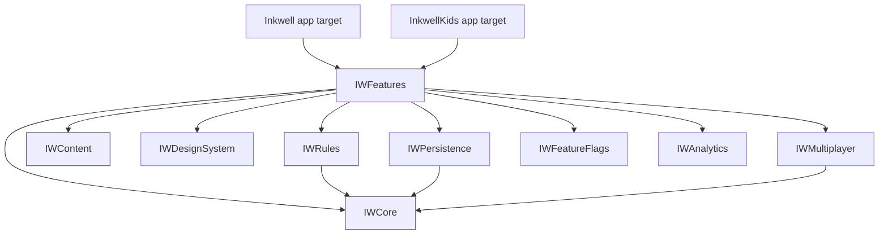

# Inkwell (App 1) — Architecture and Engineering Plan

**Document status:** Draft v0.1, 2026-10-04. Owner: **[ARCH — Priya Raman]**, with **[IOS — Marcus Oyelaran]** and **[DATA — Omar Haddad]**. Reviewed by **[JOBS]**, **[QA]**, **[GAME]**.

**Read this if...** you are going to build, review, or estimate the Inkwell iOS app. This document fixes the module boundaries, the deterministic game engine, persistence, dictionary/content, multiplayer phasing, the SwiftUI app shape, concurrency, performance and accessibility budgets, privacy, observability, security, build pipeline and repository layout. It ends with the Architecture Decision Record (ADR) list. It assumes the baseline in the shared brief: native iOS, SwiftUI-first, iOS 17 minimum, Swift 6, Xcode 16+, Swift Packages. The platform-choice debate itself lives in `06-platform-choice-and-alternatives.md`; the quality bar lives in `05-quality-release-and-app-store.md`.

---

## Table of contents

1. Architecture principles
2. Module map (Swift Packages) and dependency diagram
3. The deterministic game engine
4. Timer design
5. State persistence and crash recovery
6. Dictionary and content architecture
7. Multiplayer architecture options and phased recommendation
8. Authoritative vs. peer resolution for simultaneous NPAT rounds
9. Sync conflict handling
10. SwiftUI app structure
11. Concurrency model
12. Performance budgets
13. Accessibility architecture
14. Analytics and privacy
15. Feature flags and remote config
16. Observability
17. Security
18. Build pipeline
19. Repository layout
20. Architecture Decision Records (ADR index)
21. Risk register
22. Open questions

---

## 1. Architecture principles

| # | Principle | What it means in practice | Why it matters for Inkwell |
|---|-----------|---------------------------|----------------------------|
| P1 | **The engine is pure and deterministic** | Rules, scoring, timers and turn order are value types and pure functions. Same inputs, same outputs, on every device. | Enables replay, undo, dispute resolution, property-based tests, and multiplayer agreement without a server. |
| P2 | **Offline-first, account-free local play** | Pass-and-play and solo need no network, no sign-in, no identifiers. | Founder non-negotiable. Also the App Store privacy story becomes trivial. |
| P3 | **UI is a projection of engine state** | SwiftUI views render `MatchState`; they never mutate it directly. All changes are `MatchEvent`s through a reducer. | Animations become reactions to state transitions, which is exactly how SwiftUI wants to work. |
| P4 | **Content is data, not code** | Word lists, categories, letter weights, house-rule presets ship as versioned content packs. | App 2 (Kids) and App 3 (multilingual) reuse the engine and swap packs. |
| P5 | **Boundaries are Swift Packages with public API tests** | Every package has its own test target; the app target is thin. | A 1-2 engineer team cannot afford a monolith that takes 90 seconds to compile for a color change. |
| P6 | **Reduce Motion and VoiceOver are first-class states, not afterthoughts** | Every animated transition has a declared non-motion alternative in the DesignSystem; labels live beside the view. | "Perfect" includes accessible. Also App Review and HIG expectations. |
| P7 | **Cost of infrastructure stays near zero until it must not** | Phases 1 and 2 of multiplayer use Apple-provided transports (MultipeerConnectivity, Game Center). Custom backend only when a feature requires it. | Small team, no ops staff. |
| P8 | **Decisions are recorded** | ADRs in `docs/adr/`. | The founder wants to see the reasoning. Future hires inherit it. |

> **[JOBS]** Eight principles is seven too many to remember. Which one do I tattoo on the team?
>
> **[ARCH]** P1. If the engine is pure and deterministic, everything else (replay, undo, multiplayer, testability, Kids reuse) falls out of it. The rest are consequences.
>
> **[JOBS]** Fine. P1 goes on the wall. The others go in the ADRs.

**DECISION:** P1 (pure deterministic engine) is the governing principle; conflicts between principles are resolved in favor of P1, then P2.

---

## 2. Module map (Swift Packages) and dependency diagram

All packages live in one monorepo (`Packages/`) and are consumed by two app targets (`Inkwell`, later `InkwellKids`). Package names are prefixed `IW` in code to avoid collisions with system frameworks.

| Package | Responsibility | Depends on | Platform availability | Test style |
|---------|----------------|------------|-----------------------|------------|
| `IWCore` (InkwellCore) | `MatchState`, `MatchEvent`, reducer, turn/round state machines, scoring, timers as pure data, match log (event sourcing), replay. No Foundation beyond `Date`/`UUID` abstractions; no UI. | none (Foundation only) | iOS, macOS (for fast tests), Linux (CI) | Unit, property-based, replay fixtures |
| `IWRules` | Rule presets and house rules for NPAT and Word Chain: category sets, scoring variants, stop rule, letter exclusion, long-word bonus, elimination vs points, timer modes. Pure configuration types plus validators. | `IWCore` | same | Unit, property-based |
| `IWContent` (Dictionary/Content) | Word list loading, compressed tries/FSTs, category lists, validation and fuzzy matching API, profanity filter, content pack manifest, pack updater. | none (Compression framework, Foundation) | iOS, macOS | Unit, golden-file, performance |
| `IWDesignSystem` | Tokens (color, type, spacing, motion), components, haptics abstraction, Reduce Motion alternatives, icons, sound names. SwiftUI only. | none | iOS 17+ | Snapshot tests, previews |
| `IWPersistence` | Save/restore of matches, match log store, settings, content pack registry. Database abstraction with one concrete implementation. | `IWCore` | iOS, macOS | Unit, migration tests |
| `IWMultiplayer` (Networking) | Transport protocols: `LocalTransport` (pass-and-play, in-process), `NearbyTransport` (MultipeerConnectivity), `GameCenterTransport` (turn-based, real-time). Session, lobby, event replication. | `IWCore` | iOS | Unit with fake transports, integration on device |
| `IWAnalytics` | Privacy-preserving, opt-in, aggregate-only event counter; no identifiers; local-first; optional export. | none | iOS | Unit |
| `IWFeatureFlags` | Compile-time and runtime flags, local overrides (debug menu), optional remote config adapter behind a protocol. | none | iOS | Unit |
| `IWFeatures` (umbrella of feature modules) | `HomeFeature`, `NPATFeature`, `WordChainFeature`, `ResultsFeature`, `SettingsFeature`, `LobbyFeature`. Each is a SwiftUI feature with its own view model, previews and UI test hooks. | all of the above | iOS 17+ | Previews, snapshot, UI tests |



Rules of the graph: `IWCore`, `IWRules` and `IWContent` must never import SwiftUI, UIKit or any Apple framework beyond Foundation and Compression. This is enforced by a CI job that builds those three packages on Linux (`swift build` on an Ubuntu runner), which is cheap and fails loudly if someone imports UIKit.

> **[IOS]** Building the pure packages on Linux is a nice trick: it gives us a 1x-cost CI lane for the engine and dictionary tests, and macOS minutes (10x cost on GitHub-hosted runners, see Section 18) only pay for UI and device work.
>
> **[DATA]** One caveat: `Compression` framework is Apple-only. On Linux I need a fallback decoder (zlib via Foundation or a tiny pure-Swift LZ4). I will keep the on-disk format decoder behind a protocol so the Linux lane can decode uncompressed fixtures.

**DECISION:** Nine packages as listed. `IWCore`, `IWRules`, `IWContent` are platform-pure and built on Linux in CI.
**OPEN:** Whether `IWFeatures` is one package with many targets or many packages. Start as one package with multiple library products; split only if compile times demand it.

---

## 3. The deterministic game engine

### 3.1 Shape

The engine is a reducer: `(MatchState, MatchEvent) -> (MatchState, [Effect])`. Effects are descriptions (start timer, request haptic, persist), never executed inside the reducer. The feature layer runs effects.

```swift
public struct MatchState: Codable, Hashable, Sendable { /* rounds, players, scores, phase */ }
public enum MatchEvent: Codable, Hashable, Sendable {
  case matchCreated(MatchConfig, seed: UInt64, at: Tick)
  case letterDrawn(Character, at: Tick)
  case answerSubmitted(player: PlayerID, category: CategoryID, text: String, at: Tick)
  case playerCalledStop(PlayerID, at: Tick)
  case timerExpired(round: Int, at: Tick)
  case answerJudged(player: PlayerID, category: CategoryID, verdict: Verdict, by: Judge)
  case roundScored(round: Int)
  case undoRequested(by: PlayerID, toEventIndex: Int)
}
public func reduce(_ s: MatchState, _ e: MatchEvent) -> (MatchState, [Effect])
```

`Tick` is an engine-local monotonic integer (milliseconds since match start), not a wall-clock `Date`. Randomness comes from a seeded generator (`SplitMix64`) created from the `seed` in `matchCreated`, so a replay of the same event log draws the same letters.

### 3.2 State machines

**NPAT round** states: `idle -> drawingLetter -> writing(deadline) -> stopped(by) | expired -> judging -> scored -> next | matchOver`.
**Word Chain turn** states: `awaitingAnswer(player, mustStartWith, deadline?) -> validating -> accepted | rejected(reason) -> nextPlayer | eliminated -> matchOver`.

Both are modeled as enums with associated values. Illegal transitions are impossible to express, and the reducer returns the unchanged state plus an `Effect.ignored(reason)` for events that arrive late (for example a submission after `expired`), which multiplayer uses to reconcile.

### 3.3 Event-sourced match log

Every accepted event is appended to the `MatchLog` (an ordered array plus a content hash chain). Benefits:

| Capability | How it uses the log |
|-----------|---------------------|
| **Replay** | Fold the log from `matchCreated` to any index. Used by the Results screen "watch the round again" animation and by bug reports. |
| **Undo** | Append `undoRequested(toEventIndex)`; the reducer rebuilds state up to that index and marks later events as superseded (never deleted). Undo is itself an event, so it is visible and auditable in pass-and-play ("who undid that?"). |
| **Dispute resolution** | A judged answer can be challenged; the log records original verdict, challenger, and final verdict. In pass-and-play the group votes; in online the authoritative peer decides (Section 8). |
| **Crash recovery** | Persist the log, not the derived state. On launch, fold the log. Derived `MatchState` snapshots are cached every N events purely as an optimization. |
| **Multiplayer** | Transports replicate events, not state. Peers that hold the same log hold the same state (P1). |

> **[GAME]** The undo-as-event idea is good for house rules too. "Mom says 'Zebra' doesn't count because we said no animals from the zoo." That ruling is a judged event with `by: .humanVote` and it stays in the history so the scoreboard explains itself.
>
> **[QA]** And every bug report becomes a fixture: attach the log, replay in a unit test, done.

### 3.4 Scoring as a pure function

`score(round:, rules:) -> RoundScore` takes the judged answers and the `IWRules` preset. Classic NPAT: 10 unique, 5 shared, 0 blank or invalid. Variants (long-word bonus, stop-rule bonus, category weights) are composable `ScoringModifier`s applied in a declared order so results are reproducible. Property-based tests assert invariants: total never exceeds `players * categories * maxPerAnswer`, shared answers score symmetrically, case and whitespace normalization never changes a verdict.

**DECISION:** Reducer plus event-sourced log in `IWCore`. Derived state is a cache.

---

## 4. Timer design

Timers are the single most visible thing in both games and the thing most likely to feel "wrong" on a phone. The design separates three concerns.

| Concern | Mechanism | Notes |
|---------|-----------|-------|
| **Engine deadline** | A `Tick` deadline stored in state. The reducer does not know about real time; it receives `timerExpired` as an event. | Deterministic and replayable. |
| **Device clock source** | A `Clock` protocol; production uses `ContinuousClock` (monotonic, does not jump with wall-clock changes, keeps counting during sleep on iOS). Tests use a manual clock. | Never `Date()` for durations. `Date` only for display and for the "started at" label in history. |
| **UI countdown** | A `TimelineView` or `Task`-driven display reading `remaining = deadline - now`; redraw at 10 Hz for digits, 60 Hz for the ink ring (via `TimelineView(.animation)`). | The UI never owns the truth; it reads it. |

### 4.1 Background and foreground

- On `scenePhase == .background`: record `backgroundedAt` (monotonic). Timers keep their deadlines; the app does not request background execution (there is no legitimate background mode for a party game).
- On return: compute elapsed. If the round deadline passed while backgrounded, the engine receives `timerExpired` with `at: deadline` (not `at: now`), so the log stays consistent. The UI shows a gentle "time was up while you were away" state instead of a jarring instant round end.
- Pass-and-play house rule option (in `IWRules`): `pauseOnBackground = true` for casual play, which appends `matchPaused`/`matchResumed` events and shifts the deadline by the pause duration. Default is `true` for pass-and-play and solo, `false` for nearby and online (where other players are waiting).

### 4.2 Drift between devices

Nearby and online real-time rounds need a shared deadline. Approach, in order of phase:

1. **Nearby (MultipeerConnectivity):** the host peer sends `letterDrawn(at: hostTick)` plus its current monotonic offset; peers estimate one-way latency from a 3-ping handshake at lobby time (typical local Wi-Fi/Bluetooth RTT is tens of milliseconds) and set their local deadline accordingly. Residual drift under 100 ms is invisible in a 60-second round. The host's `timerExpired` is authoritative; a peer that expires 80 ms early simply locks input slightly early, which is acceptable.
2. **Online real-time (Game Center):** same handshake over `GKMatch`; the authoritative peer (Section 8) owns the deadline.
3. **Online async (turn-based):** no shared countdown. The deadline is a wall-clock `Date` stored in match data, enforced generously by the server-side turn timeout in `GKTurnBasedMatch` (Apple supports per-turn timeouts: https://developer.apple.com/documentation/gamekit/gkturnbasedmatch).

> **[IOS]** One concrete trap: `Timer.scheduledTimer` on the main run loop pauses during scroll tracking and is throttled in low-power mode. We use `ContinuousClock` with Swift concurrency (`try await clock.sleep(until:)`) and let `TimelineView` drive rendering. No `Timer`.
>
> **[GAME]** Also design-level: the last five seconds should feel different (ink ring thickens, haptic ticks). That is a DesignSystem concern reading `remaining`, not an engine concern.

**DECISION:** Monotonic `ContinuousClock` behind a protocol; deadlines in engine ticks; `timerExpired` carries the deadline tick, not observation time.
**OPEN:** Whether to allow a 2-second "grace" window for late submissions in nearby play to absorb drift. **[GAME]** says yes with a visible rule label; **[ARCH]** wants data from the beta first.

---

## 5. State persistence and crash recovery

### 5.1 Requirements

- Save the match log after every accepted event (small writes, dozens per minute at most).
- Restore to exact state after a crash or force-quit, including mid-round with the remaining time.
- Store match history (hundreds of matches, each a few KB), player profiles (local only), settings, content pack registry.
- No iCloud sync in v1 (OPEN for v1.x). No schema that would block CloudKit later.
- Migrations must be testable and never lose a match in progress.

### 5.2 Options

| Criterion | SwiftData | GRDB.swift (SQLite) | Core Data | Codable files (JSON/plist) |
|-----------|-----------|---------------------|-----------|----------------------------|
| Minimum OS | iOS 17 | any supported | any supported | any |
| SwiftUI integration | `@Query`, `@Model` (excellent) | via `ValueObservation` + `@Observable` wrapper (good) | `@FetchRequest` (good) | manual |
| Swift 6 strict concurrency | `ModelActor`; still rough edges in iOS 17 releases; improved in iOS 18 | explicit `DatabaseQueue`/`DatabasePool`; `Sendable` records; mature | `NSManagedObject` is not `Sendable`; needs care | trivial |
| Schema migrations | lightweight automatic; custom `SchemaMigrationPlan`; less control | explicit SQL migrations, fully testable | mapping models; mature but verbose | ad hoc |
| Query power | predicate macro, limited joins | full SQL, FTS5, JSON1 | NSPredicate | none |
| Blob/event-log fit | ok | excellent (append-only table, indexed by match) | ok | fine for small logs |
| CloudKit path | yes (SwiftData + CloudKit, constraints on schema) | no built-in; manual | `NSPersistentCloudKitContainer` | manual |
| Debuggability | opaque store | plain SQLite file, inspectable | SQLite but with Core Data schema | trivial |
| Binary size impact | system framework (0) | ~1 MB | system (0) | 0 |
| Risk | newer API, bugs reported in iOS 17.0-17.4 era; API churn across iOS 17 to 26 | third-party dependency (well maintained, MIT) | boilerplate; team velocity | no query, no indexes |

Public comparisons we read while deciding: a query-oriented comparison of SwiftData, Core Data and GRDB (https://hackernoon.com/swiftdata-core-data-or-grdb-choose-by-the-queries-you-actually-run) and a SwiftData overview spanning iOS 17 to 26 (https://www.atelier-socle.com/en/articles/swiftdata). The consistent verdict: SwiftData is least code on iOS 17+, GRDB is for control and SQL power, Core Data for legacy or minimum-effort CloudKit.

### 5.3 Recommendation

> **[ARCH]** My default is GRDB. The match log is an append-only table; SQL migrations are explicit and testable; strict concurrency is clean. We are not using iCloud sync in v1, so SwiftData's main advantage does not apply yet.
>
> **[IOS]** I want to push back on carrying a third-party dependency for storage in a tiny app. SwiftData on iOS 17 had rough edges, but we are shipping in 2027 against iOS 18 and 26 devices. `@Query` with `@Model` is the least code and the most "native" story, and it gives us iCloud later for free.
>
> **[QA]** From a testing seat: I can diff a SQLite file, I can seed a GRDB database from a fixture in a unit test in two lines, and I can test migrations. SwiftData migration testing is possible but clumsier, and the bugs I saw in 2024-2025 were around relationships and background contexts, which are exactly where crash-recovery lives.
>
> **[JOBS]** How long does each take to get to "crash mid-round, relaunch, exactly where you were"?
>
> **[ARCH]** GRDB: about a week including migrations and tests. SwiftData: about the same for the happy path, plus an unknown tail on the edge cases QA named.
>
> **[JOBS]** Pick the one with the known tail.

**DECISION:** `IWPersistence` uses **GRDB.swift** behind a `MatchStore` protocol. Schema v1: `match(id, created_at, config_json, status)`, `match_event(match_id, index, kind, payload_json, hash)`, `match_snapshot(match_id, event_index, state_json)`, `player_profile`, `content_pack`. Snapshots every 25 events. The protocol boundary means a SwiftData implementation can be evaluated as a **parallel pass** when iCloud sync is scheduled.
**OPEN:** iCloud sync of match history (v1.x). Candidates: SwiftData+CloudKit (would require migrating the store) or CloudKit record mirroring from GRDB. Revisit after launch metrics show demand.

### 5.4 Crash recovery flow

1. Launch: open database, run migrations (fail closed: if migration fails, copy DB to `recovery/` and start fresh, surfacing an "we saved your old data" note; never crash-loop).
2. Query matches with `status = inProgress`. If one exists, fold log from the latest snapshot. Validate hash chain; on mismatch, truncate to last valid event and record a `logRepaired` event.
3. Present a "Resume match?" card with the round, players and remaining time (computed from deadline and the `backgroundedAt`/`terminatedAt` the app recorded in `applicationWillTerminate` or the last heartbeat).
4. Writes: each event write is a single transaction. `DatabasePool` with WAL mode so reads for the UI never block appends.

---

## 6. Dictionary and content architecture

Owner: **[DATA — Omar Haddad]**.

### 6.1 What content exists

| Content type | Used by | Approximate size (raw) | Notes |
|--------------|---------|------------------------|-------|
| General English word list (validity check) | Word Chain "Any word" mode, NPAT "Thing" fallback, spelling hints | ENABLE ~172k words, ~1.7 MB raw text | Public domain, see 6.4 |
| Spell-check oriented list (sized variants) | Forgiving validation tiers (Kids), suggestions | SCOWL size 35 to 70, 50k to 160k words | MIT-like, see 6.4 |
| Category lists: Animals, Countries, Cities, Foods, Movies, Brands, Names, Places | NPAT categories, Word Chain categories | 2k to 60k entries each; Cities from GeoNames can be 100k+ (we cap by population) | Mixed licenses, see 6.4 |
| Profanity and slur blocklist | Display filter for pass-and-play answers; mandatory in Kids | ~2k entries | Curated in-house plus open lists |
| Letter frequency and exclusion presets | Letter draw | tiny | per language |
| House-rule presets | Rules UI | tiny | JSON |

### 6.2 Data formats

- **Validity sets** (is this a word?): a minimal acyclic finite-state automaton (DAWG/FST) serialized as a compact byte array. ENABLE as a DAWG is typically under 1 MB; we will measure. Lookup is O(len(word)). Prefix walks power the Word Chain "hint" and the Kids spelling helper.
- **Category lists**: sorted UTF-8 arrays with a shared-prefix (front coding) block layout plus an index, LZFSE-compressed at rest (`Compression` framework, https://developer.apple.com/documentation/compression). Each entry carries optional metadata: display form, normalized form, aliases ("USA" -> "United States"), tags (continent, cuisine), popularity tier (used for difficulty and for the solo opponent).
- **Normalization**: NFKC, case fold, strip diacritics for matching but keep display form, strip punctuation and whitespace, map common variants (colour/color via SCOWL variant lists).
- **Fuzzy matching**: Damerau-Levenshtein distance 1 for words of 5+ letters, with a confidence score; the UI offers "Did you mean Giraffe?" rather than silently accepting. Kids app uses a more forgiving threshold, configured per age band.

### 6.3 Content packs

A content pack is a directory with `manifest.json` (id, version, language, license notices, checksums, min engine version), one or more `.dawg`/`.lst` blobs, and a `notices.txt`. The app ships a base pack in the bundle and can install newer packs into Application Support.

| Update mechanism | Pros | Cons | Phase |
|------------------|------|------|-------|
| **Ship in app bundle only** | zero infra, App Review covers content | content fixes require app updates | Phase 1 (launch) |
| **On-Demand Resources** (Apple-hosted) | free hosting, lazy download of optional categories | tied to app version; ODR tags are awkward for versioned packs | evaluate for large optional categories (Movies, Cities) |
| **Static HTTPS (CDN) with signed manifests** | content fixes without app review, cheap | we run a (tiny) endpoint; must sign and verify | Post-launch 1.x (1.0 has zero servers per the delivery plan) |
| **Server-side validation API** | always fresh, enables server adjudication | network dependency, cost, latency, offline break | not planned (violates P2) |

Packs are signed (Ed25519 via CryptoKit); the app verifies signature and checksum before activation and falls back to the bundled pack if verification fails.

### 6.4 Size budgets

| Item | Budget | Measurement plan |
|------|--------|------------------|
| Base content pack (English, in bundle) | <= 6 MB compressed | measured on each pack build; CI fails over budget |
| All optional English categories | <= 12 MB additional | downloaded on demand in Phase 2 |
| Per-language pack (App 3) | <= 8 MB | per pack |
| In-memory footprint for loaded dictionary | <= 25 MB | measured with `os_signpost` in `IWContent` perf tests |
| Lookup latency | < 1 ms p99 on iPhone 11 class | perf test |

### 6.5 Licensing of open word lists (verified)

| Source | License (verified) | Attribution needed | Our use | Source URL |
|--------|-------------------|--------------------|---------|-----------|
| **ENABLE** (Enhanced North American Benchmark Lexicon) | Released into the **public domain**; the README asks that game designers "mention the source and credit the originators" | Courtesy credit (we will) | Core validity DAWG | README as shipped in Debian's SCOWL package: https://sources.debian.org/src/scowl/6-2/r/enable/README |
| **SCOWL** (Spell Checker Oriented Word Lists) | **MIT-like** permissive license for the combined work; derived from BSD-compatible sources | Copyright notice in `notices.txt` | Sized validity tiers, variant spellings | http://wordlist.aspell.net/ and the Debian copyright file https://sources.debian.org/src/scowl/7.1-1/Copyright/ |
| **WordNet 3.x** (Princeton) | Permissive WordNet license: use, copy, modify, distribute for any purpose without fee, provided the notice appears on all copies; explicitly usable in commercial applications | Notice required | Category seeding (hyponyms of "animal", "food") for list generation, offline, at build time | https://wordnet.princeton.edu/license-and-commercial-use and SPDX entry https://spdx.org/licenses/WordNet.html |
| **Wiktionary** | **CC BY-SA 4.0** and GFDL dual license | Attribution plus **ShareAlike** | Build-time category extraction only if we are prepared to publish the derived list under CC BY-SA. Decision below. | https://en.wiktionary.org/wiki/Wiktionary:Copyrights (general policy page; exact URL stated as the project copyright page) |
| **GeoNames** | **CC BY 4.0** | Attribution | Countries, cities (filtered by population >= 100k and capital status) | Creative Commons record: https://wiki.creativecommons.org/wiki/GeoNames ; data at https://www.geonames.org/ |

> **[DATA]** The ShareAlike clause on Wiktionary is the one that bites. If I derive a Movies or Foods list from Wiktionary and ship it, that derived list arguably must be CC BY-SA. That is fine for a data file we would publish anyway, but I would rather keep the content pack license story simple.
>
> **[ARCH]** Agreed: no Wiktionary-derived data in the shipped packs for v1. WordNet, ENABLE, SCOWL and GeoNames are all permissive with attribution. We publish `notices.txt` in Settings > About > Licenses.
>
> **[GAME]** Movies and Brands then come from where?
>
> **[DATA]** Hand-curated seed lists (a few thousand entries) plus player submissions in pass-and-play that we accept locally without shipping them. Movies: we can also use Wikidata (CC0) at build time, which is public domain dedication and avoids ShareAlike. I will verify Wikidata's CC0 status in the content pack ADR before relying on it.

**DECISION:** Shipped packs contain only public-domain, MIT-like, WordNet-licensed and CC BY data. Attribution shipped in-app. Wiktionary-derived data excluded from v1 packs.
**OPEN:** Wikidata (CC0) as the source for Movies/Brands; verify and record in ADR-007.

### 6.6 Validation policy (NPAT)

Validation is layered and always visible to players:
1. **Format**: starts with the drawn letter (after normalization), length >= 2.
2. **Category membership**: exact or alias match in the category list -> `valid`.
3. **Fuzzy**: distance-1 match -> `suggested(correction)`; the player confirms.
4. **Unknown**: not found -> `unknown`, which in pass-and-play and nearby goes to a challenge and vote of the non-authors (the app does not pretend to be smarter than the room), in solo is self-judged by the player ("Count it" / "Nope") and recorded as self-judged, and in online async is voted in match data within a 24 h window with unresolved challenges falling back to the dictionary state. This matches the game design spec (02, Sections 9.5 and 16), which supersedes the earlier "I insist token" proposal.

---

## 7. Multiplayer architecture options and phased recommendation

| Option | Cost to run | Build complexity (eng-weeks) | Offline behavior | Cheating resistance | Player cap | Notes |
|--------|-------------|------------------------------|------------------|---------------------|------------|-------|
| **Pass-and-play** (one phone) | $0 | 1 (it is the engine plus a hand-off screen) | fully offline | social only | practical 2-8 | Default, ships first. |
| **Nearby: MultipeerConnectivity** | $0 | 3-4 (discovery, lobby, event replication, reconnection) | fully offline, Wi-Fi/Bluetooth peer-to-peer | low-medium (a modified client could lie; mitigated by hash chain and host authority) | **8 peers per session including local** (https://developer.apple.com/documentation/multipeerconnectivity/mcsession) | Great for a living room. Flaky reconnection is the known pain. |
| **Game Center turn-based** (`GKTurnBasedMatch`) | $0 (Apple hosts) | 3-4 (match data blob is our event log; invites, reminders, timeouts) | async, requires network to send turns; local state cached | medium (match data is writable by the current player; peers verify hash chain) | Apple-defined, queried via `maxPlayersAllowedForMatch(of:)` (https://developer.apple.com/documentation/gamekit/gkturnbasedmatch) | Ideal for async NPAT "rounds by mail" and Word Chain turns. Requires Game Center sign-in (Apple ID), no custom accounts. |
| **Game Center real-time** (`GKMatch`) | $0 | 4-5 (matchmaking, relay, authority election, drift) | online only | medium | **4 players per peer-to-peer match** per Apple docs (https://developer.apple.com/documentation/gamekit/gkmatchrequest) | Live NPAT with friends remotely. |
| **CloudKit** (public/shared DB) | Free tier scales with users (Apple: 50 MB public DB base plus 1 MB per user, per Apple forums and WWDC material; verify current quotas in CloudKit Console) | 5-6 (record modeling, subscriptions, conflict handling) | offline queue; no real-time | medium (server-side records, but client-authored) | n/a | Good for shared custom category packs and async; weak for live play. |
| **Firebase / Supabase** | Firebase Spark free tier, then usage billing (https://firebase.google.com/docs/projects/billing/firebase-pricing-plans); Supabase free: 500 MB DB, 50k MAU, projects pause after a week idle, Pro from $25/mo (https://supabase.com/pricing) | 6-8 (auth, schema, realtime channels, rules, privacy manifest for SDK) | offline cache; realtime over websockets | medium-high with server rules | unlimited | Requires accounts (or anonymous auth), third-party SDK privacy manifest, ongoing cost. Breaks the "no accounts" promise for anything online. |
| **Custom server** (Swift on server, e.g. Hummingbird/Vapor, or Cloudflare Workers) | $5-50/mo small VPS or workers | 8-12 (auth, matchmaking, authoritative engine run on server, ops) | offline queue | **high** (server runs the same `IWCore` reducer and is authoritative) | unlimited | The only option with true authority. Only justified by ranked play or large lobbies. |

### 7.1 Phased recommendation

| Phase | Transport | Why now | Exit criteria |
|-------|-----------|---------|---------------|
| **1** (delivery Phases 1 to 3 in `03-...`) | Pass-and-play + solo | Zero infra, zero accounts, proves the feel | Crash-free 99.8%, D7 retention target met (see `05-...`) |
| **2** (delivery Phase 4, in 1.0 behind Pro) | Nearby (MultipeerConnectivity) | Living-room multiplayer with no accounts; biggest "party" multiplier | 8-device test session completes 20 rounds without desync in beta |
| **3** (delivery Phase 5, in 1.0 behind Pro; the pre-approved first cut if Phase 5 slips) | Game Center turn-based | Async play with friends remotely, Apple-hosted, no backend | Review passes, match completion rate > 60% in beta |
| **4 (conditional)** | Game Center real-time | Only if beta asks for live remote rounds | opt-in via flag |

Numbering note: the transport phases in this table are not the delivery plan's Phases 0 to 7. All three committed transports ship in 1.0 per the delivery plan (03, Section 19.1); "Phase 2" elsewhere in this document (content CDN, remote config, diagnostics endpoint) means post-launch 1.x, since 1.0 has zero servers.
| **Skunkworks** | Custom authoritative server running `IWCore` | Needed only for ranked ladders, public rooms, or cross-platform (Android) | not before App 2 ships |

> **[JOBS]** I want to kill Phase 4 right now. Live remote NPAT with four strangers is not our product. Our product is the kitchen table.
>
> **[GAME]** Live remote with *friends* is a real request (families across cities). But async turn-based NPAT, where each player writes their answers on their own time and the round scores when everyone is in, is actually a better fit for phones. I can live without Phase 4.
>
> **[ARCH]** Then Phase 4 becomes a flag-gated experiment and never a roadmap commitment. The transport protocol in `IWMultiplayer` makes it cheap to try later.
>
> **[IOS]** One more reason: Game Center real-time matches cap peer-to-peer at 4 players, which is below a typical family game. Turn-based has a higher cap.

**DECISION:** Phases 1 to 3 committed. Phase 4 demoted to skunkworks behind a feature flag. Custom server is not in the 12-month plan.
**OPEN:** Whether Game Center sign-in friction (Apple ID, parental restrictions) is acceptable for Phase 3; measure in beta.

### 7.2 Transport abstraction

```swift
public protocol MatchTransport: Sendable {
  var localPeer: PeerID { get }
  func send(_ event: SignedEvent) async throws
  var incoming: AsyncStream<SignedEvent> { get }
  var membership: AsyncStream<MembershipChange> { get }
}
```

Every transport carries the same `SignedEvent` (event, author, index, previous hash, author signature). `LocalTransport` is used by pass-and-play so the exact same code paths run in single-device mode, which means the multiplayer logic gets exercised by every pass-and-play test.

---

## 8. Authoritative vs. peer resolution for simultaneous NPAT rounds

NPAT is simultaneous: everyone writes during the same countdown, then answers are compared. In multiplayer two questions arise: who decides the round ended, and who judges unknown answers.

| Model | How it works | Pros | Cons | Where used |
|-------|--------------|------|------|-----------|
| **Host-authoritative** | One peer (lobby creator) is the authority. It draws the letter, owns the deadline, orders submissions, judges unknowns (optionally with group vote relayed through it). Others propose events; the host accepts and broadcasts. | Simple, deterministic ordering, no consensus protocol | Host leaves = match pauses until host-migration; host can cheat (mitigated: host's own answers are committed before reveal, see below) | Nearby, Game Center real-time |
| **Rotating authority** | Authority rotates per round to the player whose turn it would be in Word Chain | Spreads trust | More state, more edge cases | Word Chain online |
| **Commit-reveal, peer-verified** | During writing, each client sends a hash of its answers at submit time (commit). After the deadline, clients reveal plaintext. Any peer can verify commit == hash(reveal). Scoring is a pure function over the revealed set, so every peer computes the same result independently. | No trust needed for honesty of answers; no server | Still need someone to order "stop" and expiry events; unknown-word adjudication still needs a rule | NPAT in every online mode (layered on host-authoritative ordering) |
| **Server-authoritative** | Server runs the reducer | Strongest | Needs the custom server from Section 7 | not in plan |

**DECISION:** Host-authoritative ordering plus commit-reveal for answers. The host cannot peek at others' answers before committing its own because commits are hashes and reveals happen only after the host broadcasts `roundClosed`. Unknown words: group vote of the non-authors (each peer sends a vote event; majority wins; ties fall back to the dictionary state, per the game design spec Section 9.5 and `IWRules`). Host migration: on host loss, the peer with the lowest `PeerID` in the last agreed membership becomes host after a 5-second timeout; its first act is to rebroadcast the last agreed log hash.

> **[GAME]** The "stop" house rule (first finisher ends the round) interacts with this. The host should accept the first `playerCalledStop` by its own receive order, then give a short grace (default 5 seconds per the game design spec, configurable 0, 5 or 10 s) for in-flight submissions. That grace is a rule, so it lives in `IWRules` and shows in the lobby.

---

## 9. Sync conflict handling

Because events are replicated rather than state, conflicts are of three kinds.

| Conflict | Detection | Resolution |
|----------|-----------|------------|
| **Two peers propose events for the same log index** (nearby, real-time) | Host sees two proposals with the same `previousHash` | Host orders by receive time, assigns indices, broadcasts; losers re-apply on top. Clients render optimistically and reconcile (an optimistically shown "Accepted" badge can briefly turn into "Late", with a soft animation and no toast). |
| **Divergent logs after reconnect** | Hash chain mismatch at some index | Peer requests events from the last common index; host streams the diff. If the diverging peer has events the host never saw, they are re-proposed if still valid, else dropped with `Effect.ignored(reason)` shown as "didn't make it in time". |
| **Turn-based match data overwritten** (Game Center) | `GKTurnBasedMatch.matchData` is a single blob written by the current player | We store the log in `matchData`; on receive, validate that the new blob extends our local log. If it does not (stale write), the receiving client appends a `conflictDetected` event and the rules choose: last-writer-wins for cosmetic events, re-validate for scoring events. In practice turn-based serialization by Game Center prevents most races. |
| **Settings/profile edits on two devices** (future iCloud) | n/a in v1 | field-level last-writer-wins with timestamps; out of scope for v1 |

**DECISION:** Event log with hash chain is the conflict primitive; no CRDTs needed for v1 because every mode has a single orderer (the host or Game Center's turn serialization).

---

## 10. SwiftUI app structure

### 10.1 Navigation

- `NavigationStack` with a typed `Route` enum held in an `@Observable AppRouter`. Deep links (Game Center invites, Universal Links for "play with me" in Phase 3) map to routes.
- Game screens use full-screen covers, not pushes, because the round screen must own the whole canvas (ink effects, timer ring) and must not show a back button mid-round (a rule from **[JOBS]**: "there is no back from a round, there is only quit, and quitting asks").
- `TabView` is deliberately not used in v1. Home is a single vertical screen: two games, resume card, settings gear.

### 10.2 Dependency injection

- Protocol-based dependencies (`MatchStore`, `Dictionary`, `Haptics`, `Clock`, `Transport`, `Flags`) grouped in a `Dependencies` struct.
- Injected via SwiftUI `Environment` with custom keys at the feature boundary; feature view models receive dependencies in their initializer, so they are testable without SwiftUI.
- Previews use `Dependencies.preview` (in-memory store, canned dictionary of ~200 words, manual clock, `NoopHaptics`). Previews are the design tool: every component and every screen state has a preview, in light/dark, with Dynamic Type at `.xSmall`, `.large`, `.accessibility3`, with Reduce Motion on and off.

### 10.3 Feature modules

Each feature exposes one public `View` and one `@Observable` model, and nothing else. Cross-feature communication goes through the router and the engine's state, not through imports between features.

```swift
@Observable @MainActor final class NPATRoundModel {
  private(set) var state: MatchState
  let deps: Dependencies
  func send(_ event: MatchEvent) { /* reduce, persist, run effects */ }
}
```

### 10.4 Previews as the design tool

**[DESIGN]** and **[IOS]** agreed on a working rule: no Figma frame is "done" until it has a matching SwiftUI preview with the same tokens. The DesignSystem package ships a `PreviewGallery` that renders every component in every state; it doubles as the snapshot-test corpus.

> **[DESIGN]** The danger with "previews as the design tool" is that engineers design. I want the token layer locked (type scale, color roles, motion curves, spacing) so engineers compose, not invent.
>
> **[IOS]** Agreed. Tokens are code-generated from a single `tokens.json` that Figma variables export to. Engineers cannot type a hex color; the lint rule fails the build.
>
> **[JOBS]** Good. And every Friday I see the gallery on a device, not a screenshot.

**DECISION:** Single `NavigationStack` plus full-screen round covers; protocol DI via `Environment`; previews mandatory per component state; tokens generated from `tokens.json` with a lint rule against literal colors.

---

## 11. Concurrency model

- **Swift 6 language mode with strict concurrency complete** in all packages from day one (migration guide: https://www.swift.org/migration/documentation/migrationguide ; Apple: https://developer.apple.com/documentation/swift/adoptingswift6). Greenfield is the only cheap time to adopt it.
- **`IWCore`**: pure value types, all `Sendable`. The reducer is a free function; no actor needed. A `MatchSession` actor wraps the reducer plus the log plus persistence for a running match so that transports, timers and UI can send events concurrently and get a single ordering.
- **`IWContent`**: a `Dictionary` actor owns the loaded DAWG and lists; lookups are `async` but sub-millisecond; a synchronous `isKnownWordFast` is exposed only for the typing hot path via an immutable snapshot (`struct DictionarySnapshot: Sendable`) captured once per round.
- **UI**: `@MainActor` view models. Effects run in structured `Task`s owned by the model (cancelled on deinit or round exit).
- **Transports**: actors wrapping `MCSession`/`GKMatch` delegates, bridging callbacks to `AsyncStream`.
- **Rule**: no `DispatchQueue`, no `@unchecked Sendable` without an ADR note, no `Task.detached` outside of the app entry.

> **[IOS]** The known pain: `GKMatchDelegate` and `MCSessionDelegate` are nonisolated callback APIs. We wrap each in a small `final class` that conforms and forwards into an actor via a continuation, and we accept one `@preconcurrency import` per transport. That is the whole list of exceptions.

**DECISION:** Swift 6 strict everywhere; two actors (`MatchSession`, `Dictionary`); exceptions documented in ADR-009.

---

## 12. Performance budgets

| Metric | Budget | Device baseline | How measured |
|--------|--------|-----------------|--------------|
| Cold start to interactive Home | <= 800 ms p90 (target 500 ms) | iPhone 11 / iPhone SE 3rd gen | MetricKit `applicationLaunchMetrics`, Xcode Organizer; XCTest `measure(metrics: [XCTApplicationLaunchMetric()])` |
| Warm resume | <= 200 ms | same | MetricKit resume time |
| Frame time during round animations | 16.6 ms at 60 Hz; 8.3 ms on 120 Hz where available; zero hitches > 50 ms in a round | iPhone 11 at 60 Hz; iPhone 15 Pro at 120 Hz | Instruments Animation Hitches; `XCTOSSignpostMetric`; MetricKit `MXAnimationMetric` |
| Memory, steady state in a round | <= 150 MB; never above 250 MB | iPhone SE 3 | Xcode memory gauge; MetricKit `MXMemoryMetric` |
| Dictionary load (base pack) | <= 150 ms, off main actor | iPhone 11 | signposts |
| App binary (download size) | <= 40 MB including base content; alert at 30 | n/a | App Store Connect build size report |
| Energy | no "High" energy impact for >5 s in a round | iPhone 11 | Instruments Energy Log |
| Haptic-to-visual latency | < 20 ms between `CHHapticEngine` play and the matching frame | n/a | manual with slow-mo video; signposts |

Budgets are enforced in CI as performance XCTests with baselines on a fixed simulator and verified weekly on physical devices by **[QA]**.

---

## 13. Accessibility architecture

| Area | Architecture decision |
|------|-----------------------|
| **Reduce Motion as a first-class state** | Every `MotionToken` in `IWDesignSystem` has two definitions: `.full` and `.reduced`. The reduced variant is a crossfade or an opacity/scale change under 100 ms and never a translation across the screen. `@Environment(\.accessibilityReduceMotion)` selects it; there is also an in-app toggle ("Calmer animations") so users who have not found the system setting can opt in. Ink particle effects (SpriteKit/Metal) are disabled under Reduce Motion and replaced by a static ink stain illustration. |
| **Dynamic Type** | All type via `Font.custom(_:size:relativeTo:)` or system text styles; layouts tested at `.xSmall` to `.accessibility5`. The round screen switches from a grid to a vertical list at `.accessibility1` and above via `@Environment(\.dynamicTypeSize)`. Minimum tap targets 44x44 pt (HIG: https://developer.apple.com/design/human-interface-guidelines/accessibility). |
| **VoiceOver labeling strategy** | Labels are owned by the feature model, not scattered in views: each state exposes `AccessibilityDescription` (label, value, hint, custom actions). Timer announces at 30 s, 10 s, 5 s via `AccessibilityNotification.Announcement` with `.high` priority only for 5 s. Score changes use `.accessibilityValue` and a single announcement per round, not per point. Letter reveal reads "Letter S, as in Sierra". Decorative ink layers are `.accessibilityHidden(true)`. |
| **Haptics abstraction** | `protocol Haptics { func play(_ pattern: HapticPattern) }` with `CoreHapticsEngine`, `UIFeedbackGeneratorHaptics` (fallback) and `NoopHaptics`. Patterns are named tokens (`.letterReveal`, `.tick`, `.finalTicks`, `.accepted`, `.rejected`, `.roundEnd`) authored as AHAP files in the DesignSystem; honored `UIAccessibility` settings and the in-app "Haptics" toggle. |
| **Color and contrast** | Token pairs validated at build time for WCAG AA (4.5:1 for text, 3:1 for large text and UI). "Increase Contrast" variant tokens. Color never the only channel: validity uses icon plus color plus label. |
| **Switch Control and Full Keyboard Access** | Focus order defined per screen; the "Stop" and "Submit" controls are the first focusable elements in a round; timers never auto-advance past a screen that needs input without a focusable "Continue". |
| **Audio** | All sounds optional; captions for any spoken letter (Kids). |

**DECISION:** Dual-definition motion tokens and model-owned accessibility descriptions. Accessibility audits are release gates (see `05-...`).

---

## 14. Analytics and privacy

| Question | Answer |
|----------|--------|
| What do we collect by default? | Nothing leaves the device by default. Local, aggregate counters only (matches played per mode, rounds, feature usage), stored in `IWAnalytics` as daily buckets, viewable by the user in Settings > "Your stats". |
| Opt-in diagnostics | A single switch: "Share anonymous usage and crash data". When on: MetricKit payloads and aggregated counters are sent to our endpoint (post-launch 1.x, and OPEN in the delivery plan because it breaks the zero-infra promise) or to Apple's own crash pipeline only (1.0, which is the default because the user already consented to Apple analytics sharing in iOS settings). No identifiers, no IDFA, no device fingerprint. |
| Third-party trackers | **None.** No ad SDKs. If a crash reporter SDK is adopted it must ship a privacy manifest and we must declare it (privacy manifests and required-reason APIs are mandatory for listed SDKs since May 1, 2024: https://developer.apple.com/documentation/bundleresources/privacy-manifest-files). |
| App Privacy label (expected) | "Data Not Collected" for Phase 1 if we rely only on Apple's crash pipeline and local stats. With Game Center in Phase 3: Game Center data is handled by Apple; we still do not collect it ourselves. If an optional endpoint is enabled: "Diagnostics" and "Usage Data", "Not Linked to You", "Not used for tracking". Details: https://developer.apple.com/app-store/app-privacy-details/ |
| Kids reuse | `IWAnalytics` has a compile-time `KidsMode` that removes the network sink entirely so App 2 cannot ship with it even by misconfiguration. |

> **[JOBS]** "Data Not Collected" on the product page is a feature. It goes in the second screenshot.
>
> **[ARCH]** Then we must resist the temptation to add a funnel tool in month two. The trade is: we learn from TestFlight feedback and from Apple's aggregate App Analytics, not from per-user events.
>
> **[QA]** App Analytics in App Store Connect already gives us installs, sessions, crashes, retention, by opt-in users. It is enough for v1.

**DECISION:** No third-party analytics SDK in v1. Privacy label target: "Data Not Collected".

---

## 15. Feature flags and remote config

| Option | Pros | Cons | Decision |
|--------|------|------|----------|
| Compile-time flags (Swift `#if`) | zero risk, zero size | requires a build to change | used for `KidsMode`, debug menus |
| Local runtime flags (plist in bundle + debug override UI) | ship dark features, QA toggles | cannot change post-release | **default for v1**; all phase 2+ features (Nearby, Game Center) ship dark behind flags |
| Remote config from our static JSON (signed, same CDN as content packs) | kill switch for a transport, tune timer presets, no SDK | we host a file; must handle offline (cached last-known) | **Post-launch 1.x**, same signing as content packs |
| Firebase Remote Config | mature, A/B | third-party SDK, privacy manifest, account | not adopted |

Flags are typed (`enum Flag: String, CaseIterable`), default values in code, evaluation is synchronous from an in-memory snapshot loaded at launch. A flag can never gate a *saved* match's rules (rules are frozen into the match config at creation), so flipping a flag never changes an in-progress game.

**DECISION:** Local typed flags with a debug menu for v1; signed remote JSON as a post-launch (1.x) addition.

---

## 16. Observability

| Need | Tool | Trade-offs |
|------|------|------------|
| Crashes, hangs, launch times, hitches, energy | **MetricKit** (`MXMetricManager`, `MXMetricPayload`, `MXDiagnosticPayload`): delivered at most once per day, includes crash and hang diagnostics, no SDK, no third party. https://developer.apple.com/documentation/metrickit/mxmetricpayload | Daily latency; aggregate; we must build or buy a small ingest if we want it outside Xcode Organizer. Xcode Organizer already shows crashes, hangs, disk writes, launch and energy for users who opted in. |
| Symbolicated crash triage with breadcrumbs | **Firebase Crashlytics** (free, no caps) or **Sentry** (free tier 5k errors/month, then paid; captures breadcrumbs automatically) per comparison https://sentry.io/resources/sentry-vs-crashlytics-mobile-developers-guide/ | Both add an SDK, a privacy manifest, and a "Diagnostics" privacy label entry. Crashlytics pulls in Firebase core. Sentry is self-hostable. |
| Structured logs on device | `os.Logger` with subsystem per package; `OSLogStore` export in a debug "Send diagnostics" sheet that produces a `.txt` the user can email | user-initiated only; privacy-friendly |
| Engine-level forensics | the match log itself (attach to feedback) | zero cost, highest value for gameplay bugs |

> **[QA]** I need stack traces within an hour of a bad release, not the next day. MetricKit alone fails that bar.
>
> **[ARCH]** Xcode Organizer crash reports arrive within a day for opted-in users and carry full symbolication. For a phased 7-day rollout (Section 9 of `05-...`) a day of latency is survivable because day 1 is only 1% of users.
>
> **[IOS]** Compromise: Phase 1 ships with MetricKit plus Organizer, and a TestFlight-only build flavor includes Sentry (self-hosted or free tier) so beta crashes get breadcrumbs. If post-launch crash triage proves too slow, we add Sentry to production with the privacy label update, which is a one-line change in the label and an ADR amendment.

**DECISION:** Production v1: MetricKit + Xcode Organizer, no third-party SDK. TestFlight builds: Sentry enabled by build configuration. Revisit at the 30-day post-launch review (ADR-011).

---

## 17. Security

| Threat | Mitigation |
|--------|-----------|
| Local save tampering (editing scores in the SQLite file) | Hash chain over the match log keyed with a per-install secret in Keychain; tampered logs show a "modified" badge in history and are excluded from any future leaderboard. We do not try to prevent a user from cheating themselves offline; we only prevent silent corruption and cross-player disputes. |
| Online cheating: fake answers after seeing others' | Commit-reveal (Section 8). |
| Online cheating: modified client claiming impossible events | Every peer runs the reducer; impossible events are rejected locally and the author is flagged in the lobby ("out of sync"). Host authority decides ordering. |
| Dictionary tampering to accept non-words | Content packs are signed (Ed25519, CryptoKit) and verified before activation; the bundled pack is the fallback. |
| Replay of signed events in another match | Event signature covers `matchID`, `index`, `previousHash`. |
| Personal data exposure | None collected. Player names in pass-and-play are stored locally only; nearby play transmits display names only; Game Center uses Apple's player identity. |
| Keychain and encryption export | Only Apple-provided crypto (CryptoKit, TLS) which is exempt; `ITSAppUsesNonExemptEncryption = NO` (https://developer.apple.com/documentation/security/complying-with-encryption-export-regulations). |

---

## 18. Build pipeline

| Criterion | Xcode Cloud | GitHub Actions (hosted macOS) | Fastlane (on any runner, incl. self-hosted Mac mini) |
|-----------|-------------|-------------------------------|------------------------------------------------------|
| Cost | 25 compute hours/month included with the Apple Developer Program; 100 h for $49.99/mo, 250 h for $99.99/mo (https://developer.apple.com/xcode-cloud/get-started/) | macOS minutes bill at a 10x multiplier versus Linux; free private-repo allowance of 2,000 Linux-equivalent minutes is about 200 macOS minutes (https://docs.github.com/en/billing/managing-billing-for-your-products/managing-billing-for-github-actions) | Free tool; self-hosted Mac mini (~$600 one-time) or any CI |
| Setup effort | lowest; signing and TestFlight distribution built in | medium; needs certificates via `match` or App Store Connect API key | medium; most flexible |
| TestFlight upload and App Store Connect integration | native | via Fastlane or `xcrun altool`/`notarytool` | `pilot`, `deliver` |
| Linux lane for pure packages | no | yes (cheap) | yes |
| Device testing | simulators only | simulators only | simulators; real devices if self-hosted |
| Lock-in | Apple | GitHub | none |

**DECISION:** Hybrid. Xcode Cloud (free 25 h) builds the app, runs the iOS test plan and uploads TestFlight. GitHub Actions Linux runners build and test `IWCore`, `IWRules`, `IWContent` on every PR (fast, nearly free). Fastlane is used locally only for screenshot generation (`snapshot`) and metadata (`deliver`). Revisit if Xcode Cloud hours are exceeded (likely signal: more than 10 builds/day at 10 minutes each).

Pipeline stages: lint (SwiftLint, token lint) -> Linux package tests -> iOS unit tests -> snapshot tests -> UI smoke tests -> performance baselines (nightly) -> TestFlight internal (on `main`) -> TestFlight external (on `release/*` tags).

---

## 19. Repository layout

```
inkwell/
  Inkwell.xcworkspace
  Apps/
    Inkwell/            # app target, thin: entry, router, DI wiring
    InkwellKids/        # App 2 target (later)
  Packages/
    IWCore/  IWRules/  IWContent/  IWDesignSystem/
    IWPersistence/  IWMultiplayer/  IWAnalytics/  IWFeatureFlags/  IWFeatures/
  Content/
    sources/            # raw lists + build scripts (Python), licenses
    packs/              # built, signed packs (en-base, en-movies, ...)
  Design/
    tokens.json         # Figma variables export (single source for colors, type, motion)
    haptics/*.ahap
  Tests/
    Fixtures/matchlogs/ # replay fixtures from bug reports
    Snapshots/
  docs/
    adr/                # ADR-001 ... (markdown)
    runbooks/
  ci/                   # Xcode Cloud scripts, GitHub workflows
  fastlane/
```

---

## 20. Architecture Decision Records (ADR index)

| ADR | Title | Decision (summary) | Status |
|-----|-------|--------------------|--------|
| ADR-001 | Native SwiftUI, iOS 17 minimum | Native SwiftUI, Swift 6, iOS 17.0 minimum for 1.0 (decided in the delivery plan, 03 Section 19.2); re-evaluate the minimum at 1.1 using App Store Connect usage data; alternatives in `06-...` | Accepted |
| ADR-002 | Pure deterministic engine with event-sourced log | Reducer `(State, Event) -> (State, [Effect])`; log is source of truth; derived state cached | Accepted |
| ADR-003 | Engine time is monotonic ticks | `ContinuousClock` behind protocol; `timerExpired` carries deadline tick | Accepted |
| ADR-004 | Persistence via GRDB behind `MatchStore` | GRDB.swift, WAL, explicit SQL migrations; SwiftData as parallel pass for iCloud era | Accepted |
| ADR-005 | Package topology | Nine packages; `IWCore`/`IWRules`/`IWContent` platform-pure and Linux-built | Accepted |
| ADR-006 | Content packs: format, signing, update | DAWG + front-coded lists, LZFSE, Ed25519-signed manifests; bundle-only in Phase 1, static CDN in Phase 2 | Accepted |
| ADR-007 | Word list licensing policy | Public domain/MIT-like/WordNet/CC BY only; Wiktionary (CC BY-SA) excluded; Wikidata CC0 to verify | Accepted with OPEN |
| ADR-008 | Multiplayer phasing and transport abstraction | Pass-and-play -> Nearby (MPC) -> Game Center turn-based; real-time as skunkworks; custom server not in 12-month plan | Accepted |
| ADR-009 | Swift 6 strict concurrency, actor boundaries | Strict complete everywhere; `MatchSession` and `Dictionary` actors; documented `@preconcurrency` exceptions for GameKit/MPC delegates | Accepted |
| ADR-010 | Host-authoritative ordering with commit-reveal | For simultaneous NPAT rounds in any networked mode | Accepted |
| ADR-011 | Observability without third-party SDK in production v1 | MetricKit + Organizer in production; Sentry in TestFlight flavor; 30-day review | Accepted, time-boxed |
| ADR-012 | Privacy posture | No trackers; opt-in diagnostics only; target label "Data Not Collected" | Accepted |
| ADR-013 | Feature flags | Local typed flags + debug menu; signed remote JSON in Phase 2; flags never alter saved match rules | Accepted |
| ADR-014 | Build pipeline | Xcode Cloud for app builds and TestFlight; GitHub Actions Linux for pure packages; Fastlane for metadata/screenshots | Accepted |
| ADR-015 | Design tokens as code | `tokens.json` -> generated Swift; lint forbids literal colors and durations in features | Accepted |
| ADR-016 | Navigation | Single `NavigationStack`; rounds as full-screen covers; no `TabView` in v1 | Accepted |

---

## 21. Risk register (architecture)

| Risk | Likelihood | Impact | Mitigation | Owner |
|------|-----------|--------|-----------|-------|
| MultipeerConnectivity reconnection flakiness in mixed Wi-Fi/Bluetooth rooms | High | Medium | Event log resync (Section 9); lobby "re-join" affordance; beta on 8 devices | IOS |
| Swift 6 strict concurrency slows velocity in UI code | Medium | Medium | Patterns documented; `@MainActor` models; pair on first two features | IOS |
| Content pack over size budget once Movies/Cities added | Medium | Low | ODR or Phase 2 CDN for optional categories; budgets enforced in CI | DATA |
| Game Center sign-in friction and parental restrictions reduce Phase 3 adoption | Medium | Medium | Keep Phases 1-2 account-free; measure in beta | ARCH |
| GRDB major version change | Low | Low | Pinned version; protocol boundary | ARCH |
| MetricKit-only crash triage too slow after launch | Medium | Medium | Sentry pre-integrated in TestFlight flavor; ADR-011 review | QA |
| Animation stack (particles/Metal) breaks performance budgets on iPhone 11 | Medium | High (the "feel") | Budgets in CI; Reduce Motion fallback doubles as low-power fallback | IOS/DESIGN |

---

## 22. Open questions (consolidated)

1. Closed: iOS 17.0 is the 1.0 minimum (delivery plan, 03 Section 19.2); the minimum is re-evaluated at 1.1, not before launch.
2. Grace window for late submissions in nearby play (Section 4).
3. Wikidata as CC0 source for Movies/Brands (Section 6).
4. Closed: solo unknown words are self-judged per the game design spec (02, Section 9.5); the "I insist" token is withdrawn.
5. Game Center sign-in friction tolerance (Section 7).
6. iCloud sync of match history and which persistence path (Section 5).
7. Whether to adopt Sentry in production after the 30-day review (Section 16).

> **[JOBS]** Seven open questions is acceptable for v0.1. None of them block the first playable. Build the engine, build pass-and-play, make the ink feel right. Everything else waits for a demo.
