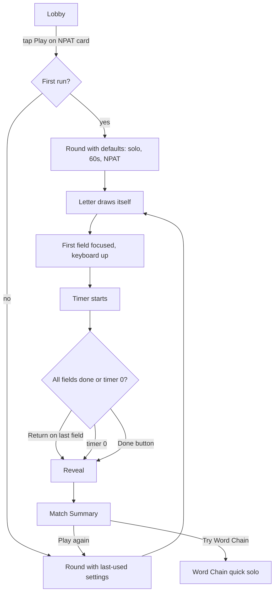
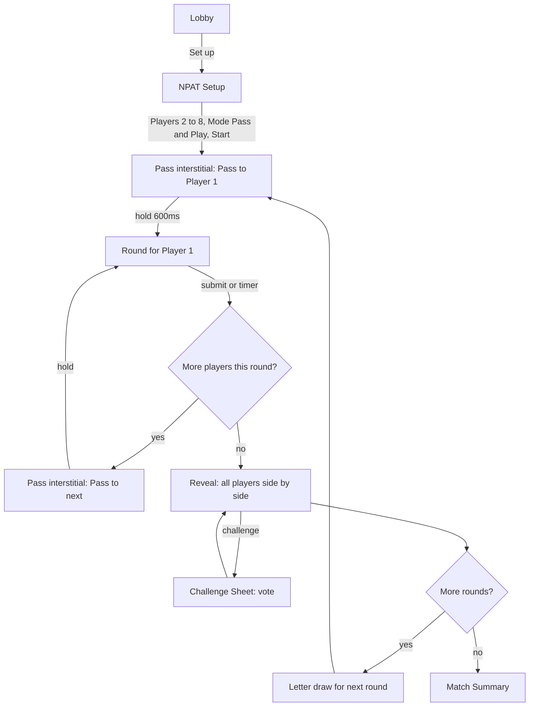
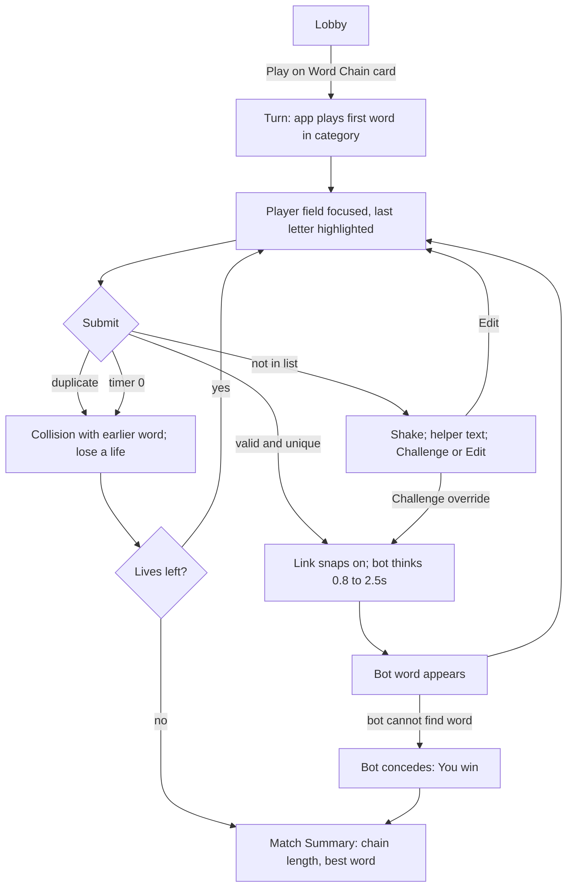
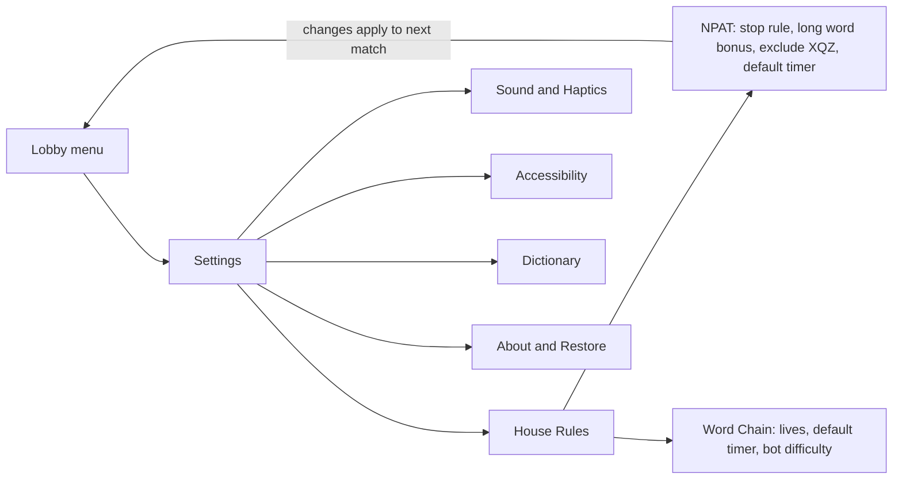
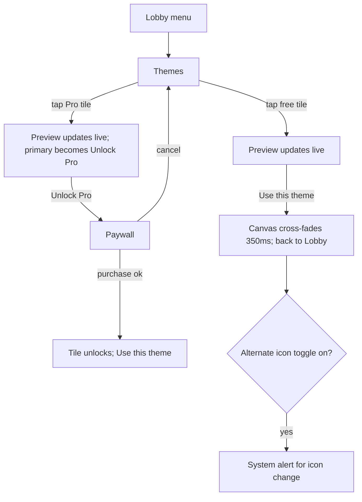
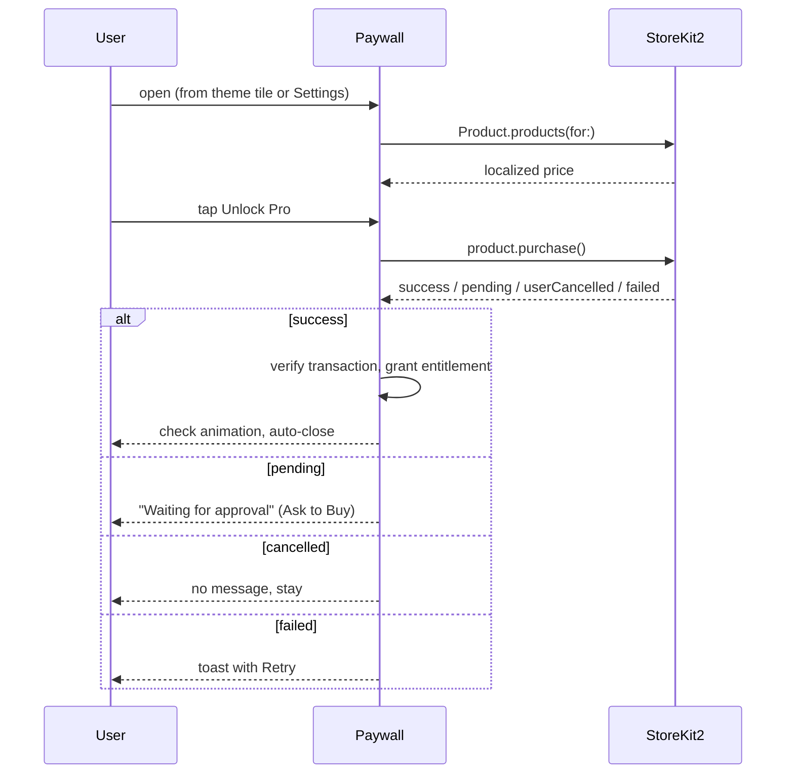
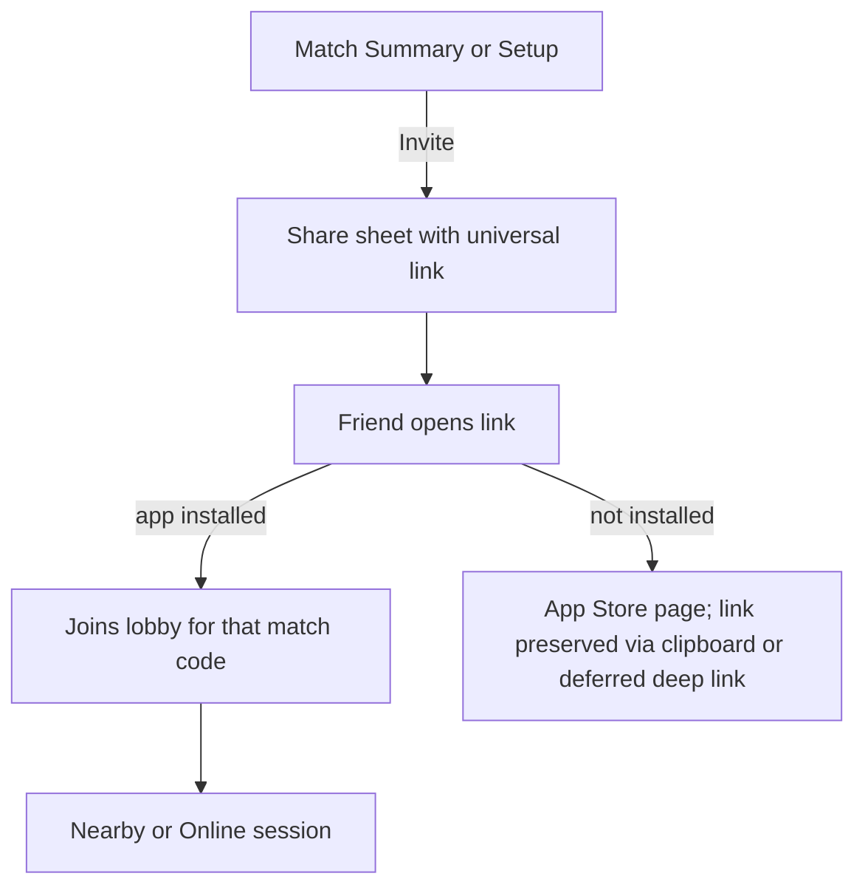

# 08. UX Flows and Screens (App 1, "Inkwell")

**Document status:** Draft v0.1, 2026-10-04. Owner: **[DESIGN — Design Director, "Sofia Lindqvist"]** with **[GAME — Game Designer, "Kenji Watanabe"]** and **[IOS — Lead iOS Engineer, "Marcus Oyelaran"]**. Contributors: JOBS, QA, DATA, ARCH.

**Read this if...** you are building or reviewing any screen in Inkwell v1, writing acceptance criteria, implementing the NPAT answer-entry or Word Chain turn screens, choosing how the chain is drawn, wiring haptics and sounds to interactions, or writing the words that appear on screen. This document defines the information architecture, the first 60 seconds, every v1 screen, the key flows as diagrams, two deep dives with alternative layouts, the scoring reveal, the haptic and sound map, accessibility behavior per screen, the voice and tone guide, and edge-case UX. It assumes the visual direction and tokens in 07 and the motion catalog in 09.

## Table of contents

1. Information architecture
2. First run, second by second
3. Screen inventory with states and acceptance criteria
4. Flows (mermaid)
5. Deep dive: NPAT answer entry
6. Deep dive: Word Chain turn screen
7. Scoring reveal choreography
8. Haptic and sound map per interaction
9. Accessibility behaviors per screen
10. Copywriting voice and tone, with 30 strings
11. Error and edge-case UX
12. Decisions and open questions
13. Sources

---

## 1. Information architecture

Inkwell has one root screen, two games, and a small set of utility screens. There is no tab bar. The root is the Lobby; everything is one tap from it.

```
Lobby (root)
├── NPAT
│   ├── Quick Solo (one tap, defaults)
│   ├── Setup (players, categories, timer, house rules)
│   ├── Pass-and-Play Interstitial
│   ├── Round (letter + answer entry)
│   ├── Reveal (scoring, duplicates, challenges)
│   └── Match Summary
├── Word Chain
│   ├── Quick Solo vs Bot (one tap, defaults)
│   ├── Setup (mode, category, timer, lives)
│   ├── Turn (chain + entry)
│   ├── Turn Result (valid / duplicate / out)
│   └── Match Summary
├── Themes (picker; Pro gate on paid themes)
├── Pro (paywall, restore)
├── Settings
│   ├── House Rules (per game defaults)
│   ├── Sound and Haptics
│   ├── Accessibility (in-app overrides, links to system)
│   ├── Dictionary and Language (v1: English only)
│   └── About, Privacy, Restore Purchases
└── Invite (future; hidden in v1)
```

Design rule: the Lobby shows two large cards (NPAT, Word Chain). Each card has one primary action ("Play") that starts a round with last-used settings, and one secondary text action ("Set up") that opens setup. Themes, Pro and Settings are a single trailing icon button in the navigation bar; Pro is also surfaced contextually in the theme picker.

> **[JOBS]** Two cards. One button each. If I see a "Daily Challenge" card, a news card, or a "rate us" card on the Lobby in v1, it is gone. The Lobby is a door, not a lobby.
>
> **[GAME]** I accept two cards, but I want each card to show the last letter and last score as a tiny line, so returning players feel continuity. It is one line of secondary text, no interaction.
>
> **DECISION:** Lobby is two cards plus one nav-bar icon. Each card may show one line of recent-play context.

---

## 2. First run, second by second (0 to 60 s)

Standard: a brand-new user reaches a live, editable NPAT round within ten seconds of tapping the icon, with no account, no permission prompt and no tutorial carousel. The HIG onboarding guidance supports this: let people explore before requiring anything, keep onboarding brief, teach through contextual hints. Source: https://developer.apple.com/design/human-interface-guidelines/onboarding

| Time | What the user sees | What the system does | Design notes |
|------|--------------------|----------------------|--------------|
| 0.0 s | Icon tap | Launch; static launch screen is the theme canvas (cream page), no logo | Launch screen must be indistinguishable from the Lobby canvas so there is no "flash" |
| 0.4 s | Lobby appears: two cards; the NPAT card already shows a letter being drawn (hero animation M01) | Load last settings or defaults; prewarm dictionary; no network | Hero animation doubles as the "what is this" explanation: a letter, four blanks |
| 1.5 s | The NPAT card's drawn letter finishes; "Play" button is present and stable | Haptic none; sound none on first launch (respect silent switch) | The card is tappable from 0.4 s; animation never blocks input |
| 2 to 4 s | User taps "Play" | Round starts with defaults: solo, 60 s, Name Place Animal Thing, letter drawn | No setup screen on first run; defaults are the tutorial |
| 4.0 s | Round screen: the letter writes itself large (M01, 600 ms), four ruled fields appear with a 60 ms stagger, keyboard rises, first field focused | Timer does not start until the letter finishes writing and the first field is focused | Ten-second clock is met at ~4.6 s |
| 4.6 s | Timer starts; a single inline hint under the first field: "Something starting with P" | OnboardingHint component, one at a time, dismissed on first keystroke | No overlay, no coach-mark dimming |
| 5 to 50 s | User types; Return advances to the next field; a second hint appears once on the last field: "Return to finish early" | Validation runs after submit, not while typing | Never flag a word as wrong mid-typing on first run |
| 50 to 60 s | Timer ends or user finishes; Reveal screen scores each answer with the reveal choreography (section 7) | Dictionary check, duplicate check (none in solo), score tally | The reveal is the first "wow"; it must be under 6 s total |
| ~60 s | Match Summary with one primary "Play again" and one secondary "Try Word Chain" | Store defaults; mark first-run complete; still no account, no prompts | Theme picker and Pro are never shown in the first session unless the user navigates there |

What we deliberately do not do in the first 60 seconds: ask for notifications, ask for a name, show a sign-in, show a paywall, ask for a rating, explain scoring in text, or play music.

> **[JOBS]** This table is the product. I will test it with a stopwatch on an iPhone 12, not a 16 Pro. If the letter animation makes the clock run over ten seconds, the animation gets shorter, not the standard.
>
> **[IOS]** Dictionary prewarm on launch is the only thing that could threaten this. ARCH's plan loads the compressed word list lazily; validation on the first reveal may take 200 ms longer on first run. Acceptable because the reveal is after the ten-second line.
>
> **[QA]** Acceptance test FR-01: cold launch to first editable field under 10 s on iPhone 12, iOS 17, airplane mode. FR-02: zero system permission prompts in the first session. FR-03: zero modal sheets before the first round. These three block release.
>
> **DECISION:** First run goes straight to a solo NPAT round. Hints are inline, one at a time, dismissed by the user's own action.

---

## 3. Screen inventory with states and acceptance criteria

Every screen lists purpose, content, primary action, states and acceptance criteria. "States" always covers empty, loading, error and success where they apply. Principle references are to 07 section 1.

### 3.1 Lobby

- **Purpose:** choose a game and start it in one tap.
- **Content:** two game cards (title, one line of recent context, drawn letter preview on NPAT, short chain preview on Word Chain), one nav-bar icon (menu: Themes, Pro, Settings).
- **Primary action:** "Play" on each card. Secondary: "Set up".
- **States:** empty (first run: context line says "New game"); loading (none visible; cards render from local state); error (none possible offline); success (n/a).
- **Acceptance:** cards tappable within 400 ms of launch; both cards fully visible at AX5 Dynamic Type without scrolling on 6.1 inch screens (allowed to scroll on 5.4 inch); passes principles 2 and 3.

### 3.2 NPAT Setup

- **Purpose:** configure a match without reading a manual.
- **Content:** Players (stepper 1 to 8, names editable inline; "Solo" when 1); Mode segmented control (Solo, Pass and Play, Nearby [disabled v1 with "Soon"], Online [hidden v1]); Categories (chips: Name, Place, Animal, Thing on by default; Movie, Food, Brand, Custom); Timer (Off, Relaxed 90 s, Standard 60 s, Blitz 30 s); Rounds (3, 5, 10, Until Stopped); House rules disclosure (Stop rule, Long word bonus, Exclude X Q Z).
- **Primary action:** "Start" pinned at bottom.
- **States:** empty (defaults); loading (none); error (duplicate player names: inline "Two players named Sam. Add an initial?"; zero categories: Start disabled with helper); success (navigates to Round or Pass interstitial).
- **Acceptance:** Start is reachable without scrolling at default Dynamic Type; every control has a VoiceOver label and value; changes persist as the new defaults; no setting requires more than two taps.

### 3.3 Pass-and-Play Interstitial

- **Purpose:** hand the phone over without the next player seeing answers.
- **Content:** full-screen "Pass to Priya" with avatar; "Hold to start" button (press and hold 600 ms); small text "Previous answers are hidden".
- **Primary action:** hold to start.
- **States:** loading (n/a); error (release early: button resets with a gentle bounce, no text); success (reveals Round).
- **Acceptance:** nothing from the previous player's round is visible or in the view hierarchy (QA screenshot test); hold threshold is adjustable in Accessibility settings (300 to 1200 ms); works with Switch Control via a long-press alternative action.

### 3.4 NPAT Round (answer entry)

Detailed in section 5. Acceptance in short: letter visible at all times; timer visible and never covers a field; keyboard never covers the focused field; accidental dismissal protected; every field reachable at AX5.

### 3.5 NPAT Reveal

Detailed in section 7. Acceptance in short: complete reveal under 6 s for up to 8 players with Skip available at 0.5 s; duplicates visibly paired; challenge affordance on every non-blank answer; totals match the engine's deterministic score to the point.

### 3.6 Match Summary (shared by both games)

- **Purpose:** celebrate, then continue.
- **Content:** winner (or your score in solo), per-player totals, best answer of the match (longest unique), "Play again" primary, "Change setup" and "Back to Lobby" secondary, share button (renders an image card of the results).
- **States:** loading (image render for share is async; button shows spinner but screen is live); error (share failed: toast "Could not share. Try again."); success (confetti alternative per theme, see 09 M16).
- **Acceptance:** "Play again" starts a new match with identical settings in one tap; share image respects the active theme and includes no personal data beyond names entered by the user.

### 3.7 Word Chain Setup

- **Content:** Mode (Solo vs Bot, Pass and Play); Category (Countries, Cities, Animals, Foods, Movies, Anything); Turn timer (Off, Relaxed 30 s, Standard 15 s, Blitz 7 s); Rules (Elimination with 1 to 3 lives, or Points to 50/100); Bot difficulty (Easy, Normal, Hard).
- **Primary action:** "Start".
- **States:** error (none possible beyond empty names); success (first word is drawn by the app or chosen by the first player, per rules).
- **Acceptance:** same as NPAT Setup.

### 3.8 Word Chain Turn

Detailed in section 6.

### 3.9 Word Chain Turn Result

- **Purpose:** show the outcome of a submission without leaving the chain view.
- **Content:** inline, not a new screen: valid (link snaps on), duplicate (word collides with its earlier twin, which scrolls into view), invalid (word shakes, helper "Not in our Countries list. Challenge?"), out (life pip breaks or player row strikes through).
- **Acceptance:** outcome visible within 300 ms of submit; each outcome distinguishable with sound off and color blind (icon plus text).

### 3.10 Theme Picker

- **Content:** three tiles (Paper & Ink, Swiss Editorial, Night Lounge with Pro badge); live preview region above the tiles showing the Round screen in that theme with a drawn letter; "Use this theme" primary; alternate app icon toggle.
- **States:** loading (none; themes are bundled); error (Pro purchase fails: toast, tile remains locked); success (theme applies with 350 ms canvas cross-fade; alternate icon prompt appears only after explicit toggle).
- **Acceptance:** selecting a free theme never shows a paywall; selecting a locked theme previews it fully and shows "Unlock Pro" as the primary action; switching themes does not move any tap target (principle 7 test).

### 3.11 Pro Paywall

- **Content:** one price, what you get (Night Lounge theme, alternate icons, custom categories unlimited, future online play when available), "Unlock Pro" primary, "Restore purchases" text button, legal links. No timer, no fake discount, no "most popular" badge.
- **States:** loading (price fetch via StoreKit 2; skeleton on the price only); error (store unavailable: "The App Store is not reachable. Try again later." with Retry); success (check, close, return to the theme picker with the tile unlocked).
- **Acceptance:** price shown in local currency from StoreKit; restore works without sign-in prompts beyond Apple's own; passes App Review guideline 3.1.1 expectations (owned by the monetization document).

### 3.12 Settings

- **Content:** grouped list: House Rules (per game), Sound and Haptics (master toggles, sound pack per theme, haptic intensity), Accessibility (hold duration, always show timer numerically, one-field-at-a-time always on, high-contrast ink), Dictionary (strictness: Standard, Lenient; show "Why?" explanations), About (version, privacy policy, acknowledgements for OFL fonts and word lists), Restore Purchases.
- **States:** none special; all local.
- **Acceptance:** every row is a standard system control; no custom switches.

### 3.13 Challenge Sheet

- **Content:** the challenged word, its category, the dictionary's verdict with a one-line reason ("Not found in Places" or "Found: a city in Peru"), vote buttons for pass-and-play (Accept, Reject) or a single Override for solo.
- **Acceptance:** challenge never blocks the reveal more than it must; verdict appears within 200 ms; override is recorded in match history for the summary.

### 3.14 Invite (future, hidden in v1)

- Documented in flow 4.8 only. Not built in v1.

---

## 4. Flows

### 4.1 Start a quick solo NPAT round



### 4.2 Pass-and-play setup and round



Note on the stop rule: when enabled, the first player to finish ends the round for everyone in pass-and-play by setting a shared 10 s grace timer for players who have not yet had the phone; GAME to confirm whether the grace applies per player or ends immediately (OPEN below).

### 4.3 Word Chain solo vs bot



### 4.4 Results and scoring reveal

```mermaid
sequenceDiagram
  participant UI
  participant Engine
  participant Dict
  UI->>Engine: round answers (all players)
  Engine->>Dict: validate each answer (category, letter)
  Dict-->>Engine: verdicts with reasons
  Engine->>Engine: duplicate detection (normalized), scoring
  Engine-->>UI: ordered reveal script (per category, per player)
  UI->>UI: Category 1 header slides in
  loop each player
    UI->>UI: answer card flips, score chip pops (10/5/0)
  end
  UI->>UI: duplicates pair with collision animation
  UI->>UI: repeat for categories 2..n
  UI->>UI: totals tally up
  UI-->>UI: Skip available from 0.5s; Challenge on long press any card
```

### 4.5 Settings and house rules



### 4.6 Theme picker



### 4.7 Purchase of Pro



### 4.8 Invite flow (future, not v1)



> **[ARCH]** Invite requires either Game Center invitations or our own match codes. Documented here as a shape only; the networking document decides.

---

## 5. Deep dive: NPAT answer entry

This is the most-used screen in the app and the one where the ten-second standard, the hero principle and accessibility collide. Reference for data-entry conventions: HIG Entering data, https://developer.apple.com/design/human-interface-guidelines/entering-data

### 5.1 Requirements

1. The letter is visible at all times, including with the keyboard up and at AX5.
2. The timer is visible at all times but never larger than the letter and never covers a field.
3. The keyboard never covers the focused field.
4. Four fields must be reachable with the keyboard alone (Return advances; the last Return submits).
5. Submitting is one gesture; dismissing by accident is impossible.
6. Blanks are allowed; the player may submit with empty fields.
7. Auto-advance never steals focus mid-word.

### 5.2 Three alternative layouts

**Layout 1: Four fields, stacked, letter pinned top**

The letter (font.letter, clamped) sits top-left with the timer ring top-right. Four AnswerFields stack below. With the keyboard up on a 6.1 inch screen at default type, all four fields and the letter remain visible. At AX3 and above, the stack no longer fits; the layout scrolls, which risks hiding the letter.

- Pros: all answers visible at once, matches the paper mental model, easy to review before submit.
- Cons: breaks at large Dynamic Type; four fields plus keyboard is tight on 5.4 inch devices; Return-to-advance order must be obvious.

**Layout 2: One field at a time, paged**

The letter stays large and centered above a single field. The category label is the field's title ("Place"). Return advances to the next page with a horizontal slide; a four-dot progress indicator shows position; swiping back revisits. The timer is a thin bar under the letter.

- Pros: letter stays huge; perfect for AX sizes; focus is unambiguous; each category gets its own hero moment.
- Cons: players cannot see all answers together; back-navigation costs time under a countdown; feels slower for experts.

**Layout 3: Hybrid, compact stack that expands the focused field**

Four fields stacked, but only the focused field is full height with its label; the other three collapse to one line showing category and typed text. The letter remains pinned above. At AX sizes the collapsed rows shrink to category initials and the layout degrades toward Layout 2 automatically.

- Pros: letter always visible; all answers glanceable; scales to AX by design; expert players move fast.
- Cons: more motion on focus change (must be tame under Reduce Motion); more complex component; the collapsed rows are small tap targets unless padded.

### 5.3 Comparison

| Criterion | L1 Stacked | L2 Paged | L3 Hybrid |
|-----------|:-:|:-:|:-:|
| Letter always visible | 3 | 5 | 5 |
| Review before submit | 5 | 2 | 4 |
| AX5 usability | 2 | 5 | 4 |
| Speed for experts | 4 | 3 | 5 |
| Implementation effort (eng-weeks) | 0.5 | 1 | 1.5 |
| Fits Paper & Ink metaphor | 5 | 3 | 4 |

**Recommendation:** Layout 3 as default with Layout 2 as the automatic fallback at AX3 and above and as an always-on accessibility option ("One answer at a time" in Settings). Layout 1 is retired after prototyping, except as the Reduce Motion rendering of Layout 3 (no expand animation, fixed heights).

### 5.4 Interaction details

- **Keyboard:** standard alphabetic keyboard, autocorrect on (names and places benefit), autocapitalization words, smart punctuation off, Return key labeled "Next" on fields 1 to 3 and "Done" on field 4 via `submitLabel`. No custom keyboard.
- **Letter display:** the letter never scrolls away. Under the keyboard-up condition the letter is allowed to shrink to 96 pt (its clamp floor) with a 200 ms animation, and grows back when the keyboard hides.
- **Timer visibility:** ring top-right at 36 pt with numeric center; in the last 10 s the digits also appear as a thin bar under the letter so peripheral vision picks it up. "Always show numeric timer" is an accessibility setting.
- **Auto-advance:** only on Return. Never on word boundary, never on autocorrect commit. A player who types "New York" is not advanced after "New".
- **Submit affordance:** "Done" on the keyboard for field 4, plus a persistent "Finish" text button in the navigation bar for finishing early from any field. Both go straight to Reveal (no confirmation) when all four fields have content. If any field is blank, a non-blocking sheet asks "Submit with 2 blanks?" with "Submit" primary and "Keep writing" secondary; this sheet is suppressed when the timer has under 5 s left.
- **Accidental dismissal:** the Round screen is not a sheet; there is no swipe-down. Back navigation is replaced by a "Quit round" text button that opens a confirmation ("Quit this round? Your answers will not count."). Interactive pop gesture is disabled on this screen. App backgrounding pauses the timer in solo and records the pause in pass-and-play (GAME: OPEN whether backgrounding in pass-and-play forfeits the turn).
- **Paste:** allowed; pasted text is trimmed to one line.
- **Validation timing:** none while typing in v1. Live validation (green underline as you type) is a tested variant in the skunkworks track because GAME worries it changes the feel from "writing" to "being graded".

> **[GAME]** Live validation is a trap. The joy of NPAT is committing and then finding out. If the app tells you mid-word that "Quito" is fine, the reveal has nothing to reveal.
>
> **[IOS]** Counterpoint: a lenient live hint for letter mismatch only ("That does not start with P") saves the most common wasted answer. It is not grading, it is a typo guard.
>
> **[DESIGN]** Accept the letter-mismatch hint only, shown as a quiet helper line, never red, never blocking.
>
> **DECISION:** Layout 3 default, Layout 2 at AX3+ and as a setting. No live dictionary validation. Letter-mismatch helper allowed. No swipe to dismiss; explicit Quit with confirmation.
>
> **OPEN:** Backgrounding during a pass-and-play turn: pause or forfeit. GAME to decide in the rules document.

---

## 6. Deep dive: Word Chain turn screen

### 6.1 Requirements

1. The last letter of the previous word is the hero (principle 1). It must be larger and higher-contrast than any other character on screen.
2. The chain history is visible enough to avoid duplicates, but the player should not have to scroll to play.
3. The per-turn timer, when on, is visible and never covers the entry field.
4. Duplicate detection reveals which earlier word was duplicated.
5. Works with one hand, portrait only in v1.

### 6.2 Three chain visualization alternatives

**Option V: Vertical scroll (shopping list)**

Words listed top to bottom, newest at the bottom just above the entry field; the shared letter between consecutive words is underlined in the accent and connected by a short stroke. The list auto-scrolls to keep the newest visible; the player can scroll up to review. In Paper & Ink, older words fade like earlier lines on a page.

- Pros: natural reading order; unlimited length; easy accessibility (a plain list for VoiceOver); cheap.
- Cons: the hero letter sits mid-screen rather than at a focal point; long chains show only the last 6 to 8 words without scrolling.

**Option R: Horizontal ribbon**

Words run left to right in a single typographic line that scrolls to keep the latest word's last letter at a fixed anchor point near screen center, directly above the entry field. The shared letters are set in the accent so the ribbon reads as one word stream. Swipe left to review history.

- Pros: the hero letter is always at the same spot; the typographic object is beautiful in Swiss Editorial; strong sense of momentum.
- Cons: long words overflow narrow screens; horizontal scrolling of text is poor for VoiceOver unless an alternate list is provided; RTL languages (App 3) complicate direction.

**Option S: Spiral or path**

Words placed along a gently curving path (spiral or S-curve) that winds down the screen; each word is a bead; the latest bead sits at the path's end near the field. In Playful Pop the chain physically sways when a bead snaps on; in Night Lounge the path is a neon tube.

- Pros: most distinctive; strong theme expression; the chain's growth is visible as a shape.
- Cons: hardest to make legible at AX sizes; expensive layout; curved text is a VoiceOver and Dynamic Type liability; risk of style over substance.

### 6.3 Comparison and recommendation

| Criterion | V Vertical | R Ribbon | S Spiral |
|-----------|:-:|:-:|:-:|
| Hero letter prominence | 3 | 5 | 4 |
| Duplicate review ease | 5 | 3 | 2 |
| AX5 and VoiceOver | 5 | 3 | 1 |
| Theme expressiveness | 3 | 4 | 5 |
| RTL and other scripts (App 3) | 5 | 2 | 3 |
| Effort (eng-weeks) | 0.5 | 1 | 2.5 |

**Recommendation:** Option V as the structural default, with a "hero strip" borrowed from R: the latest word's last letter is lifted out of the list and rendered large (font.letter at 96 to 140 pt) directly above the entry field, so the hero is at a fixed focal point while history stays a plain list. Option R ships as the rendering for Swiss Editorial only if its VoiceOver alternate (a hidden list) is implemented. Option S is skunkworks, revisited for Playful Pop.

### 6.4 Interaction details

- Entry field pre-filled with the required first letter as a non-deletable prefix (rendered as part of the field, not as text, so VoiceOver reads "Starts with S, text field").
- Submit on Return. Empty submit does nothing.
- Valid: link snap (09 M11), the word slides into the list, hero letter updates with a flip.
- Duplicate: the earlier twin scrolls into view and both words collide (09 M12); a life pip breaks. Text helper: "Already played by Priya, 6 turns ago."
- Not found: field shakes once (Reduce Motion: underline turns danger), helper "Not in our Countries list." with "Challenge" and "Edit" buttons. Challenge opens the Challenge Sheet; in solo the player can override, and the override is counted in the summary ("2 overrides").
- Timer: thin bar above the field; at under 3 s the hero letter pulses (Reduce Motion: bar turns danger color only).
- Bot turn: a "thinking" indicator (three ink dots) for 0.8 to 2.5 s scaled by difficulty; the bot's word appears with the same link snap. The bot never answers instantly, because instant answers feel like cheating.
- Long-press on any chain word: Challenge Sheet for that word, with the dictionary's verdict and reason.

> **[DATA]** Normalization matters for duplicates: "Sao Paulo", "São Paulo" and "sao paulo" are the same word. The engine normalizes diacritics, case, whitespace and common punctuation before comparison; the UI shows the player's original spelling. Also the "last letter" must be the last letter of the normalized word, so "Québec" ends in C, not a combining accent.
>
> **[IOS]** And the hero strip must use the normalized letter in the theme's font; handwriting faces like Caveat lack some diacritic glyphs, so the strip always falls back to the system font for non-ASCII letters in v1.

---

## 7. Scoring reveal choreography

The reveal is the climax of NPAT. It must be fast enough not to bore eight players and slow enough that each answer lands.

### 7.1 Sequence (default theme)

1. **Header** (0 to 300 ms): category name slides in from the left, written in the margin.
2. **Answers** (per player, 350 ms each, overlapping by 150 ms): each player's answer card flips from face-down to face-up; the score chip pops with 10, 5 or 0 and the matching haptic (section 8).
3. **Duplicates** (after all answers in the category): matched answers are pulled toward each other with a short collision (09 M12), both chips change from 10 to 5 with a numeric roll, and a DuplicateBadge ("Same") appears on both. Players hear the "tock".
4. **Invalid or blank**: the card flips to show a dash; the chip shows 0; a one-line reason is shown in ink.secondary ("Not a place" or "Blank"). A Challenge affordance (long press, or a small text button when VoiceOver is on) is on every non-blank card.
5. **Next category**: repeat 1 to 4. Categories reveal in the order played.
6. **Totals** (last 800 ms): per-player totals tally up with `contentTransition(.numericText())` (09 M14); the round leader's row gets the theme's hero accent.
7. **Skip**: available from 0.5 s; tapping jumps to the final state with every chip in place and no animation debt.

Total time for 4 categories and 4 players: roughly 4 categories x (0.3 + 4 x 0.2 + 0.4) + 0.8 = 6.0 s. For 8 players we overlap more aggressively (100 ms between players) to hold under 8 s.

### 7.2 Challenge flow UI

- Long press (or tap the small "Challenge" button under VoiceOver) opens the Challenge Sheet.
- The sheet shows the word, the category, the dictionary verdict and reason, and vote buttons in pass-and-play ("Accept" and "Reject", majority wins, ties go to the writer) or a single "Count it anyway" or "Strike it" pair in solo.
- Resolving a challenge re-runs scoring for that category only; affected chips roll to new values; totals re-tally.
- Challenges are recorded in the Match Summary as a small line ("1 challenge, accepted").

> **[GAME]** Two scoring design notes. First, the 10/5/0 reveal must show 10 first and then drop to 5 for duplicates. The drop is the emotional beat. Second, long word bonus (house rule) shows as a separate "+2" chip that arrives after the main chip so the base score is always legible.
>
> **[JOBS]** Six seconds for a reveal is the maximum. If the room is quiet for six seconds, we lost them. The Skip must be obvious without being a button that steals the hero spot. A tap anywhere on the background skips.
>
> **DECISION:** Reveal per category, per player, duplicates after each category, totals last, tap-anywhere to skip. Six-second cap at 4 players; eight-second cap at 8.

---

## 8. Haptic and sound map per interaction

Haptics use SwiftUI's `sensoryFeedback(_:trigger:)` where a system pattern fits and Core Haptics (AHAP files) for custom patterns, as detailed in 09. Sources: https://developer.apple.com/documentation/swiftui/view/sensoryfeedback(_:trigger:) and https://developer.apple.com/documentation/corehaptics. Sound respects the silent switch and the in-app master toggle; sounds are per theme (09 section 6). The HIG guidance on haptics is at https://developer.apple.com/design/human-interface-guidelines/playing-haptics

| Interaction | Haptic | Sound (Paper & Ink) | Notes |
|-------------|--------|---------------------|-------|
| Tap Play | `.impact(weight: .light)` | none | silence before the letter |
| Letter draws | custom AHAP "pen scratch" (3 soft transients over 600 ms) | pencil stroke | Reduce Motion: single `.impact(.light)` |
| Timer starts | none | soft page settle | avoid startling |
| Field focus change | `.selection` | none | |
| Return to next field | `.selection` | faint pencil tick | |
| Letter-mismatch helper | none | none | quiet by design |
| Submit round | `.impact(weight: .medium)` | pen tap on paper | ink bleed visual |
| Reveal: unique answer (10) | `.impact(weight: .rigid)` | short "tick" | one per card |
| Reveal: duplicate (5) | `.impact(weight: .soft)` twice, 80 ms apart | muted "tock" | collision visual |
| Reveal: blank or invalid (0) | none | pencil scratch-out | absence as signal |
| Totals tally | custom AHAP continuous, intensity decays over 700 ms | rising paper rustle | Reduce Motion: single `.success` |
| Round leader highlighted | `.success` | soft chime | |
| Timer last 10 s | `.impact(.light)` each second | faint tick each second | user can disable in Settings |
| Timer end | `.warning` | page slap | |
| Chain link valid | `.impact(.rigid)` | link click | |
| Chain duplicate | `.error` | double tock | life pip breaks |
| Chain word not found | `.warning` | eraser | |
| Life lost | `.error` | pencil snap | |
| Bot thinking | none | faint pencil hover loop (very quiet) | |
| Pass phone hold | `.selection` at 0 ms, continuous ramp to 600 ms, `.success` on reveal | paper slide | hold progress |
| Theme applied | `.impact(.soft)` | page turn | |
| Purchase success | `.success` | ink stamp | |
| Error toast | `.error` | none | |
| Challenge resolved | `.impact(.medium)` | stamp | |

Rules: never stack two haptics within 60 ms except the designed double for duplicates; never play a sound without a visual; the master haptic toggle in Settings overrides everything except system alert feedback.

---

## 9. Accessibility behaviors per screen

Baseline for all screens: Dynamic Type through AX5 with reflow (never truncation of game text), VoiceOver labels and hints on all controls, 44 pt targets, color never the sole state signal, Reduce Motion alternatives from 09, Bold Text respected, Increase Contrast uses the theme's high-contrast token set, Switch Control reachable actions for all gestures (long press and hold have button equivalents).

| Screen | VoiceOver order | Dynamic Type at AX5 | Reduce Motion | Other |
|--------|-----------------|---------------------|---------------|-------|
| Lobby | Title, NPAT card (as one element: "Name Place Animal Thing, last played letter P, score 85, button, Play"), "Set up", Word Chain card, Menu | Cards stack and scroll; letter preview shrinks | Letter preview static | Cards are grouped containers |
| NPAT Setup | Players stepper, names, Mode, Categories (each chip a toggle button), Timer, Rounds, House rules, Start | Chips wrap to multiple rows; Start pinned | Chip selection without scale | Stepper announces "3 players" |
| Pass interstitial | "Pass to Priya", "Hold to start, button, double-tap and hold" plus an "Start now" alternative action in the rotor | Text wraps | Hold fill only | Hold threshold adjustable |
| NPAT Round | Letter ("Letter P, heading"), Timer ("45 seconds remaining", updates every 10 s and each of the last 5 s, not every second), Field 1 to 4, Finish, Quit | Switches to one-field-at-a-time automatically; letter clamps at 220 pt | Fields expand without animation; no shake; no pulse | Keyboard never covers field; timer announcements are polite, not interrupting |
| NPAT Reveal | Category header, then each player: "Priya, Paris, 10 points" or "Priya, Paris, 5 points, same as Marcus", Challenge button, Totals | Cards become full-width rows; chips wrap | Cards appear with fades; no collision; DuplicateBadge fades in | Reveal auto-pauses announcements between categories so VoiceOver can catch up; Skip is a visible button under VoiceOver |
| Match Summary | Winner, totals list, Play again, Change setup, Share | Totals list scrolls | No confetti; static celebration glyph | Share image includes alt text in the share sheet subject |
| Word Chain Turn | Hero letter ("Starts with S, heading"), Timer, Entry field ("Starts with S, text field"), Chain history list (newest first for VoiceOver, newest last visually), Lives, Quit | Hero clamps at 140 pt; list rows wrap | No link snap; words fade in | History list newest-first under VoiceOver so the relevant words are read first |
| Theme Picker | Preview ("Preview of Night Lounge theme"), tiles ("Night Lounge, locked, requires Pro"), Use this theme, Alternate icon toggle | Tiles stack vertically | Cross-fade becomes instant cut | Preview has a text description of the theme |
| Paywall | Title, benefits list, Price and Unlock button ("Unlock Pro, 4.99 dollars, button"), Restore, Terms, Privacy | Scrolls; Unlock pinned | None needed | No timers or urgency |
| Settings | Standard grouped list order | System behavior | n/a | System controls throughout |
| Challenge Sheet | Word, verdict, reason, vote buttons | Wraps | n/a | Reason is read before buttons |

Reference: HIG Accessibility, https://developer.apple.com/design/human-interface-guidelines/accessibility, and WWDC19 "Visual Design and Accessibility", https://developer.apple.com/videos/play/wwdc2019/244/ (Reduce Motion guidance). Apple's App Store Connect accessibility evaluation criteria for Reduced Motion: https://developer.apple.com/help/app-store-connect/manage-app-accessibility/reduced-motion-evaluation-criteria

> **[QA]** The timer is the most common VoiceOver failure in timed games: either it announces every second and talks over the player, or it never announces and the player is surprised by time-up. Announce at 30, 20, 10, then 5 to 1, and always announce "Time's up". Nothing else.
>
> **[IOS]** Agreed. Implementation note: timer announcements use `AccessibilityNotification.Announcement` with low priority so a player's typing is never interrupted mid-word.
>
> **DECISION:** Timer announcement schedule as QA specified. One-field-at-a-time is automatic at AX3+ and a setting otherwise.

---

## 10. Copywriting voice and tone

**Voice:** a sharp, warm friend who played this with you at school. Short sentences. Plain words. Dry humor in small doses, never in errors. Never exclamation marks in system messages; at most one in celebrations. No "Oops". No "Uh oh". No emoji in UI text.

**Tone by moment**

| Moment | Tone | Avoid |
|--------|------|-------|
| Lobby and setup | calm, direct | marketing language |
| During a round | nearly silent | tips, jokes, anything that reads like a distraction |
| Reveal | playful, specific | generic praise ("Awesome!") |
| Errors | plain, actionable, blame-free | humor, apology theater |
| Paywall | honest, brief | urgency, fake scarcity |
| Accessibility hints | literal, complete | cleverness |

**30 example strings**

| # | Context | String |
|---|---------|--------|
| 1 | Lobby, NPAT card primary | Play |
| 2 | Lobby, NPAT card secondary | Set up |
| 3 | Lobby, first run context line | New game |
| 4 | Lobby, return context line | Last round: P, 85 points |
| 5 | Round, first hint | Something starting with P |
| 6 | Round, second hint | Return finishes early |
| 7 | Round, letter mismatch helper | That does not start with P |
| 8 | Round, finish with blanks sheet title | Submit with 2 blanks? |
| 9 | Round, finish with blanks primary | Submit |
| 10 | Round, finish with blanks secondary | Keep writing |
| 11 | Round, quit confirmation | Quit this round? Your answers will not count. |
| 12 | Pass interstitial | Pass to Priya |
| 13 | Pass interstitial button | Hold to start |
| 14 | Pass interstitial footnote | Previous answers are hidden |
| 15 | Reveal, duplicate badge | Same |
| 16 | Reveal, duplicate helper | Same as Marcus |
| 17 | Reveal, invalid reason | Not a place |
| 18 | Reveal, blank reason | Blank |
| 19 | Reveal, long word bonus chip | +2 long word |
| 20 | Reveal, skip hint (VoiceOver only) | Skip reveal |
| 21 | Summary, solo | 85 points. Your best: Quokka. |
| 22 | Summary, winner | Priya wins by 15 |
| 23 | Summary, tie | Tie. Settle it with one more round? |
| 24 | Word Chain, entry placeholder | Starts with S |
| 25 | Word Chain, duplicate helper | Already played by Priya, 6 turns ago |
| 26 | Word Chain, not found helper | Not in our Countries list |
| 27 | Word Chain, challenge override | Count it anyway |
| 28 | Word Chain, bot concedes | The app is out of countries. You win. |
| 29 | Paywall title | Inkwell Pro |
| 30 | Store error | The App Store is not reachable. Try again later. |

Additional conventions: player names are always used where known ("Same as Marcus", not "Same as another player"); numbers are numerals; categories are capitalized as proper nouns only in headers; the app never refers to itself in the first person except the single bot concession line, which GAME insisted on.

> **[JOBS]** String 28 is the only joke in the app. It earns its place because the app losing is funny. Nothing else gets to be funny in v1.

---

## 11. Error and edge-case UX

| Edge case | Behavior | Owner |
|-----------|----------|-------|
| Timer ends while the player is mid-word | The partial word is kept and validated as typed; no sheet | GAME |
| App backgrounded during a solo round | Timer pauses; on return a small "Paused" chip shows for 1 s then the timer resumes after a 3-2-1 count | IOS |
| App backgrounded during a pass-and-play turn | OPEN: pause or forfeit | GAME |
| Phone call during a round | Same as background; audio session is interrupted and resumed | IOS |
| Low Power Mode | Grain shader off, hero animations shortened by 30 percent, sound unchanged | IOS |
| Dictionary cannot load (corrupt) | Validation falls back to "letter and non-empty" rule with a one-time toast "Word checking is unavailable. Scores are on trust." | DATA |
| Two players same name | Inline helper in Setup; names auto-suffixed with initials if ignored | DESIGN |
| Eight players at AX5 in Reveal | Reveal becomes a per-player paged view with "Next player" | DESIGN |
| Player types the letter itself as an answer ("P") | Treated as blank: "Too short" | GAME |
| Answer with trailing spaces or emoji | Normalized; emoji stripped; original shown | DATA |
| Custom category with no dictionary | Validation is letter-only; Reveal shows no reason text and a "Custom category: on trust" footnote | DATA |
| Stop rule triggered in pass-and-play | Players who have not had the phone get a 10 s turn; a banner "Priya stopped the round. 10 seconds." | GAME |
| Word Chain: no valid word exists in the category for the required letter | Bot concedes (solo); in pass-and-play the player may "Pass" once per match without losing a life, and the app draws a new starting letter | GAME |
| Theme purchase succeeds but entitlement not reflected | "Restore purchases" row in Settings; automatic transaction listener re-grants on next launch | IOS |
| Device rotated to landscape | v1 is portrait-locked for iPhone; iPad supports landscape with the same layouts widened | IOS |
| Deleted app with match in progress | No cloud state in v1; match lost; no message needed | ARCH |
| VoiceOver on and timer on | Default timer preset changes to Relaxed on first run; a one-time inline note explains | DESIGN |

---

## 12. Decisions and open questions

**DECISIONS**
1. Lobby is two cards plus one menu icon; no promotional surfaces.
2. First run goes directly into a solo NPAT round; inline hints only; no prompts of any kind in session one.
3. NPAT entry: Layout 3 (hybrid expanding stack) default; Layout 2 (paged) at AX3+ and as a setting; no live dictionary validation; letter-mismatch helper allowed; no swipe-to-dismiss on the Round screen.
4. Word Chain: vertical list with a lifted hero letter strip; ribbon only for Swiss Editorial with a VoiceOver list alternative; spiral is skunkworks.
5. Reveal: category by category, player by player, duplicates after each category, totals last, tap anywhere to skip, 6 s cap at 4 players.
6. Timer VoiceOver announcements at 30, 20, 10, 5 to 1, and time's up.
7. One joke in the app (bot concession).

**OPEN**
1. Backgrounding during a pass-and-play turn: pause or forfeit (GAME).
2. Stop rule grace: 10 s per remaining player or immediate end (GAME).
3. Whether the share image includes the drawn letter in the handwriting face for all themes or the theme's own letter style (DESIGN).
4. Live letter-mismatch helper: ship in v1 or hold for a usability test (DESIGN, GAME).

---

## 13. Sources

- HIG Onboarding: https://developer.apple.com/design/human-interface-guidelines/onboarding
- HIG Entering data: https://developer.apple.com/design/human-interface-guidelines/entering-data
- HIG Playing haptics: https://developer.apple.com/design/human-interface-guidelines/playing-haptics
- HIG Accessibility: https://developer.apple.com/design/human-interface-guidelines/accessibility
- HIG Layout: https://developer.apple.com/design/human-interface-guidelines/layout
- HIG Game Center: https://developer.apple.com/design/human-interface-guidelines/game-center
- SwiftUI sensoryFeedback: https://developer.apple.com/documentation/swiftui/view/sensoryfeedback(_:trigger:)
- SwiftUI ContentTransition: https://developer.apple.com/documentation/swiftui/contenttransition
- Core Haptics: https://developer.apple.com/documentation/corehaptics
- App Store Connect Reduced Motion evaluation criteria: https://developer.apple.com/help/app-store-connect/manage-app-accessibility/reduced-motion-evaluation-criteria
- WWDC19 Visual Design and Accessibility: https://developer.apple.com/videos/play/wwdc2019/244/
- WWDC18 Designing Fluid Interfaces (interruptible, redirectable gestures): https://developer.apple.com/videos/play/wwdc2018/803/
- Heads Up! (tilt gesture pacing reference): https://apps.apple.com/us/app/id623592465
