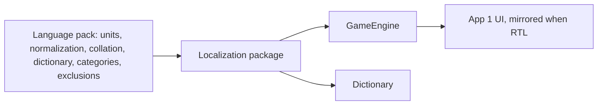

# App 3: Multilingual Inkwell, Short Story Plan

**Read this if...** you want to know what it would take to play Name Place Animal Thing and Word Chain in languages whose "letters" are not Latin letters, why we are not doing it yet, and the small number of things App 1 must do now so the door stays open. This is a back-burner item. It may ship as language packs inside App 1 rather than as a third app.

**Document status:** Draft v0.1, 2026-10-04, owner: [DATA] Omar Haddad, with [ARCH] Priya Raman. Back burner; no engineering committed.

---

## 1. Premise

Both Inkwell games rest on one operation: take a unit of writing (in English, a letter), ask players for words that start with it, and in Word Chain extract the last unit of a word to seed the next. Both games exist in dozens of languages under local names (see the master reference, Section 2), so demand is not the question. The question is whether "letter" survives translation. It does not. In each target language the unit is different, the dictionary is different, the default categories are different and sometimes the layout direction is different. App 3 is the plan for generalizing "letter" to "unit".

> **[JOBS]** This is a real product, and it is not this year's product. The only decision I want now is: what does App 1 have to avoid so that App 3 is a feature and not a rewrite?

## 2. Why "letter" breaks per language (with sources)

| Language or script | What breaks | Detail | Source |
|---|---|---|---|
| Spanish | Digraphs | "ch" and "ll" were treated as letters of the alphabet from 1803 until the Academies excluded them in 1994 and the 2010 Ortografía fixed the alphabet at 27 letters. Older players still expect a "ch" round; Tutti Frutti house rules differ by country. "ñ" is a letter in its own right and collates after "n". | [Wikipedia, Spanish orthography](https://en.wikipedia.org/wiki/Spanish_orthography); [Universidad de Piura, ¿La ch y la ll han desaparecido?](https://www.udep.edu.pe/castellanoactual/la-ch-y-ll-han-desaparecido/) |
| German | Umlauts and ß | Does "Ä" count as its own draw or as "A"? Stadt Land Fluss tables usually fold umlauts into the base vowel. "ß" never starts a word, so it is excluded from the pool; in Word Chain a word ending in ß (Fuß) must map to "s". Capital ẞ became an official variant in 2017 and the preferred capital form in 2024, so uppercase rendering must not assume "SS". | [Wikipedia, ß](https://en.wikipedia.org/wiki/%C3%9F); [Wikipedia (de), Stadt, Land, Fluss](https://de.wikipedia.org/wiki/Stadt,_Land,_Fluss) |
| Hindi (Devanagari) | Abugida | Each consonant carries an inherent "a"; dependent vowel signs (matras) attach above, below, left or right of the consonant. A "letter" draw must decide whether क and का and कि are the same unit. For Word Chain, Antakshari convention chains on the consonant of the final akshara regardless of matra. Grapheme clusters, not code points, are the unit. | [Wikipedia, Devanagari](https://en.wikipedia.org/wiki/Devanagari); [Wikipedia, Antakshari](https://en.wikipedia.org/wiki/Antakshari) |
| Arabic | Shaping and RTL | Letters take isolated, initial, medial and final forms chosen by the text engine, so a hero glyph for the draw must be rendered as an isolated form deliberately. Layout is right to left and the whole UI mirrors. Short vowels are usually unwritten, so dictionary matching must ignore optional diacritics. | [Wikipedia, Arabic script](https://en.wikipedia.org/wiki/Arabic_script); [Unicode UAX #9, Bidirectional Algorithm](https://www.unicode.org/reports/tr9/); [HIG, Right to left](https://developer.apple.com/design/human-interface-guidelines/right-to-left) |
| Japanese | Kana rules | Shiritori chains on the final kana. A word ending in ん loses the turn because almost nothing starts with it. House rules decide whether dakuten and handakuten are ignored (スープ may be followed by ふろ), whether a long vowel mark counts as the preceding vowel, and whether small kana such as しょ chain on しょ or on よ. Katakana and hiragana must be normalized to one script before comparison. | [Wikipedia, Shiritori](https://en.wikipedia.org/wiki/Shiritori); [Tofugu, Shiritori](https://www.tofugu.com/japanese/shiritori/); [Unicode UAX #15, Normalization Forms](https://www.unicode.org/reports/tr15/) |
| Korean | Syllable blocks | Hangul letters (jamo) are composed into syllable blocks; kkeunmaritgi chains on the last whole block, not the last jamo. Blocks must be compared in a fixed normalization form because precomposed and decomposed encodings differ. | [Wikipedia, Hangul](https://en.wikipedia.org/wiki/Hangul); [Go! Billy Korean, 끝말잇기](https://gobillykorean.com/practice-vocabulary-by-playing-%eb%81%9d%eb%a7%90%ec%9e%87%ea%b8%b0-korean-faq/); [Wikipedia, Word chain](https://en.wikipedia.org/wiki/Word_chain) |
| Chinese | Characters and idioms | Jielong chains on the last character; chengyu jielong chains four-character idioms, and many house rules accept a homophone of the last character. There is no "random letter" at all for an NPAT-style round, so NPAT in Chinese needs a different seed (a radical, a pinyin initial, or a character). | [Wikipedia, Word chain](https://en.wikipedia.org/wiki/Word_chain); [Wikipedia, Chengyu](https://en.wikipedia.org/wiki/Chengyu) |

> **[DATA]** The honest summary: English is the easy case and we got lucky. Every other row needs a definition of "unit", a normalization step and a collation order, and those three are per language, not per app.

## 3. Language-pack architecture sketch

The design replaces the hardcoded idea of a letter with a `Unit` abstraction supplied by a language pack. App 1's Localization package already defines the protocol; App 3 fills it in per language.

```swift
protocol WritingSystem {
  var drawPool: [Unit]                      // what the wheel can land on
  func firstUnit(of word: String) -> Unit   // for "starts with" checks
  func lastUnit(of word: String) -> Unit    // for Word Chain
  func normalize(_ s: String) -> String     // case, diacritics, kana script, NFC
  var collation: Locale                     // ICU collator for sorting the reveal
  var layoutDirection: LayoutDirection
}
```

| Component | Content | Notes |
|---|---|---|
| Unit definition | Per language: Latin letter, digraph set, grapheme cluster, kana after normalization, Hangul block, Han character | Grapheme clusters via Swift `Character`, which already iterates by extended grapheme cluster |
| Normalization | Unicode NFC or NFKC, case folding, optional diacritic folding, kana unification, Arabic diacritic stripping | [Unicode UAX #15](https://www.unicode.org/reports/tr15/) |
| Collation | ICU collation through `Locale` so the reveal sorts the way natives expect (ñ after n, ä with a) | [ICU User Guide, Collation](https://unicode-org.github.io/icu/userguide/collation/); [Apple, Locale](https://developer.apple.com/documentation/foundation/locale) |
| Dictionary pack | Per language: general words plus category lists, with frequency bands | Wiktionary dumps as the seed, CC BY-SA share-alike honored by publishing derived lists ([Wikimedia dumps](https://dumps.wikimedia.org/)) |
| Category localization | Not translation: the local default set (Stadt, Land, Fluss; Nombre, Apellido, Animal, Fruta) | From the master reference, Section 2.1 |
| Draw pool exclusions | Per language equivalent of "no Q, X, Z" (no ん in Japanese; no ß in German) | Part of the pack, editable as a house rule |
| Layout | RTL mirroring, isolated-form hero glyph for Arabic, vertical-space allowances for Devanagari matras | [HIG, Right to left](https://developer.apple.com/design/human-interface-guidelines/right-to-left); [Apple, Localization](https://developer.apple.com/documentation/xcode/localization) |
| Bots | Per-pack precomputed bot sheets | Same engine, new data |



> **[ARCH]** Nothing in the engine changes. `drawLetter` becomes `drawUnit` in name only; the reducer never inspects a unit beyond equality. That is the whole point of doing the abstraction in App 1 now.

## 4. Prioritized language list

| Priority | Language | Rationale | Market note |
|---|---|---|---|
| 1 | Spanish | Latin script, one digraph question, huge Tutti Frutti and Basta culture across Latin America and Spain | Largest non-English App Store language footprint reachable without new rendering work |
| 2 | German | Latin script; Stadt Land Fluss is a household name; umlaut and ß rules are small | High willingness to pay; classroom use |
| 3 | French | Latin script; Petit Bac is well known; accents fold cleanly | Rounds out the European trio in one pack format |
| 4 | Hindi | Antakshari culture and NPAT's own name come from India; first abugida, proves grapheme-cluster handling | Large audience; English UI often acceptable, which lowers the localization cost |
| 5 | Japanese | Shiritori is the best-known word chain in the world; forces kana normalization | Strong puzzle-game market; high design expectations |
| 6 | Portuguese (Brazil) | Latin script, "Adedonha" and "Stop" culture | Cheap once Spanish exists |
| 7 | Korean | Syllable-block unit; kkeunmaritgi is popular | Technically clean once grapheme logic exists |
| 8 | Arabic | RTL and shaping; the largest layout change | Do last; it also validates RTL for the whole app |
| 9 | Chinese | Needs a redesigned NPAT seed; chengyu jielong is a different game in spirit | Research only |

## 5. Three options

| Option | Description | Pros | Cons |
|---|---|---|---|
| A. Separate app | "Inkwell Worldwide" as a third binary | Clean marketing per region; no bloat in App 1 | Splits reviews and ratings; triples release burden for a two-person team |
| B. In-app language packs | App 1 downloads packs on demand (On-Demand Resources or hosted assets); the UI follows the device locale | One app, one review rating; packs are data not code; English users never see it | App 1 must be RTL-ready and unit-agnostic before the first pack; packs need a QA matrix |
| C. Kids-first bilingual learning angle | Ship packs in Inkwell Kids as a language-learning mode (Spanish for English-speaking kids and the reverse) | Clear educational story; parents pay for learning | Kids review constraints; pedagogy needs a specialist; narrower audience |

> **[DESIGN]** B is the only option that does not create a second visual identity to maintain. A Spanish user opening Inkwell should see Inkwell, in Spanish, with Tutti Frutti categories.

> **[KIDS]** C is attractive and I would not kill it. A bilingual NPAT is a genuinely good literacy exercise. But it is a mode inside a pack, not a reason to choose the architecture.

**Recommendation: decide later between A and B; design for B now.** B is the default assumption because it is the cheapest and the packs are pure data. The decision point is after App 1 reaches 1.2 and we can see where downloads come from. C survives as a Kids feature once a pack exists.

**What App 1 must do now so the door stays open:**

1. Never hardcode A to Z. The draw pool, first-unit and last-unit functions come from the Localization package (master reference, idea 24).
2. Iterate strings by `Character` (grapheme cluster), never by UTF-16 index.
3. Normalize before comparing; store normalized forms alongside display forms.
4. Use leading and trailing, never left and right, in layouts; run the RTL pseudo-locale in CI snapshots.
5. Render the hero glyph through a text API that accepts a locale, so Arabic isolated forms and Devanagari matras render correctly later.
6. Keep category names as identifiers with localized display names, not as English strings.
7. Keep the dictionary format language-agnostic (unit-keyed trie), so a Spanish pack is a file and not a code change.

## 6. Phased story

| Phase | Scope | Entry criteria | Exit criteria | Rough estimate |
|---|---|---|---|---|
| A. Research | Confirm unit rules with native speakers for Spanish, German, Hindi, Japanese; pick the Wiktionary extraction pipeline; legal review of share-alike; pack file format spec | App 1 at 1.2 with the seven constraints above verified by a CI test that runs the engine on a non-Latin unit set | Written unit rules per language; one prototype pack loaded in a debug build | 2 engineer-weeks plus consultant time |
| B. One pilot language (Spanish) | Spanish pack: dictionary, Tutti Frutti categories, ch/ll house rule, collation; localized UI strings; TestFlight in Spain, Mexico and Argentina | Phase A exit | Pack ships in App 1 as a free download; validation complaints below 2% of rounds in TestFlight | 5 to 6 engineer-weeks |
| C. Scale | German and French (2 weeks each, same pipeline); Hindi (4 weeks, grapheme and matra work); Japanese (4 weeks, kana normalization and ん rule); Arabic (5 weeks, RTL audit for the whole app) | Phase B exit and evidence of demand in App Store Connect territory data | Six packs; RTL app-wide; App 3 "separate app" question answered | 17 to 20 engineer-weeks spread over releases |

> **[QA]** Each pack needs native-speaker QA, not just translation QA. A validation rule that rejects a common Spanish surname is a one-star review in a language we cannot read. Budget a native tester per pack.

## 7. Risks

| Risk | Likelihood | Impact | Mitigation |
|---|---|---|---|
| App 1 ships with a hidden A-to-Z assumption (a keyboard layout, a sort, a regex) | Medium | High | CI test that runs every engine test with a synthetic non-Latin unit set; grep gate for "A"..."Z" ranges |
| Wiktionary-derived lists are noisy for proper nouns | High | Medium | Curated category lists per language; table adjudication remains the final layer |
| Unit rules are contested within a language (ch in Spanish, dakuten in Japanese) | High | Low | Ship them as house rules with the regional default on |
| RTL work is larger than estimated because the ink and motion layer assumes left-to-right strokes | Medium | Medium | Design the ink draw as direction-neutral in App 1; audit with the RTL pseudo-locale early |
| Chinese NPAT has no natural seed and the game feels wrong | High | Low | Research only; do not promise Chinese |
| Two-person team cannot sustain App 1, Kids and packs | High | High | Packs are data; the pipeline is built once in Phase B; no pack without evidence of demand |
| Font coverage for Devanagari and Arabic in custom display typefaces | Medium | Medium | Fall back to system fonts for the hero glyph per script |

**DECISION:** App 3 is design-for-now, build-later. The seven constraints in Section 5 are added to the App 1 acceptance criteria.
**OPEN:** Separate app versus packs (decide after App 1 reaches 1.2). Whether the first pilot is Spanish (market size) or German (clean rules and classroom demand).
**OPEN:** Whether the Kids bilingual mode (Option C) deserves its own short plan once a pack exists.

## Sources

1. Wikipedia, Spanish orthography: https://en.wikipedia.org/wiki/Spanish_orthography
2. Universidad de Piura, Castellano Actual, ¿La ch y la ll han desaparecido?: https://www.udep.edu.pe/castellanoactual/la-ch-y-ll-han-desaparecido/
3. Wikipedia, ß: https://en.wikipedia.org/wiki/%C3%9F
4. Wikipedia (de), Stadt, Land, Fluss: https://de.wikipedia.org/wiki/Stadt,_Land,_Fluss
5. Wikipedia, Devanagari: https://en.wikipedia.org/wiki/Devanagari
6. Wikipedia, Antakshari: https://en.wikipedia.org/wiki/Antakshari
7. Wikipedia, Arabic script: https://en.wikipedia.org/wiki/Arabic_script
8. Unicode Standard Annex #9, Unicode Bidirectional Algorithm: https://www.unicode.org/reports/tr9/
9. Unicode Standard Annex #15, Unicode Normalization Forms: https://www.unicode.org/reports/tr15/
10. Apple HIG, Right to left: https://developer.apple.com/design/human-interface-guidelines/right-to-left
11. Wikipedia, Shiritori: https://en.wikipedia.org/wiki/Shiritori
12. Tofugu, Shiritori: https://www.tofugu.com/japanese/shiritori/
13. Wikipedia, Hangul: https://en.wikipedia.org/wiki/Hangul
14. Go! Billy Korean, Practice vocabulary by playing 끝말잇기: https://gobillykorean.com/practice-vocabulary-by-playing-%eb%81%9d%eb%a7%90%ec%9e%87%ea%b8%b0-korean-faq/
15. Wikipedia, Word chain: https://en.wikipedia.org/wiki/Word_chain
16. Wikipedia, Chengyu: https://en.wikipedia.org/wiki/Chengyu
17. ICU User Guide, Collation: https://unicode-org.github.io/icu/userguide/collation/
18. Apple, Foundation Locale: https://developer.apple.com/documentation/foundation/locale
19. Apple, Xcode Localization: https://developer.apple.com/documentation/xcode/localization
20. Wikimedia database dumps: https://dumps.wikimedia.org/
