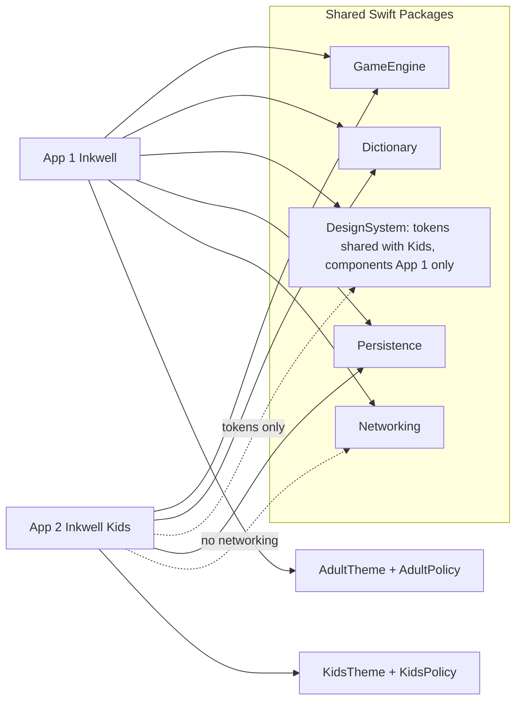
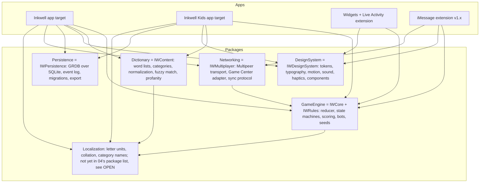
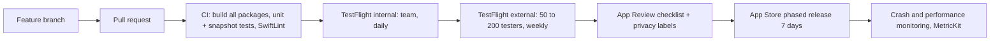

# Inkwell: Complete Reference

**Read this if...** you are joining the Inkwell program (engineer, designer, tester, advisor or investor) and want one document that explains the games we are building, why they matter, how the software is designed, how it is built and shipped, what the team recommends beyond the baseline, and where every external claim comes from. It is long on purpose. Each section stands alone, so skip to what you need using the table of contents. Companion documents (App 1 phased plan, App 2 Kids plan, App 3 multilingual story plan, design option packs) go deeper on each area; this document is the spine that ties them together.

**Document status:** Draft v0.1, 2026-10-04, owner: [JOBS] Theo Marr (Product Lead), with contributions from the whole team. Sources are numbered in Section 11 and linked inline.

---

## Table of contents

1. [Executive summary](#1-executive-summary)
2. [The games: history and cultural footprint](#2-the-games-history-and-cultural-footprint)
3. [Complete game design as implemented](#3-complete-game-design-as-implemented)
4. [The software: App 1, App 2, App 3](#4-the-software-app-1-app-2-app-3)
5. [The architecture](#5-the-architecture)
6. [Design and experience](#6-design-and-experience)
7. [Recommendations, ideas and creative contributions](#7-recommendations-ideas-and-creative-contributions)
8. [UX/UI best-practice checklist](#8-uxui-best-practice-checklist)
9. [Risks and open questions](#9-risks-and-open-questions)
10. [Glossary](#10-glossary)
11. [Full sources list](#11-full-sources-list)

---

## 1. Executive summary

Inkwell is a family of native iOS word games built by a one-to-two engineer team as its first polished, top-to-bottom shipped product. The family has three members:

| App | Codename | What it is | Status in this program |
|---|---|---|---|
| App 1 | Inkwell | Two classic paper-and-pencil games in one app: Name Place Animal Thing (NPAT) and Word Chain. Solo, pass-and-play, nearby and online play. | Primary deliverable. Full phased plan. |
| App 2 | Inkwell Kids (working name; "Inkling" is the first choice for launch pending a trademark search, "Inkwell Kids" the fallback; "Jr." rejected) | A separate, kid-focused app with the same two games adapted for ages roughly 5 to 13 in three bands (Sprouts 5 to 7, Explorers 8 to 10, Navigators 11 to 13), built on shared engine packages, compliant with COPPA and the App Store Kids Category. | Second deliverable. Full plan, ships after App 1. |
| App 3 | Inkwell Worldwide (naming open) | Multilingual extension where "letter" semantics change: Spanish, French, German, Hindi, Arabic, Japanese, Korean, Chinese. | Back burner. Short story plan only. May fold into App 1 as language packs. |

The founder's non-negotiable is simple to state and hard to do: the game is not technically difficult, so the bar is perfection. Aesthetics, animation and feel come first. We present design and technical choices as options with a recommendation, and we keep the losing options alive as parallel passes or skunkworks where they deserve it.

The core bets, in one paragraph each:

**The games are evergreen.** Categories games have been played on paper since at least the 19th century in Germany and were commercialized as Scattergories in 1988; word chain games exist in nearly every language, from Japanese shiritori to Korean kkeunmaritgi to Chinese chengyu jielong (Section 2). They survive because they need nothing but a letter, a clock and a few people. A phone app wins if it keeps that lightness and loses if it buries it under menus, accounts and ads.

**Native, SwiftUI-first, offline-first.** iOS 17.0 minimum (re-evaluated at 1.1, not before), Swift 6 concurrency, Xcode 16, Swift Packages for the engine, dictionary, design system, networking and persistence. This document uses the brief's short names (GameEngine, Dictionary, DesignSystem, Networking, Persistence); the App 1 architecture document (04) is canonical and names them `IWCore` plus `IWRules`, `IWContent`, `IWDesignSystem`, `IWMultiplayer` and `IWPersistence`, with `IWAnalytics`, `IWFeatureFlags` and `IWFeatures` alongside. The engine is deterministic and UI-free so it can be tested exhaustively and reused across App 1, App 2 and App 3 (Section 5). Cross-platform frameworks were evaluated honestly and rejected for this product because the whole value is in platform feel.

**Pass-and-play is the hero.** It is the paper experience: one phone passed around a table. Nearby play via MultipeerConnectivity comes next, then online via Game Center turn-based matches, which costs us nothing in servers (Section 5.4). Online real-time is a stretch and is deliberately deferred.

**Monetization: free with a one-time Pro unlock via StoreKit 2.** Themes are part of the Pro unlock in v1 (a la carte theme packs are a later option). No subscription, no ads, no consumables or currencies in App 1; Kids is paid up front with no in-app purchases in v1 (Section 4.4).

**Design as a set of parallel passes.** Five visual directions are explored in the design directions document (07) and summarized here (Section 6.2). The team's recommendation is "Paper & Ink" as the default identity, "Swiss Editorial" as the free second theme and "Night Lounge" as the Pro theme.

**Twenty-plus ideas beyond the baseline**, each tied to a shipped product that proves the pattern (Section 7). The ones we endorse for v1.x are the ink wheel letter draw, the flipbook replay reel, Wordle-style shareable result cards, a daily letter without streak pressure, Live Activities for the round timer, and SharePlay for FaceTime play.

> **[JOBS]** If a reader only remembers one thing: the moment the letter is drawn has to feel like a small event. Everything else in this document exists to protect that moment and the fifteen seconds after it.

> **[ARCH]** And the one thing I want remembered: the engine never imports UIKit or SwiftUI. If it does, we have lost the ability to test it, port it, and reuse it in Kids.

---

## 2. The games: history and cultural footprint

### 2.1 Name Place Animal Thing and its relatives

The game we call Name Place Animal Thing is one regional name for a far older pencil-and-paper game. The generic form is called **Categories**: players agree a list of categories, a letter is chosen at random, and everyone writes one word per category starting with that letter inside a time limit. Players then swap sheets and score each other; traditionally an answer unique among the group earns more than an answer shared with another player ([Wikipedia, Categories (game)](https://en.wikipedia.org/wiki/Categories_(game))). A variant called **Guggenheim** writes five letters across the top of the sheet so that they spell a word and asks for one answer per category per letter.

The commercial descendant is **Scattergories**, published by Milton Bradley in 1988, in which a 20-sided die generates the letter and players fill twelve categories in a timed round, scoring only for unique answers. It won the Mensa Select award in 1990 and became an NBC game show hosted by Dick Clark in 1993 ([Wikipedia, Scattergories](https://en.wikipedia.org/wiki/Scattergories)). Hasbro still sells it and publishes an official mobile version ([Hasbro instructions](https://instructions.hasbro.com/en-us/instruction/scattergories-game)).

The game has a different household name almost everywhere:

| Region or language | Name | Notes | Source |
|---|---|---|---|
| India, Pakistan, parts of the UK | Name Place Animal Thing | The four fixed categories give the game its name. | [Wikipedia, Categories (game)](https://en.wikipedia.org/wiki/Categories_(game)) |
| Germany, Austria, Switzerland | Stadt, Land, Fluss (City, Country, River) | Originated in Germany in the 19th century. The letter is chosen by one player silently reciting the alphabet until another says "Stop". | [Wikipedia (de), Stadt, Land, Fluss](https://de.wikipedia.org/wiki/Stadt,_Land,_Fluss); [Wikibooks (de)](https://de.wikibooks.org/wiki/Spiele:_Stadt-Land-Fluss) |
| Argentina, Uruguay, Paraguay, Peru | Tutti Frutti | Same structure; typical categories are names, animals, colors, fruits, countries. | [Wikipedia (es), Tutti frutti (juego)](https://es.wikipedia.org/wiki/Tutti_frutti_(juego)) |
| Chile, Colombia, Venezuela, Central America | Stop | The first finisher shouts "Stop" and ends the round, which we adopt as a house rule. | [Wikipedia (es), Tutti frutti (juego)](https://es.wikipedia.org/wiki/Tutti_frutti_(juego)) |
| Mexico, Guatemala | Basta | Same as above. | [Wikipedia (es), Tutti frutti (juego)](https://es.wikipedia.org/wiki/Tutti_frutti_(juego)) |
| Spain | Alto el lápiz, Bachillerato | "Pencils up". | [Wikipedia (es), Tutti frutti (juego)](https://es.wikipedia.org/wiki/Tutti_frutti_(juego)) |
| France | Jeu du Baccalauréat (Petit Bac) | Named after the school-leaving exam. | [Wikipedia, Categories (game)](https://en.wikipedia.org/wiki/Categories_(game)) |
| United States and worldwide (commercial) | Scattergories | 1988, Milton Bradley, now Hasbro. | [Wikipedia, Scattergories](https://en.wikipedia.org/wiki/Scattergories) |

The practical lesson for us: the game is already known in our target markets under a local name, so the product should let users rename it and pick their local categories without friction. This also tells App 3 that localization is not just translation; it is choosing the right default categories per region.

### 2.2 Word chain games

**Word chain** (also "grab on behind", "last and first", "alpha and omega") asks each player to say a word that begins with the letter the previous word ended with, usually within a category, with no repeats and often a short time limit. The version restricted to countries, cities, rivers and capitals is called **Geography** ([Wikipedia, Word chain](https://en.wikipedia.org/wiki/Word_chain)).

The best-documented relative is **Shiritori** (しりとり, "taking the end"), the Japanese game where the next word must begin with the final kana of the previous word. A player who says a word ending in ん (n) loses, because almost no Japanese word begins with that mora. House rules cover whether dakuten and handakuten marks are ignored (so スープ may be followed by ふろ), whether a long vowel counts as a vowel, and how small kana such as しょ are handled ([Wikipedia, Shiritori](https://en.wikipedia.org/wiki/Shiritori); [Tofugu, Shiritori](https://www.tofugu.com/japanese/shiritori/)). Shiritori appears in Japanese TV, anime and classroom teaching and is the clearest evidence that "letter" means something different in other scripts, which is the whole premise of App 3.

Korean **kkeunmaritgi** (끝말잇기) chains on the last Hangul syllable block rather than a letter ([Go! Billy Korean](https://gobillykorean.com/practice-vocabulary-by-playing-%eb%81%9d%eb%a7%90%ec%9e%87%ea%b8%b0-korean-faq/); [Wikipedia, Word chain](https://en.wikipedia.org/wiki/Word_chain)). Chinese **jielong** (接龍) chains on the last character, and its most popular form, **chengyu jielong** (成語接龍), chains four-character idioms ([Wikipedia, Word chain](https://en.wikipedia.org/wiki/Word_chain); [Wikipedia, Chengyu](https://en.wikipedia.org/wiki/Chengyu)).

**Antakshari** is the musical cousin from South Asia: each player sings the opening of a song (classically Hindustani or Bollywood) that begins with the consonant on which the previous song ended. The name comes from Sanskrit antya (end) and akshara (letter). It is a staple of bus journeys, weddings and college festivals and ran as a Zee TV game show from 1993 to 2007 ([Wikipedia, Antakshari](https://en.wikipedia.org/wiki/Antakshari); [Wikipedia, Antakshari (TV series)](https://en.wikipedia.org/wiki/Antakshari_(TV_series))). We do not build a singing game, but Antakshari proves the chain format travels across media and that a "letter" can be a sound.

### 2.3 Why these games are evergreen

Four properties recur across every variant above and explain two centuries of survival:

1. **Zero setup.** A letter and a clock. No board, no pieces, no rulebook longer than a sentence. This is why they are played in cars and classrooms.
2. **Social scoring.** In Categories the points come from being unique relative to the table, not from a fixed answer key. The game is about reading the room, and the arguing over "does Antarctica count as a place" is part of the fun.
3. **Infinite content from finite rules.** Twenty-six letters times a handful of categories generates thousands of rounds without authored content. Word chain is literally unbounded.
4. **Adjustable difficulty with no settings screen.** Add a category, shorten the timer, ban X and Z, and the same game serves a seven-year-old or a trivia team.

> **[GAME]** The social scoring point is the one digital versions get wrong most often. The Hasbro app scores you against a dictionary. Paper scores you against your friends. We keep paper's rule: unique against the table is 10, shared is 5, and validity is a group decision first and a dictionary second.

### 2.4 What paper gives that phones lose, and how we keep it

| Paper gives | Phones usually lose it because | Inkwell keeps it by |
|---|---|---|
| Everyone writes at once, in silence, then reveals together | Apps serialize input or hide others' answers behind a sync | Pass-and-play has a "pens down" reveal; nearby mode shows all sheets at once when the timer ends |
| Handwriting and crossing out, personal and messy | Text fields are sterile | Ink-styled input, hand-drawn letter draw, optional PencilKit handwriting on iPad (Section 7, idea 11) |
| The group adjudicates disputed answers | Apps auto-reject anything not in the dictionary | Dictionary advises; players vote; the host can overrule. Validation is a suggestion, not a verdict |
| The letter draw is a tiny ritual (reciting the alphabet, rolling the die) | Apps show a letter instantly | A deliberate 1.2 second ink-wheel or tile draw with haptics (Section 7, idea 1) |
| Nothing to install, nobody logs in | Account walls and permissions prompts | Zero accounts for local play; no sign-in until online play is chosen |
| Zero notifications | Streak and re-engagement pushes | No streaks, no push by default (Section 7, idea 4) |

> **[DESIGN]** The disputes row is the design brief in miniature. The best screen in the app will be the one where four friends look at a word and tap "allow" or "nope".

---

## 3. Complete game design as implemented

This section is the compact but complete rule set. The App 1 phased plan contains the full acceptance criteria; the engine package implements exactly what is written here.

### 3.1 Name Place Animal Thing (NPAT)

**Setup.** 1 to 8 players. Categories default to Name, Place, Animal, Thing. Optional extra categories: Movie, Food, Brand, Song, Sport, Color, Profession, Country, City, Fruit or Vegetable, Body Part, Cartoon Character, plus custom categories (3 to 8 categories per game, per the game design spec). The letter pool is A to Z; in the Classic preset nothing is excluded, but X, Q and Z are drawn rarely through availability weighting, and the Gentle preset excludes them (game design spec, Section 6). Round timer defaults to 60 seconds with presets Relaxed (120), Classic (60), Quick (45) and Blitz (30).

**Round flow.**

1. Letter draw: a random letter from the pool, without replacement until the pool is exhausted.
2. Writing phase: each player fills one answer per category. In pass-and-play, players take turns on the same phone (each player's phase is timed separately and the letter stays fixed). In nearby and online, players write concurrently.
3. Stop: the round ends when the timer expires or, if the "Stop" house rule is on, when the first player taps Stop after filling every category.
4. Reveal and adjudication: all answers are shown side by side per category. The dictionary pre-marks each answer Valid, Unknown or Invalid. Any non-author can challenge; a challenge triggers a vote of the non-authors (majority decides, ties fall back to the dictionary state). A "Designated judge" house rule lets one person (teacher, parent) rule instead of a vote; whether it ships in App 1 v1 is OPEN in the game design spec.
5. Scoring: 10 points for a unique valid answer, 5 if another player wrote the same valid answer (compared after normalization), 0 for blank, invalid or rejected. Optional "Long words" bonus: +1 per letter beyond six, capped at +5 (house rule, off by default, per the game design spec Section 5.1).
6. Next round or end of game. A game is N rounds (default 5) or first to a target score.

**Normalization for duplicates.** Case-insensitive, diacritics folded, leading articles stripped ("The Nile" equals "Nile"), whitespace and hyphens collapsed. Spelling variants within a small edit distance are flagged as "probably the same" and shown to the table for a decision, never auto-merged.

**Modes.**

| Mode | Players | Transport | Notes |
|---|---|---|---|
| Solo vs. clock | 1 | None | Score against your own history and against bot sheets (Section 3.4). |
| Pass-and-play | 2 to 8 | One phone | Hero mode. Hand-off screen hides the previous player's answers. |
| Nearby | 2 to 8 | MultipeerConnectivity | Host phone owns the state machine; others are thin clients. |
| Online async | 2 to 6 | Game Center turn-based | Each player gets the same letter; results are reconciled when all have submitted or a deadline passes. |
| Online real-time | 2 to 6 | Game Center real-time or custom | Stretch, deferred to v2. |

### 3.2 Word Chain

**Setup.** 1 to 8 players. One category (Animals by default; Countries, Cities, Foods, Movies, Fruits and Vegetables, or Any English word). Timer per turn: Off, Relaxed (30 s, default for pass-and-play), Standard (15 s, default for solo), Blitz (7 s). Three end conditions: Lives (default, 3 lives), Elimination, or Points over a fixed number of turns.

**Turn flow.**

1. The required starting letter is the last letter of the previous accepted word (first turn: a random letter from the pool). In English the last letter is the last alphabetic character after normalization ("Côte d'Ivoire" ends in E).
2. The player enters a word. The engine checks: starts with the required letter, not already used in this game, in the category dictionary or accepted by the table.
3. Pass or fail. Fail costs a life (or eliminates). Timeout counts as fail.
4. Points mode: 1 point per accepted word, with optional bonuses from the game design spec Section 5.2 (long word, rare link letter +2, trap bonus +1). Elimination mode: last player standing wins.

**The hard-letter problem.** Many English words end in Y, S or E and few begin with X or Q; chains naturally funnel into dead ends. The game design spec (Section 11.2) offers three edge-letter rules: **Reroll** (default: the engine draws a new weighted link letter and says so), **Use letter** (brutal) and **Last vowel**. A "Singular link" house rule uses the singular's last letter for pluralized words. The Kids edition adds a "wildcard" (next player picks any letter) for its younger bands.

### 3.3 Validation philosophy

Validation has three layers, and the ordering matters:

1. **Dictionary and category lists on device** (ENABLE, SCOWL and curated category lists, see Section 5.3) mark an answer Valid, Unknown or Invalid. Unknown is the normal state for proper nouns and recent brands.
2. **Table adjudication** decides Unknown answers by vote or host ruling. This mirrors paper.
3. **Learning**: accepted Unknown answers are stored locally as "house dictionary" entries for that device. Proposing them upstream to DATA is OPEN in the game design spec (JOBS: not in v1 unless completely silent, on-device aggregation only).

> **[DATA]** No offline dictionary will contain every place name or every cartoon character. The design mistake is pretending otherwise. We ship confidence levels, not verdicts, and we never show a red X without a way to override it.

> **[KIDS]** In Kids the ordering changes: we are more forgiving on spelling (phonetic match), and we never put a child in front of a table vote. The grown-up reviews instead. Same engine, different policy object.

### 3.4 Bots

Solo play needs an opponent. Bots generate NPAT sheets and Word Chain turns from the same category dictionaries with three tunings: Casual (common words, occasionally blank), Clever (mid-frequency words, rarely blank) and Ruthless (full list, fails only when no word exists, plays traps). Tiers are data rows so Kids can add a gentler one. Bot answers are precomputed per letter and category and drawn with a seed, so a replay of the same seed produces the same bot sheet. Bots never cheat: they draw from the same dictionary the validator uses, and they take believable time (animated "thinking" dots tied to word rarity).

### 3.5 Scoring summary

| Event | NPAT points | Word Chain points |
|---|---|---|
| Unique valid answer | 10 | 1 (+2 rare link bonus, +1 trap bonus in Points mode) |
| Duplicate valid answer | 5 | n/a (duplicates are invalid) |
| Blank, invalid or rejected | 0 | lose a life |
| Long word bonus (house rule) | +1 per letter beyond six, max +5 | +1 per letter above six, max +4 |
| First to Stop (house rule) | +0 by default, but ends the round | n/a |

> **[GAME]** We debated a first-to-stop bonus. DECISION: no bonus by default. Ending the round early is already an advantage; adding points turns the game into a typing race and punishes slower typists and younger players. The game design spec keeps a +3 "Speed bonus" as an off-by-default toggle that exists only with the Stop rule, for groups that want the race.

### 3.6 Team debate: should the dictionary ever be the final word?

> **[DATA]** For online async play there is no table to vote. Someone has to be the referee, and the only neutral referee is the dictionary.

> **[GAME]** Then the online game plays differently from the living-room game, which breaks the promise that it is the same game.

> **[ARCH]** We can make the policy explicit: a `ValidationPolicy` value on the match. Local and nearby default to table adjudication; online async defaults to dictionary-final with a one-tap "dispute" that the opponent can accept. The engine does not care which is in force.

> **[JOBS]** Fine, but the dispute flow in async has to be one screen and one tap. If it needs a chat thread, cut it.

**DECISION (reconciled with the game design spec, 02 Section 16):** `ValidationPolicy` is a first-class engine type. The default everywhere, including online async, is the hybrid: the dictionary auto-judges with three visible states (accept, unsure, reject), any non-author may challenge, the majority of non-authors decides, ties fall back to the dictionary state. In async the challenge window is 24 h, votes travel in match data, and an unresolved challenge falls back to the dictionary state, which is the only sense in which the dictionary is "final" online. The "Challenge mode" house rule offers Vote (default), Dictionary only, Honor system and Designated judge. The earlier `.dictionaryFinal` default for async is withdrawn so that the online game stays the same game.
**OPEN:** Whether accepted disputes in async should feed the shared curation queue, or only the local house dictionary.

---

## 4. The software: App 1, App 2, App 3

### 4.1 App 1, "Inkwell": product scope

App 1 is one app, two games, four ways to play. The v1.0 cut is deliberately narrow:

**In v1.0:** NPAT and Word Chain; solo vs. clock with bots; pass-and-play; nearby play over MultipeerConnectivity (delivery Phase 4, Pro); online async over Game Center turn-based (delivery Phase 5, Pro; Word Chain first, NPAT second; the pre-approved first cut if Phase 5 slips); house rules (Stop, long-word bonus, letter difficulty presets, edge-letter rules); custom categories; result cards for sharing; three themes (Paper & Ink default, Swiss Editorial free, Night Lounge in Pro), each with its own sound and haptic pack; full accessibility (Dynamic Type, VoiceOver, Reduce Motion alternatives, Switch Control audit); one-time Pro unlock.

**In v1.x:** achievements (a global leaderboard is trimmed per the product brief; a friends-only daily-letter board is the most the team would consider); Live Activity timer; daily letter; iMessage turn cards; iPad split-table; a la carte theme packs.

**Deferred to v2 or killed:** real-time online, chat of any kind, user accounts of our own, a marketplace for house rules (evaluated in Section 7, idea 15), SharePlay (kept alive as skunkworks).

**Naming options.** "Inkwell" is the working name and the product brief (01, Section 8) owns the decision: keep Inkwell pending a trademark clearance and App Store name reservation in Phase 0; ranked fallbacks are Nib, Letterhead, Foolscap. "Stop!" was considered and rejected because Fanatee's "Stop" owns that term in the App Store; "Quill" and "Scribble" were rejected as crowded. Naming criteria: pronounceable in Spanish, Hindi and German; not an existing trademark in games; works as a short app label; has a natural Kids sibling.

> **[JOBS]** "Inkwell" is the one that tells you what the brand looks like, and the whole visual language falls out of it. We clear it first and we pick the fallback only if the lawyer says so, before the App Store listing is written.

### 4.2 App 2, "Inkwell Kids": product scope

App 2 is a separate binary with a kid vibe, not a mode in App 1. It reuses GameEngine, Dictionary core and Persistence via Swift Packages, shares only primitive tokens with DesignSystem (its own `KidsDesignSystem` package holds everything visible), and does not link Networking or Analytics. It differs in: age bands (Sprouts 5 to 7, Explorers 8 to 10, Navigators 11 to 13) that change timers, categories, letter pool and hint density; illustrated letter cues (the letter B comes with a bear sketch, not a bare glyph); forgiving validation with phonetic matching; optional spelling help; no ads, no chat, no open social, no third-party analytics; a parental gate on anything that leaves the app; non-manipulative rewards (stickers for a sketchbook, no loot boxes, no timers that nag). It sits in the App Store Kids Category and follows guideline 1.3 (Kids Category) and 5.1.4 (Kids privacy) which prohibit third-party advertising and analytics and the transmission of personally identifiable information from Kids apps ([App Store Review Guidelines](https://developer.apple.com/app-store/review/guidelines/); [Apple, Kids](https://developer.apple.com/kids/)). COPPA governs data collection from children under 13 in the United States; the FTC's six-step compliance plan is our checklist ([FTC, COPPA six-step compliance plan](https://www.ftc.gov/business-guidance/resources/childrens-online-privacy-protection-rule-six-step-compliance-plan-your-business)).

> **[KIDS]** The simplest way to comply with COPPA is to collect nothing. Kids has no accounts, no cloud save by default, and no network calls except StoreKit. That is a feature, not a limitation.

### 4.3 Relationship between App 1 and App 2



The contract is: App 2 may depend on any shared package; no shared package may depend on an app; `Networking` is not linked into App 2 at all so a reviewer can verify there is no network path other than StoreKit.

### 4.4 Monetization options and recommendation

| Option | Pros | Cons | Verdict |
|---|---|---|---|
| Paid up front ($3.99 to $5.99) | Clean, no IAP code, no "free" expectations | Kills trial; discovery relies on featuring | Kids app only (parents prefer it; no IAP in a 5 to 7 band) |
| Free + one-time Pro unlock (StoreKit 2 non-consumable) | Trial is the full local game; one purchase; honest; host pays and guests play free in a session | Need a crisp line between free and Pro | **Decided for App 1 (product brief, 01 Section 11).** Free: both games, pass-and-play, solo, classic rules, default theme, unlimited rounds. Pro: nearby, online async, house rules, category packs, the Night Lounge theme, stats. Custom categories free or Pro is OPEN. |
| Cosmetic themes as IAP | Pure upside, no gameplay gating | Needs ongoing art | **Folded into Pro for v1**; a la carte non-consumable theme packs are a post-launch option. Knotwords and many indie puzzle games ship a single unlock plus cosmetics ([Six Colors, Knotwords](https://sixcolors.com/post/2022/04/knotwords-offers-crossword-puzzles-without-clues/)) |
| Subscription | Recurring revenue | Wrong for a party game; review friction; founder dislikes it | **Rejected** (product brief DECISION: no subscription). Does not survive as a parallel pass. |
| Ads | Revenue without purchase | Destroys the feel; forbidden in Kids by guideline 1.3 | **Never** |

StoreKit 2 is used for all purchases ([Apple, In-App Purchase (StoreKit)](https://developer.apple.com/documentation/storekit/in-app-purchase)); the App Store Small Business Program gives a 15% commission to developers under $1M in proceeds, which we qualify for ([Apple, Small Business Program](https://developer.apple.com/app-store/small-business-program/)). The HIG page on in-app purchase guides the purchase UI ([HIG, In-app purchase](https://developer.apple.com/design/human-interface-guidelines/in-app-purchase)).

> **[IOS]** StoreKit 2's `Transaction.currentEntitlements` and the Xcode StoreKit configuration file mean we can test the whole purchase flow offline before App Store Connect products exist. Budget one engineer-week for the store, not three.

### 4.5 App 3, the multilingual idea

App 3 generalizes "letter" to a locale-aware "unit": a Spanish digraph, a Devanagari syllable with its vowel sign, a Japanese kana after normalization, a Korean syllable block, a Chinese character. It also needs localized dictionaries, localized default categories and right-to-left layout for Arabic. It is a short story plan, not a committed deliverable, and its most important output is a list of things App 1 must do now to keep the door open (never hardcode A to Z, treat the letter pool and the "last unit" extraction as pluggable). See `npat-planning/app3-multilingual/short-story-plan.md`.

---

## 5. The architecture

### 5.1 Module map



Rules of the map: `GameEngine` and `Dictionary` have no UI imports. `DesignSystem` is the only package that imports SwiftUI. `Networking` depends on `GameEngine` to serialize state, never the reverse. `Localization` is small in v1 (English alphabet) and exists so App 3 does not require refactoring.

### 5.2 The engine: deterministic state machines

The engine is a pure Swift reducer: `(State, Action) -> (State, [Effect])`. Randomness comes in through a seeded generator passed with the action, never from a global. This gives us three things: exhaustive unit tests (every rule in Section 3 has a test), deterministic replays (the replay reel in Section 7 is free), and transport independence (pass-and-play, nearby and online all drive the same reducer with the same actions).

```swift
enum NPATAction {
  case drawLetter(seed: UInt64)
  case submit(player: PlayerID, answers: [CategoryID: String])
  case stop(by: PlayerID)
  case adjudicate(answer: AnswerID, verdict: Verdict, by: PlayerID)
  case timerExpired
}
```

States for NPAT: `lobby -> drawing -> writing -> revealing -> adjudicating -> scored -> (next round | finished)`. Word Chain: `lobby -> awaitingTurn(player) -> validating -> (accepted | failed) -> awaitingTurn(next) | finished`. Each state transition is tested with property-based tests for invariants such as "scores never decrease within a round" and "the used-word set is monotonic".

> **[ARCH]** The reducer pattern is boring and that is the point. The flashy parts of the app (ink, motion, sound) all live on top of a core that a junior engineer can read in an afternoon.

> **[QA]** Determinism is what makes my job possible. A bug report comes with a seed and an action log; I replay it on any device.

### 5.3 Data: dictionaries and categories

| Source | What it gives us | License | Use |
|---|---|---|---|
| ENABLE word list | ~173k English words, public domain | Public domain | Base validity for "Any Word" and Thing category | 
| SCOWL (Spell Checker Oriented Word Lists) | Size-graded English lists, includes ENABLE at level 80 | Permissive, requires copyright notice | Frequency banding (common vs. rare) ([SCOWL](https://wordlist.aspell.net/)) |
| WordNet | Nouns with hypernyms (an "animal" is anything under the animal synset) | Princeton WordNet license, permits commercial use with notice ([WordNet license](https://wordnet.princeton.edu/license-and-commercial-use)) | Seeding Animal, Food, Profession categories |
| Wiktionary dumps | Multilingual headwords, categories, proper nouns | CC BY-SA (attribution and share-alike apply to derived lists) ([Wikimedia dumps](https://dumps.wikimedia.org/)) | Excluded from App 1 v1 packs (ADR-007); reserved for App 3 language packs with published derived lists. English places come from GeoNames (CC BY 4.0) instead |
| Curated lists (ours) | Names, Places, Brands, Movies, Cartoon Characters | Ours | Proper-noun categories where open lists are weak |

Storage: lists are compiled at build time into a compact trie or FST per category with a frequency byte per entry; the English pack is targeted under 6 MB on disk. Profanity filtering uses a blocklist applied to custom category names and shared result cards, never to private in-game entries (a word game that refuses "ass" as an animal is a broken word game).

> **[DATA]** The share-alike clause on Wiktionary-derived lists is manageable in principle: we publish the derived list file under the same license and it does not infect the app. For App 1 v1 we chose not to carry even that (ADR-007): shipped packs use only public-domain, MIT-like, WordNet-licensed and CC BY data. Legal review confirms before any App 3 pack ships.

### 5.4 Multiplayer options

| Option | Cost | Complexity | Latency | Accounts | Verdict |
|---|---|---|---|---|---|
| Pass-and-play | 0 | Low | None | None | **v1.0** |
| Nearby via MultipeerConnectivity (Wi-Fi, peer-to-peer Wi-Fi, Bluetooth) ([Apple, MultipeerConnectivity](https://developer.apple.com/documentation/multipeerconnectivity)) | 0 | Medium (discovery, host election, reconnection) | Low | None | **v1.0, delivery Phase 4, Pro** |
| Game Center turn-based (`GKTurnBasedMatch` stores and forwards match data) ([Apple, GKTurnBasedMatch](https://developer.apple.com/documentation/gamekit/gkturnbasedmatch)) | 0 | Medium | Minutes to days | Apple ID (free) | **v1.0 for async, delivery Phase 5, Pro; first cut if Phase 5 slips** |
| Game Center real-time | 0 | High | Sub-second | Apple ID | v2 stretch |
| CloudKit public database | Free up to large quotas; private DB billed to the user's iCloud ([Apple, CloudKit](https://developer.apple.com/documentation/cloudkit)) | Medium | Seconds | iCloud | Cloud save and shared curation queue, not matchmaking |
| Supabase (Postgres, realtime, auth) | Free tier; Pro $25/month ([Supabase pricing](https://supabase.com/pricing)) | Medium | Sub-second | Our accounts | Parallel pass for real-time online in v2 |
| Firebase (Spark free, Blaze pay-as-you-go) ([Firebase pricing](https://firebase.google.com/pricing)) | Free then usage | Medium | Sub-second | Our accounts | Alternative to Supabase; disallowed in Kids because of third-party analytics SDK concerns |
| Custom backend | Highest | Highest | Any | Our accounts | No |

> **[ARCH]** Game Center turn-based is the quiet winner: zero servers, Apple handles identity, push and storage, and it fits an async NPAT round perfectly (everyone gets the same letter, submits a sheet, the match data is reconciled). Letterpress proved this model in 2012 ([Wikipedia, Letterpress](https://en.wikipedia.org/wiki/Letterpress_(video_game))).

> **[IOS]** Caveat: Game Center UI is Apple's UI. The access point and dashboard are fine ([Apple, GKAccessPoint](https://developer.apple.com/documentation/gamekit/gkaccesspoint)); matchmaking sheets are not ours to style. We hide them behind our own invite flow where the API allows.

### 5.5 Persistence and sync

GRDB.swift over SQLite behind a `MatchStore` protocol for local storage (match event log, snapshots, player profiles, settings, content pack registry), per the architecture document's ADR-004; SwiftData ([Apple, SwiftData](https://developer.apple.com/documentation/swiftdata)) was evaluated and kept as a parallel pass for the iCloud era. No iCloud sync in v1 (OPEN for 1.x); absent in App 2. Every game is exportable as a JSON action log, which is also the replay format.

### 5.6 Platform choice: honest comparison

| Stack | Feel and animation | Access to Live Activities, SharePlay, Game Center, PencilKit, Core Haptics | Team fit (1 to 2 engineers, iOS first) | Verdict |
|---|---|---|---|---|
| Native SwiftUI (with UIKit where needed) | Best; PhaseAnimator and KeyframeAnimator built in ([Apple, PhaseAnimator](https://developer.apple.com/documentation/swiftui/phaseanimator); [KeyframeAnimator](https://developer.apple.com/documentation/swiftui/keyframeanimator)) | Full, same day as the OS | Best | **Default** |
| React Native / Expo ([Expo docs](https://docs.expo.dev/)) | Good with Reanimated; bridging for everything platform-specific | Partial, via community modules that lag | OK if the team is JS-first | No; the product is the platform feel |
| Flutter ([flutter.dev](https://flutter.dev/)) | Excellent custom rendering; does not use native text or controls | Partial; platform channels needed | Good for Android later | No for v1; revisit if Android demand appears |
| Kotlin Multiplatform shared logic + SwiftUI UI ([KMP for iOS](https://kotlinlang.org/docs/multiplatform/kmp-for-ios.html)) | Native | Full (UI is native) | Adds a toolchain for a 1 to 2 person team | Skunkworks only; our engine is small enough to port by hand if Android happens |
| Unity / Godot | Great for particles, poor for text UI and accessibility | Poor | Overkill | No |
| PWA then Capacitor ([Capacitor docs](https://capacitorjs.com/docs)) | Weakest feel | Weakest | Fast to prototype | Prototype only; useful for App 3 dictionary tooling |

**DECISION:** Native SwiftUI-first, iOS 17.0 minimum for 1.0 (re-evaluated at 1.1 with usage data, per the delivery plan 03 Section 19.2), Swift 6 language mode on all packages ([Apple, Adopting Swift 6](https://developer.apple.com/documentation/swift/adoptingswift6)). iOS 18 features (new Game Center UI, more Live Activity surfaces, the zoom transition) are adopted with availability checks.

### 5.7 Build, test and release



Release trains: a minor release every four weeks after 1.0, patches as needed (quality plan, 05 Section 10). Beta program and tester counts follow the quality plan (05 Section 5). Test strategy: engine has 90 percent coverage as the gate and 95 percent as the target; DesignSystem has snapshot tests at three Dynamic Type sizes and both appearances; UI tests cover the three hero flows (first run, pass-and-play round, purchase). Device matrix: iPhone SE (small screen, no Dynamic Island), iPhone 15 or 16 (Dynamic Island), iPhone Pro Max, iPad mini, iPad Pro 13, plus one device on the minimum OS ([Apple, Testing your apps in Xcode](https://developer.apple.com/documentation/xcode/testing-your-apps-in-xcode)). Crash budget: crash-free sessions above 99.8% before widening a phased release. No third-party crash SDK in Kids; MetricKit only.

> **[QA]** "Ship top-to-bottom cleanly" means the App Review checklist is a document, not a memory. Privacy nutrition labels, the Kids Category checklist, and the Reduce Motion audit are gates, not tasks.

### 5.8 Team debate: SwiftData versus a plain file store

> **[ARCH]** SwiftData is the obvious choice, but it is young and its CloudKit mirroring has rough edges. The game state is tiny. A JSON file per game plus a small SQLite index would be more predictable.

> **[IOS]** SwiftData gives us `@Query` in views and iCloud mirroring for free. The edges are real, but the models here are flat.

> **[QA]** Migrations worry me more than performance. Whichever we choose, the action log is the source of truth and the store is a cache we can rebuild.

**DECISION (superseded and reconciled):** this debate was settled the other way in the architecture document (04, Section 5.3, ADR-004), which is canonical: `IWPersistence` uses GRDB.swift over SQLite behind a `MatchStore` protocol, with explicit SQL migrations and WAL mode. The parts of this debate that survive are QA's point and the store design: the event log is canonical, the store is a rebuildable cache, and a "rebuild store from logs" command ships in debug builds. SwiftData is a parallel pass to be re-evaluated only when iCloud sync is scheduled.
**OPEN:** iCloud sync of match history in 1.x (SwiftData plus CloudKit, which would mean migrating the store, versus CloudKit record mirroring from GRDB). Not in 1.0.

---

## 6. Design and experience

### 6.1 Principles

1. **One thing per screen.** The letter screen shows the letter. The writing screen shows the sheet. The reveal screen shows the table. Nothing else.
2. **Motion communicates, then gets out of the way.** Apple's HIG motion page says to add motion purposefully, never for its own sake, and to make it optional ([HIG, Motion](https://developer.apple.com/design/human-interface-guidelines/motion)). Nielsen Norman Group's guidance puts simple feedback animations around 100 ms and larger transitions at 200 to 500 ms, and warns that anything slower reads as lag ([NN/g, Executing UX Animations](https://www.nngroup.com/articles/animation-duration/); [NN/g, Response Times](https://www.nngroup.com/articles/response-times-3-important-limits/)).
3. **Paper is the metaphor, not the costume.** We borrow the behaviors of paper (reveal, cross out, pass) and only as much of the look as each visual direction wants.
4. **Every animation has a Reduce Motion twin.** Not a disabled state; an alternative that still communicates (a cross-fade instead of a spin, a color pulse instead of a bounce). SwiftUI exposes the setting as `accessibilityReduceMotion` in the environment.
5. **Haptics are consistent and causal.** The HIG's "Playing haptics" page asks for a clear causal relationship between each haptic and its action and for haptics to be optional ([HIG, Playing haptics](https://developer.apple.com/design/human-interface-guidelines/playing-haptics)). Core Haptics lets us author custom transient and continuous patterns for the ink wheel and the Stop slam ([Apple, Core Haptics](https://developer.apple.com/documentation/corehaptics); [WWDC19, Introducing Core Haptics](https://developer.apple.com/videos/play/wwdc2019/520/); [WWDC21, Practice audio haptic design](https://developer.apple.com/videos/play/wwdc2021/10278/)).
6. **Type is the interface.** The letter is the hero glyph. Dynamic Type everywhere, including the sheet ([HIG, Typography](https://developer.apple.com/design/human-interface-guidelines/typography)).
7. **Color carries meaning once, and only once.** Semantic colors for valid, unknown and invalid; never color alone ([HIG, Color](https://developer.apple.com/design/human-interface-guidelines/color); [HIG, Accessibility](https://developer.apple.com/design/human-interface-guidelines/accessibility)).
8. **Fluid, interruptible, redirectable.** The vocabulary of Apple's "Designing Fluid Interfaces" session: every gesture-driven motion can be interrupted and redirected mid-flight ([WWDC18, Designing Fluid Interfaces](https://developer.apple.com/videos/play/wwdc2018/803/)).

### 6.2 The five visual directions (summary)

The design directions document (07) explores these as parallel passes and is canonical for names, palettes and the recommendation; here is the summary. (An earlier draft of this table used different labels: "Ink and Paper", "Neon Night", "Swiss Grid", "Playroom"; the names below are 07's.)

| Direction | Essence | Type | Motion signature | Risk | Role |
|---|---|---|---|---|---|
| A. Paper & Ink | Warm cream stock, blue-black fountain-pen ink, hand-written letter draw, paper grain under five percent | Handwriting face (Caveat) for the letter and headers, New York for body, SF for numerals | The letter writes itself stroke by stroke; ink bleeds and dries; pages turn | Could read as "retro notebook" cliche if overdone | **Default identity** |
| B. Swiss Editorial | Pure typographic, black on white, hairlines, one accent, no ornament | Space Grotesk or Fraunces display, SF for UI | Type slam; numbers count with numericText | Can feel cold for a party game | **Free second theme**; its results table is borrowed into every theme; doubles as the high-legibility baseline |
| C. Playful Pop | Rounded stickers, saturated accents per category, bouncy | SF Pro Rounded | Sticker drop; duplicates collide and bounce | Overlaps with Kids and must not; heavy illustration load; no mascot with eyes in App 1 | **Skunkworks**, parked until Kids has defined its own look (Kids chose Bright Blocks with crayon-styled characters, not this direction) |
| D. Night Lounge | Dark glass, neon pink and cyan, bar-trivia-at-midnight | Condensed display face (licensing check) over SF | Neon flicker on; glowing chain tube | GPU cost of glow and materials; outdoor contrast; flicker must be fully disabled under Reduce Motion | **Pro theme**; offers (never forces) a blitz house-rules preset |
| E. Quiet Minimal | Pure HIG, system materials, SF only, semantic colors | SF Pro and SF Pro Rounded | System springs, numericText roll | Indistinct; weak vibe | **Skeleton**, built first as the semantic-token reference rendering and QA baseline; never shipped as a face |

The tactile embossed-tile idea ("Letterpress Studio" in the earlier draft) is not one of 07's five directions; it survives only as the tile variant of the letter draw in Section 7, idea 1, as skunkworks.

**DECISION (aligned with 07):** A Paper & Ink is the identity and default; B Swiss Editorial ships free; D Night Lounge ships in the Pro unlock; C Playful Pop is parked skunkworks; E Quiet Minimal is the skeleton. The theme picker ships with exactly three tiles.

> **[DESIGN]** The hardest part of A is restraint. Paper grain at 3% opacity, not 15%. One ink color, not a stationery shop. If someone describes it as "cute" we have overshot.

> **[JOBS]** I want A and D demoed on a device, side by side, with the letter draw and nothing else. No slides. We confirm the identity from that demo at the W4 gate in the delivery plan.

### 6.3 Motion

The stack: SwiftUI animations with springs as the default curve ([WWDC23, Animate with springs](https://developer.apple.com/videos/play/wwdc2023/10158/)), PhaseAnimator for multi-step beats like the letter reveal and KeyframeAnimator for choreographed sequences like the score tally ([WWDC23, Wind your way through advanced animations](https://developer.apple.com/videos/play/wwdc2023/10157/); [WWDC23, Explore SwiftUI animation](https://developer.apple.com/videos/play/wwdc2023/10156/)). SpriteKit overlays for particles (ink splatter at Stop) ([Apple, SpriteKit](https://developer.apple.com/documentation/spritekit)). Metal shaders, via SwiftUI's shader modifiers, for the ink bleed effect ([Apple, Metal](https://developer.apple.com/documentation/metal)). Rive and Lottie are evaluated in the motion document's bake-off (09, Section 5) under the rule of at most one third-party animation runtime in App 1, possibly none; Rive's runtime files are typically far smaller than Lottie's and support interactive state machines, while Lottie remains the simplest for playback-only motion ([Rive, Rive as a Lottie alternative](https://rive.app/blog/rive-as-a-lottie-alternative); [Lottie](https://airbnb.io/lottie/)). Kids ships with no third-party animation runtime in v1 (Kids doc 04).

The motion document (09) is the governing catalog for durations, springs and the 32 named animations; the eight-token table below is a summary and 09's values win where they differ (for example 09 specifies the letter draw at 600 ms, scaled by preset as decided in Section 6.8).

Material Design is the useful contrast: its motion system specifies named easing tokens and duration ranges (short transitions near 50 to 200 ms, medium 250 to 400 ms, long 450 to 600 ms) and a shared "container transform" pattern ([Material 3, Applying easing and duration](https://m3.material.io/styles/motion/easing-and-duration/applying-easing-and-duration)). Apple's approach is physics-based (springs with duration and bounce) rather than curve-token based. We follow Apple's physics but adopt Material's discipline of a named, finite set of motion tokens in the DesignSystem package so that every animation in the app is one of about eight.

| Token | Duration | Curve | Used for |
|---|---|---|---|
| tap | 90 ms | spring, bounce 0 | button and key feedback |
| settle | 250 ms | spring, bounce 0.15 | cards and sheets arriving |
| reveal | 420 ms | spring, bounce 0.25 | answer rows appearing in the reveal |
| draw | 1200 ms | custom keyframes | the letter draw ritual |
| stop | 180 ms | spring, bounce 0.4 plus haptic | the Stop slam |
| tally | 600 ms | keyframes | score counters |
| page | 350 ms | spring, bounce 0.1 | screen transitions |
| ambient | 6 to 12 s loop | linear | paper light, neon flicker; disabled under Reduce Motion |

### 6.4 Sound

A small palette of 12 to 16 sounds, authored to the motion tokens so sound and motion share timing. Lessons from shipped games are detailed in Section 7, idea 20. Rules: every sound has a haptic partner; nothing loops except the optional ambient bed; the app respects the silent switch and never plays audio over a user's music without an explicit toggle.

### 6.5 Haptics

| Moment | Haptic | Notes |
|---|---|---|
| Letter draw tick | transient, light, increasing interval | mirrors a roulette slowing down |
| Letter lands | medium impact | paired with the "draw" sound |
| Key press on the sheet | none (system keyboard) or soft transient for the custom letter pad | avoid fatigue |
| Stop | heavy impact plus short continuous rumble | the one big moment |
| Unique answer scored | light transient per 10 points | tally rhythm |
| Round won | success notification pattern | system semantic ([Apple, UIImpactFeedbackGenerator](https://developer.apple.com/documentation/uikit/uiimpactfeedbackgenerator)) |

All haptics are optional (a single toggle) and reduce automatically when Low Power Mode is on.

### 6.6 Accessibility

Dynamic Type through the largest accessibility sizes, with the sheet reflowing to one category per screen when needed; VoiceOver labels and custom actions on every answer row (allow, reject, hear spelling); Reduce Motion twins for every token in the table above; color contrast at WCAG AA minimum on all themes including Night Lounge; Switch Control traversal order audited on the three hero flows; captions for every sound (a visible "Stop!" when the slam plays). The HIG accessibility page and SwiftUI accessibility fundamentals are the reference ([HIG, Accessibility](https://developer.apple.com/design/human-interface-guidelines/accessibility); [Apple, SwiftUI accessibility fundamentals](https://developer.apple.com/documentation/swiftui/accessibility-fundamentals)). Touch targets follow NN/g's minimum of roughly 1 cm square, which is comfortably above Apple's 44 pt ([NN/g, Touch target size](https://www.nngroup.com/articles/touch-target-size/)). Inclusive language and imagery follow the HIG inclusion page ([HIG, Inclusion](https://developer.apple.com/design/human-interface-guidelines/inclusion)).

### 6.7 Benchmarks: Apple Design Award winners we measure against

| Winner | Year, category | What we take from it | Source |
|---|---|---|---|
| NYT Games | 2024, Delight and Fun (game) | A daily puzzle app that feels calm; share cards; no streak panic in Wordle | [Apple Newsroom, 2024 ADA](https://www.apple.com/newsroom/2024/06/apple-announces-winners-of-the-2024-apple-design-awards/) |
| Crouton | 2024, Interaction (app) | A tiny indie app winning on interaction polish alone | same |
| Gentler Streak | 2024, Social Impact (app) | Proof that "gentle" engagement is a selling point | same |
| Rytmos | 2024, Interaction (game) | Sound and interaction fused | same |
| Afterplace | 2023, Delight and Fun (game) | One-handed control as a design pillar | [Apple Newsroom, 2023 ADA](https://www.apple.com/newsroom/2023/06/apple-announces-winners-of-the-2023-apple-design-awards/) |
| Knotwords | 2023, Delight and Fun finalist | Minimal word game with a single unlock | same; [Six Colors review](https://sixcolors.com/post/2022/04/knotwords-offers-crossword-puzzles-without-clues/) |
| Balatro | 2025, Delight and Fun (game) | Juice: tally animations and sound that make numbers feel good | [Apple Newsroom, 2025 ADA](https://www.apple.com/newsroom/2025/06/apple-unveils-winners-and-finalists-of-the-2025-apple-design-awards/) |
| Art of Fauna | 2025, Inclusivity (game) | Accessibility as a design feature in a quiet puzzle | same |
| Alto's Odyssey | 2018 ADA | Sound with a musical quality on ordinary actions | [Wikipedia, Alto's Odyssey](https://en.wikipedia.org/wiki/Alto%27s_Odyssey); [CGMagazine interview](https://www.cgmagonline.com/interviews/interview-with-the-team-behind-altos-odyssey) |
| Monument Valley | 2014 ADA | Restraint: a short, perfect thing beats a long, uneven one | [Wikipedia, Monument Valley](https://en.wikipedia.org/wiki/Monument_Valley_(video_game)) |
| Threes | 2014 ADA | Fourteen months of iteration to reach a tiny rule set | [Wikipedia, Threes](https://en.wikipedia.org/wiki/Threes) |

The Apple Design Awards page lists all years ([Apple Design Awards](https://developer.apple.com/design/awards/)).

### 6.8 Team debate: how much motion is too much?

> **[DESIGN]** The letter draw at 1.2 seconds is the only long animation in the app, and it is skippable with a tap. Everything else is under half a second.

> **[GAME]** In Blitz mode 1.2 seconds is 8% of the round. The draw should scale with the timer preset.

> **[IOS]** Scaling is easy. What I want to avoid is the draw being a video. If it is a PhaseAnimator over a real glyph, it stays crisp at every Dynamic Type size and under every theme.

> **[JOBS]** Agreed on all three. And the second time you see the draw in a session it should already feel familiar, not like a splash screen.

**DECISION:** Draw duration is 1200 ms for Relaxed and Standard, 700 ms for Quick and 400 ms for Blitz; always tap-to-skip; always a live glyph, never a rendered clip; a 120 ms cross-fade under Reduce Motion.
**OPEN:** Whether the letter should be visible before the draw completes to VoiceOver users (announce immediately) or announced at the end for parity.

---

## 7. Recommendations, ideas and creative contributions

Each idea lists: the idea, why it fits Inkwell, a shipped product that proves the pattern (cited), effort in engineer-weeks (1 to 2 engineer team), and risk. Verdicts are the team's recommendation; "parallel pass" means we keep exploring in design or skunkworks without committing to ship.

**1. Letter draw: spinning ink wheel versus tactile letter tile.** Two candidate rituals for the most important moment. The ink wheel: a vertical drum of letters spins, slows with ticking haptics and settles with a bleed. The tile: a wooden or metal tile flips from a bag and lands face up with a heavy haptic. *Fits because* the draw is the one place a deliberate pause earns its time (Section 2.4). *Proof:* Scattergories' 20-sided die made the draw a physical event ([Wikipedia, Scattergories](https://en.wikipedia.org/wiki/Scattergories)); Letterpress built its whole feel on tiles ([Wikipedia, Letterpress](https://en.wikipedia.org/wiki/Letterpress_(video_game))). *Effort:* 1.5 weeks for the wheel, 2 for the tile with Metal materials. *Risk:* low for wheel; medium for tile (art cost, resemblance to Letterpress). **Verdict:** wheel ships in A; tile is a parallel pass in direction E.

**2. Replay reel: the round as a hand-drawn flipbook.** Because the engine is deterministic (Section 5.2), any round can be replayed from its action log. Render it as a 6 to 10 second flipbook: letter drawn, sheets filling with ink, Stop slam, scores tallying. *Fits because* it turns a data structure we already have into the most shareable artifact in the app. *Proof:* Balatro's score tallies and NYT Games' end-of-puzzle sequences show that animating the outcome is where delight lives ([Apple Newsroom, 2025 ADA](https://www.apple.com/newsroom/2025/06/apple-unveils-winners-and-finalists-of-the-2025-apple-design-awards/)). *Effort:* 2 weeks (renderer plus video export via AVFoundation). *Risk:* medium; export performance on older devices. **Verdict:** v1.1.

**3. Shareable result cards.** A static, spoiler-free card: the letter, category icons, a 10/5/0 glyph grid per player, no words. Copy as text and image. *Fits because* the game is social and the card invites the next game. *Proof:* Wordle's emoji grid, added in December 2021 after players started sharing by hand, is the single feature most credited for its viral growth and the New York Times acquisition in January 2022 ([Wikipedia, Wordle](https://en.wikipedia.org/wiki/Wordle); [NPR, 2022](https://www.npr.org/2022/01/31/1077089945/nyt-wordle)); Connections repeats the pattern with colored squares ([Wikipedia, Connections](https://en.wikipedia.org/wiki/The_New_York_Times_Connections)). *Effort:* 1 week. *Risk:* low. **Verdict:** v1.0.

**4. Daily letter challenge with no streak pressure.** One letter per day, same for everyone, solo against bots, with a share card. No streak counter, no "don't break your chain" notification. Show a calendar of played days as dots, never a number to protect. *Fits because* a daily ritual gives a reason to return without the anxiety the founder wants to avoid. *Proof and counter-proof:* Duolingo documents that streaks increase retention through loss aversion ([Duolingo blog, How the streak builds habit](https://blog.duolingo.com/how-duolingo-streak-builds-habit/)); designers and users document the anxiety side ([UX Collective, Gamification gone wrong: stop the streaks](https://uxdesign.cc/gamification-gone-wrong-stop-the-streaks-c3de42618ae); [Smashing Magazine, Designing a streak system](https://www.smashingmagazine.com/2026/02/designing-streak-system-ux-psychology/)); Gentler Streak won a 2024 ADA for Social Impact precisely by reframing streaks around rest ([Apple Newsroom, 2024 ADA](https://www.apple.com/newsroom/2024/06/apple-announces-winners-of-the-2024-apple-design-awards/)). Harry Brignull's deceptive.design catalog is our checklist for what not to do ([Deceptive Design](https://www.deceptive.design/)). *Effort:* 1.5 weeks. *Risk:* low. **Verdict:** v1.1.

**5. App Intents and interactive widgets.** "Today's letter" small widget with a Play button; a Shortcut "Start a quick round with 4 players". Buttons in widgets run App Intents, which also exposes them to Siri and Shortcuts ([Apple, Adding interactivity to widgets and Live Activities](https://developer.apple.com/documentation/widgetkit/adding-interactivity-to-widgets-and-live-activities); [Apple, App Intents](https://developer.apple.com/documentation/appintents)). *Fits because* it removes two taps from the daily ritual. *Proof:* interactive widgets were the headline of iOS 17 and are expected from quality apps; the HIG widgets page sets the bar ([HIG, Widgets](https://developer.apple.com/design/human-interface-guidelines/widgets)). *Effort:* 1 week. *Risk:* low. **Verdict:** v1.1 alongside the daily letter.

**6. Apple Watch companion: timer and letter.** A watchOS app that shows the current letter and round timer and lets the host tap Stop from the wrist, which is the natural posture when the phone is face down on the table for pass-and-play ([Apple, watchOS apps](https://developer.apple.com/documentation/watchos-apps)). *Fits because* the table host rarely holds the phone. *Proof:* timers and remote controls are the most used class of Watch apps in Apple's own portfolio. *Effort:* 2 weeks. *Risk:* medium; connectivity and a second target to maintain. **Verdict:** parallel pass; ship only if TestFlight hosts ask.

**7. Live Activities for the round timer.** When the phone locks mid-round (it will, at a dinner table), the timer and letter persist on the Lock Screen and in the Dynamic Island ([Apple, ActivityKit](https://developer.apple.com/documentation/activitykit); [HIG, Live Activities](https://developer.apple.com/design/human-interface-guidelines/live-activities)). *Fits because* NPAT rounds are short, bounded events, exactly what the HIG says Live Activities are for. *Proof:* timers, deliveries and sports scores are the canonical uses Apple itself ships. *Effort:* 1 week. *Risk:* low. **Verdict:** v1.1.

**8. Dynamic Island as the letter.** The compact Dynamic Island presentation shows the letter on the left and the countdown on the right; the expanded view shows category checkmarks ([Apple, DynamicIsland](https://developer.apple.com/documentation/widgetkit/dynamicisland)). *Fits because* it is the one place iOS lets a game be ambient. *Effort:* included in idea 7. *Risk:* low. **Verdict:** ship with 7.

**9. SharePlay for FaceTime play.** A GroupActivity that syncs the round across a FaceTime call so remote families can play NPAT live, with end-to-end encrypted session sync and no server of ours ([Apple, Group Activities](https://developer.apple.com/documentation/groupactivities); [HIG, SharePlay](https://developer.apple.com/design/human-interface-guidelines/shareplay); [TN3128, Starting SharePlay without a FaceTime call](https://developer.apple.com/documentation/technotes/tn3128-starting-shareplay-without-an-existing-facetime-call)). *Fits because* it gives us real-time online for families with zero infrastructure. *Proof:* Apple's own sample, a collaborative photo gallery, and the WWDC23 SharePlay session show the pattern ([WWDC23, Add SharePlay to your app](https://developer.apple.com/videos/play/wwdc2023/10239/)). *Effort:* 3 weeks. *Risk:* medium; adoption of SharePlay by users is modest. **Verdict:** skunkworks in 1.x; it is the cheapest route to "real-time online" we have.

**10. Game Center achievements and leaderboards, tastefully.** A handful of achievements that celebrate play styles ("Wrote an animal starting with U", "Won a round with all four answers unique") and a single friends-only leaderboard for the daily letter ([Apple, GameKit](https://developer.apple.com/documentation/gamekit); [HIG, Game Center](https://developer.apple.com/design/human-interface-guidelines/game-center); [WWDC20, Tap into Game Center](https://developer.apple.com/videos/play/wwdc2020/10618/)). *Fits because* identity and friends come free; no account of ours. *Proof:* Letterpress ran entirely on Game Center identity in 2012 ([Wikipedia, Letterpress](https://en.wikipedia.org/wiki/Letterpress_(video_game))). *Effort:* 1 week. *Risk:* low; the access point can be hidden in-round. **Verdict:** v1.1.

**11. iMessage app for async turns.** A Messages extension that sends a round as a message bubble; the recipient taps, plays their sheet, and the bubble updates. Messages framework supports exactly this interactive-message flow ([Apple, Messages](https://developer.apple.com/documentation/messages)). *Fits because* NPAT async is a sheet per person, which fits a message bubble perfectly and skips Game Center matchmaking UI. *Proof:* iMessage games (for example the early wave of 2016 word and trivia titles) showed the bubble-as-turn pattern works for short turns. *Effort:* 2.5 weeks. *Risk:* medium; iMessage app discovery is weak, and the extension must share the engine. **Verdict:** parallel pass against Game Center async; pick one for 1.2.

**12. Handwriting input via PencilKit on iPad (nostalgia mode).** On iPad, write answers with Apple Pencil or finger on a PKCanvasView; recognize them with Vision text recognition; keep the ink as the displayed answer ([Apple, PencilKit](https://developer.apple.com/documentation/pencilkit)). *Fits because* it is the most literal return of paper. *Proof:* Apple's own Notes handwriting and Scribble demonstrate the recognition quality; PencilKit ships with low-latency ink. *Effort:* 3 weeks including recognition fallback to a keyboard. *Risk:* medium-high; recognition errors on proper nouns, and the feature is iPad-only. **Verdict:** skunkworks; a demo is required before any commitment.

**13. iPad split-table mode.** iPad flat on a table, two to four players each with a sheet region oriented toward them, writing simultaneously, then a shared reveal in the center. *Fits because* it is the only mode that truly reproduces "everyone writes at once" on one device. *Proof:* tabletop iPad games have used rotated player zones since the first iPad board game ports; the HIG game design guidance covers multi-orientation layouts ([HIG, Designing for games](https://developer.apple.com/design/human-interface-guidelines/designing-for-games)). *Effort:* 2.5 weeks. *Risk:* medium; keyboards for four players at once is the hard problem (custom letter pads solve it). **Verdict:** v1.2 for iPad.

**14. Mac via "Designed for iPad" first, Mac Catalyst later.** Ship the iPad app as-is on Apple silicon Macs with no extra work, and evaluate Mac Catalyst if Mac usage shows up ([Apple, Mac Catalyst](https://developer.apple.com/documentation/uikit/mac-catalyst)). *Fits because* classrooms and offices have Macs. *Proof:* Knotwords shipped on iOS and Mac together ([9to5Mac, Knotwords for iOS and Mac](https://9to5mac.com/2022/04/28/knotwords-for-ios-and-mac-clever-logic-puzzle/)). *Effort:* 0.5 weeks for Designed for iPad validation; 3 weeks for Catalyst. *Risk:* low. **Verdict:** Designed for iPad on at 1.0; Catalyst later.

**15. A "house rules" marketplace.** Share rule presets and category packs by link or code; curated community packs. *Fits because* every region has its own version (Section 2.1). *Proof:* Puzzmo built a platform on shared daily puzzles and community ([Pocket Gamer, Puzzmo acquired by Hearst](https://www.pocketgamer.biz/zach-gage-and-orta-theroxs-puzzle-platform-puzzmo-acquired-by-hearst-newspapers)). *Effort:* 2 weeks for link-based sharing, 6 or more for a curated marketplace with moderation. *Risk:* high for the marketplace (moderation, profanity, trademarked category names). **Verdict:** link sharing of presets in 1.2; marketplace killed for now.

> **[JOBS]** A marketplace is a second product. We are shipping one. Link sharing gets 90% of the value with 10% of the surface area.

**16. Classroom mode.** A teacher preset: fixed curriculum categories (Science word, Historical figure, Country), no timers under 60 seconds, no leaderboards, a printable summary sheet of all answers for review. Lives in App 1 (teachers of 11 and up) and App 2 (younger). *Fits because* the game is already a classroom staple under every name in Section 2.1. *Proof:* Stadt Land Fluss is used in German schools as a vocabulary exercise ([Wikibooks (de), Stadt-Land-Fluss](https://de.wikibooks.org/wiki/Spiele:_Stadt-Land-Fluss)). *Effort:* 1.5 weeks. *Risk:* low. **Verdict:** v1.2.

**17. Themes as cosmetic unlocks.** Night Lounge in the Pro unlock, Swiss Editorial free, and later seasonal variations of Paper & Ink (a green ink, a red ink) as a la carte non-consumable packs. Themes change color, type, sound set and letter-draw material; never rules (07, principle 7). *Fits because* the founder wants aesthetics first, and players who love the look will pay for more of it. *Proof:* Knotwords sells a single unlock plus customization options ([Six Colors, Knotwords](https://sixcolors.com/post/2022/04/knotwords-offers-crossword-puzzles-without-clues/)); Two Dots changes palette per world while staying recognizable ([Wikipedia, Two Dots](https://en.wikipedia.org/wiki/Two_Dots)). *Effort:* 07 estimates 2 to 5 engineer-weeks per direction beyond the shared skeleton, far above the 1 week assumed here; see the OPEN on theme scope in the decisions register. *Risk:* low on review, medium on schedule. **Verdict:** v1.0 with three themes, Night Lounge inside Pro; a la carte packs post-launch.

**18. "Ink" currency versus one-time Pro.** Option A: a soft currency earned by playing and spent on themes. Option B: a single Pro purchase and direct theme purchases. *Fits:* only B fits. A currency creates the grind and the loot-box-adjacent psychology the founder and the Kids spec reject. *Proof:* Zach Gage, whose puzzle games are repeatedly ADA finalists, describes resisting dark patterns as a design principle ([Six Colors, Zach Gage interview](https://sixcolors.com/post/2024/08/interview-game-developer-zach-gage-on-pile-up-poker-and-resisting-dark-patterns/)). *Effort:* 0 extra for B. *Risk:* A carries review and reputational risk. **Verdict:** B. The "Ink" currency is **rejected** in both apps, consistent with the product brief's "no consumables, ever" and the Kids refusal list; the same request ("ink drops") was raised and refused again in Kids doc 02.

**19. Bots with personalities.** Three named bots (for example "Aunt Meera", "Professor Ödön", "Kid Tobi") whose dictionaries, blank rates and thinking times differ, with tiny ink portraits. *Fits because* solo play needs a sense of a table, and names make the 10/5 duplicate rule legible ("Meera also wrote Mango"). *Proof:* Really Bad Chess and Good Sudoku show that a personality-driven twist makes a classic approachable ([Wikipedia, Zach Gage](https://en.wikipedia.org/wiki/Zach_Gage)). *Effort:* 1 week on top of Section 3.4. *Risk:* low. **Verdict:** v1.0.

**20. Sound design, learned from specific games.** What exactly to learn from each:

| Game | What to learn | Source |
|---|---|---|
| Alto's Odyssey | Sound effects with a musical quality so ordinary actions feel magical; a score that varies subtly so it feels fresh each session | [CGMagazine, Team Alto interview](https://www.cgmagonline.com/interviews/interview-with-the-team-behind-altos-odyssey) |
| Monument Valley | Ambient sound as place; every interaction answers in the key of the ambient bed | [Wikipedia, Monument Valley](https://en.wikipedia.org/wiki/Monument_Valley_(video_game)) |
| Threes | Characterful voice-like sounds for tiles; the game "talks" without words | [Wikipedia, Threes](https://en.wikipedia.org/wiki/Threes) |
| Two Dots | Minimal, soft pops; palette and sound change per world while the core stays recognizable | [Wikipedia, Two Dots](https://en.wikipedia.org/wiki/Two_Dots) |
| Wordle | Almost no sound at all; a reminder that silence is a valid default and that the share card can be the celebration | [Wikipedia, Wordle](https://en.wikipedia.org/wiki/Wordle) |
| Knotwords | A single satisfying completion chord; a one-time unlock, no nagging | [Six Colors, Knotwords](https://sixcolors.com/post/2022/04/knotwords-offers-crossword-puzzles-without-clues/) |
| Letterpress | Tile-tap sounds that make a word board tactile | [Game Developer, 7 design lessons from Letterpress](https://www.gamedeveloper.com/business/7-design-lessons-from-i-letterpress-i-) |
| Puzzmo | Newspaper-page calm; a platform that feels like a morning ritual, not an arcade | [Pocket Gamer, Puzzmo](https://www.pocketgamer.biz/zach-gage-and-orta-theroxs-puzzle-platform-puzzmo-acquired-by-hearst-newspapers) |
| NYT Connections | Restrained end-of-game moment; mistakes shown as dots, never as alarms | [Wikipedia, Connections](https://en.wikipedia.org/wiki/The_New_York_Times_Connections) |
| Rytmos | Sound as the interaction itself | [Apple Newsroom, 2024 ADA](https://www.apple.com/newsroom/2024/06/apple-announces-winners-of-the-2024-apple-design-awards/) |

*Effort:* 2 weeks with a contract sound designer. *Risk:* low. **Verdict:** v1.0; the audio-haptic pairing follows Apple's "Practice audio haptic design" session ([WWDC21](https://developer.apple.com/videos/play/wwdc2021/10278/)).

**21. "Pens down" hand-off screen for pass-and-play.** A full-screen card with the next player's name and a single "I'm ready" slide that hides all previous answers, with a soft paper-turn sound. *Fits because* the hand-off is where pass-and-play games leak answers. *Proof:* Hasbro's own Scattergories app and most party apps lack a hidden hand-off, which reviewers call out; our fix is cheap. *Effort:* 0.5 weeks. *Risk:* none. **Verdict:** v1.0.

**22. Dispute vote as the signature screen.** All answers for one category side by side, each with "allow" and "nope" on a long-press, with a live count. Design it as the best screen in the app (Section 2.4). *Effort:* 1 week. *Risk:* none. **Verdict:** v1.0.

**23. Spoken Word Chain.** Use on-device speech recognition so Word Chain can be played out loud in a car with the phone listening, confirming each word and letter with a chime. *Fits because* Word Chain is natively a spoken game ([Wikipedia, Word chain](https://en.wikipedia.org/wiki/Word_chain)). *Effort:* 2 weeks. *Risk:* medium; recognition of proper nouns and background noise. **Verdict:** skunkworks.

**24. Keep A to Z out of the code.** Not a feature, a constraint: the letter pool, the "first unit" and "last unit" extraction and the collation are injected via the Localization package from day one (Section 4.5). *Effort:* 0.5 weeks now; many weeks saved later. *Risk:* none. **Verdict:** v1.0.

### 7.1 Team debate: which three ideas make v1.0?

> **[JOBS]** Three and only three beyond the baseline: the ink-wheel draw (1), result cards (3), and the pens-down hand-off (21). The dispute screen (22) is baseline, not an idea.

> **[GAME]** Bots with personalities (19) is cheap and it is what makes solo play feel like a table. I would trade the second theme for it.

> **[DESIGN]** Themes are the monetization. Keep both themes, add the bots, and push the replay reel (2) to 1.1 where it belongs.

> **[ARCH]** Idea 24 costs nothing now and everything later. It is in.

**DECISION:** v1.0 ships ideas 1, 3, 17, 19, 21, 22 and 24. v1.1 takes 2, 4, 5, 7, 8 and 10. v1.2 takes 13, 15 (link sharing only), 16. Parallel passes: 6, 11, 14 (Catalyst). Skunkworks: 9, 12, 23 and the tactile tile from 1. Killed: the marketplace in 15 and the currency in 18.
**OPEN:** Whether idea 4 (daily letter) should ship in 1.0 as the hook for result cards, given that it is the simplest reason to open the app alone.

---

## 8. UX/UI best-practice checklist

The highest-level checklist; each line is a release gate with an owner. Sources are the pages we hold ourselves to.

| # | Check | Owner | Source |
|---|---|---|---|
| 1 | First run reaches a live, editable round in under 10 seconds (the UX plan's standard; the product brief's storyboard lands it at about 5 s) with no account, no permission prompt, zero modals and no tutorial longer than one card | JOBS | [HIG, Onboarding](https://developer.apple.com/design/human-interface-guidelines/onboarding); [NN/g, Onboarding tutorials](https://www.nngroup.com/articles/onboarding-tutorials/) |
| 2 | Every screen has one primary action; destructive actions are never adjacent to primary ones | DESIGN | [NN/g, Ten usability heuristics](https://www.nngroup.com/articles/ten-usability-heuristics/) |
| 3 | Feedback within 100 ms for every tap; transitions 200 to 500 ms; nothing blocks longer than 1 second without an indicator | IOS | [NN/g, Response times](https://www.nngroup.com/articles/response-times-3-important-limits/); [NN/g, Animation duration](https://www.nngroup.com/articles/animation-duration/) |
| 4 | Motion is purposeful, consistent with the eight tokens, and has a Reduce Motion twin | DESIGN, IOS | [HIG, Motion](https://developer.apple.com/design/human-interface-guidelines/motion); [NN/g, Animation usability](https://www.nngroup.com/articles/animation-usability/) |
| 5 | Haptics follow system semantics, are causal and optional | IOS | [HIG, Playing haptics](https://developer.apple.com/design/human-interface-guidelines/playing-haptics) |
| 6 | Dynamic Type at all sizes; text never truncates on the sheet or the reveal | IOS, QA | [HIG, Typography](https://developer.apple.com/design/human-interface-guidelines/typography) |
| 7 | Color never the only carrier of meaning; WCAG AA contrast on all themes; Dark Mode first-class | DESIGN | [HIG, Color](https://developer.apple.com/design/human-interface-guidelines/color); [HIG, Dark Mode](https://developer.apple.com/design/human-interface-guidelines/dark-mode) |
| 8 | VoiceOver labels, traits and custom actions on every interactive element; Switch Control traversal audited | IOS, QA | [HIG, Accessibility](https://developer.apple.com/design/human-interface-guidelines/accessibility) |
| 9 | Touch targets at least 44 pt and roughly 1 cm; no targets within 8 pt of the screen edge in-round | DESIGN | [NN/g, Touch target size](https://www.nngroup.com/articles/touch-target-size/); [Laws of UX, Fitts's Law](https://lawsofux.com/fittss-law/) |
| 10 | Mobile context respected: one-handed reach for Stop; interruptions (calls, locks) resume the round correctly | IOS, QA | [NN/g, Mobile UX](https://www.nngroup.com/articles/mobile-ux/) |
| 11 | SF Symbols used for system concepts; custom glyphs only for game concepts | DESIGN | [HIG, SF Symbols](https://developer.apple.com/design/human-interface-guidelines/sf-symbols) |
| 12 | Game Center surfaces hidden during a round; access point only in the lobby | IOS | [HIG, Game Center](https://developer.apple.com/design/human-interface-guidelines/game-center) |
| 13 | Purchases explained in plain words, restorable, never interrupting a round | IOS | [HIG, In-app purchase](https://developer.apple.com/design/human-interface-guidelines/in-app-purchase) |
| 14 | No deceptive patterns: no fake urgency, no confirmshaming, no hidden costs, no streak guilt | JOBS, KIDS | [Deceptive Design](https://www.deceptive.design/) |
| 15 | Kids: no third-party ads or analytics, parental gate on external links, Kids Category checklist complete | KIDS, QA | [App Store Review Guidelines 1.3, 5.1.4](https://developer.apple.com/app-store/review/guidelines/); [FTC COPPA plan](https://www.ftc.gov/business-guidance/resources/childrens-online-privacy-protection-rule-six-step-compliance-plan-your-business) |
| 16 | Live Activities end immediately when the round ends; never exceed the round | IOS | [HIG, Live Activities](https://developer.apple.com/design/human-interface-guidelines/live-activities) |
| 17 | Right-to-left readiness: no hardcoded leading/trailing, mirrored layouts verified with pseudo-locale | IOS, QA | [HIG, Right to left](https://developer.apple.com/design/human-interface-guidelines/right-to-left); [Apple, Localization](https://developer.apple.com/documentation/xcode/localization) |
| 18 | Localized strings are never concatenated; plurals via stringsdict; dates and numbers via Locale | IOS | [Apple, Locale](https://developer.apple.com/documentation/foundation/locale) |
| 19 | Sound respects the silent switch and other audio; every sound has a caption | IOS | [Apple, AVFAudio](https://developer.apple.com/documentation/avfaudio) |
| 20 | Fluid: gestures interruptible and redirectable; no dead frames on the hero flows at 60 or 120 Hz | IOS | [WWDC18, Designing Fluid Interfaces](https://developer.apple.com/videos/play/wwdc2018/803/) |

> **[QA]** Items 1, 4, 8 and 15 are release blockers. The rest are "fix before phased release reaches 100%".

---

## 9. Risks and open questions

### 9.1 Risk register

| ID | Risk | Likelihood | Impact | Mitigation | Owner |
|---|---|---|---|---|---|
| R1 | Scope creep: the idea list in Section 7 leaks into v1.0 | High | High | The v1.0 list in 7.1 is frozen; every addition requires removing something | JOBS |
| R2 | The "feel" is not reached: the letter draw and the reveal are competent but not special | Medium | High | Device demos at the end of every two-week train; a named "feel owner" (DESIGN) with veto | DESIGN |
| R3 | Dictionary gaps make validation feel broken | High | Medium | Confidence levels not verdicts; table adjudication; house dictionary; curated proper-noun lists | DATA |
| R4 | Proper-noun and brand categories carry trademark exposure in shared cards | Low | Medium | Share cards carry no words, only the 10/5/0 grid | DATA |
| R5 | Wiktionary share-alike misunderstood | Low | Medium | Publish derived lists under the same license; legal review before the App 3 pilot | DATA |
| R6 | Game Center async feels slow or opaque to players | Medium | Medium | Clear "waiting for Priya" states; reminders via GameKit; iMessage turn cards as the parallel pass | IOS |
| R7 | MultipeerConnectivity reliability (host drops, mixed Wi-Fi and Bluetooth) | Medium | Medium | Host election and reconnection in the Networking package; action-log resync | ARCH |
| R8 | App Review rejection for Kids Category | Medium | High | No network except StoreKit; parental gate; review of guidelines 1.3 and 5.1.4 before submission | KIDS, QA |
| R9 | Store corruption or a future CloudKit sync conflict corrupts a game | Low | Medium | Event log canonical with hash chain; GRDB store rebuildable from the log; no sync in 1.0 | ARCH |
| R10 | Reduce Motion alternatives skipped under time pressure | Medium | Medium | Alternative is part of the token; a motion token without a twin fails CI lint | IOS |
| R11 | Performance of ink shaders on iPhone SE | Medium | Medium | Shader quality tiers by device; fall back to flat fills | IOS |
| R12 | Monetization line (free versus Pro) set wrong | Medium | Medium | A/B via TestFlight cohorts before launch; Small Business Program keeps margins | JOBS |
| R13 | Naming collision in the App Store | Medium | Low | Trademark and App Store search before the listing; shortlist in 4.1 | JOBS |
| R14 | Two apps double the release burden for a two-person team | High | Medium | Shared packages; Kids ships after App 1 is stable; shared release train | QA |
| R15 | App 3 assumptions (A to Z) baked in by accident | Medium | High later | Localization package from day one; a CI test that runs the engine with a non-Latin unit set | ARCH |

### 9.2 Open questions across the program

1. OPEN: Final name for App 1 (Inkwell pending clearance; fallbacks Nib, Letterhead, Foolscap) and App 2 (Inkling pending trademark; fallback Inkwell Kids).
2. OPEN: Daily letter in 1.0 or 1.1 (Section 7.1).
3. OPEN: iCloud sync of match history in 1.x; not in 1.0 (Section 5.8).
4. OPEN: Game Center async versus iMessage turns as the primary async path (ideas 10 and 11).
5. OPEN: Whether accepted async disputes feed shared curation (Section 3.6).
6. OPEN: VoiceOver timing for the letter draw (Section 6.8).
7. OPEN: Which single Kids age band ships first if the Kids schedule compresses.
8. OPEN: Price points for Pro and themes; whether Pro includes all current and future themes.
9. OPEN: Whether to pursue Apple featuring (editorial pitch) at 1.0 or after 1.1 when the feature set is fuller.
10. OPEN: Android demand threshold that would justify the KMP skunkworks becoming a project.

---

## 10. Glossary

| Term | Meaning in this program |
|---|---|
| Action log | The ordered list of engine actions for a game; canonical record and replay source |
| Adjudication | Deciding whether an Unknown answer counts, by table vote or host ruling |
| Age band | Kids grouping: Sprouts 5 to 7, Explorers 8 to 10, Navigators 11 to 13 |
| Blitz | The shortest timer preset |
| Categories | The generic name of the NPAT family of games |
| Design token | A named value (color, type, motion, sound) in the DesignSystem package |
| Dictionary-final | A validation policy where the dictionary decides without a table vote |
| Draw | The letter selection ritual at the start of a round |
| Engine | The GameEngine Swift package (`IWCore` plus `IWRules` in the architecture document): pure reducers and state machines, no UI |
| House dictionary | Device-local list of answers the table has accepted |
| House rule | An optional rule variant (Stop, long-word bonus, letter difficulty preset, edge-letter rule; the full matrix is in the game design spec Section 8) |
| Kids Category | The App Store category with extra privacy rules for apps aimed at children |
| Live Activity | Lock Screen and Dynamic Island presentation of an ongoing round |
| Nearby | Local multiplayer over MultipeerConnectivity |
| NPAT | Name Place Animal Thing |
| Parallel pass | An alternative we keep designing without committing to ship |
| Pass-and-play | Multiplayer on one device, passed around |
| Pens down | The hand-off screen between players in pass-and-play |
| Pro | The one-time unlock in App 1 |
| Reduce Motion twin | The alternative animation used when Reduce Motion is on |
| Reveal | The screen where all answers appear side by side |
| Seed | The random seed that makes a round reproducible |
| Shiritori | Japanese word chain game |
| Skunkworks | Exploratory work protected from the shipping schedule |
| Stop | Ending a round early by the first finisher (house rule), and the slam moment |
| Unit | The locale-aware generalization of "letter" (App 3) |
| Validation policy | The engine value that decides who has the final word on an answer |
| Reroll (edge-letter rule) | Default Word Chain rule: after a dead-end letter the engine draws a new weighted link letter; "Use letter" and "Last vowel" are the alternatives. The Kids edition's "wildcard" lets the next player pick any letter |

---

## 11. Full sources list

### A. Game history and culture
1. Wikipedia, Categories (game): https://en.wikipedia.org/wiki/Categories_(game)
2. Wikipedia, Scattergories: https://en.wikipedia.org/wiki/Scattergories
3. Hasbro, Scattergories instructions: https://instructions.hasbro.com/en-us/instruction/scattergories-game
4. Wikipedia (de), Stadt, Land, Fluss: https://de.wikipedia.org/wiki/Stadt,_Land,_Fluss
5. Wikibooks (de), Spiele: Stadt-Land-Fluss: https://de.wikibooks.org/wiki/Spiele:_Stadt-Land-Fluss
6. Wikipedia (es), Tutti frutti (juego): https://es.wikipedia.org/wiki/Tutti_frutti_(juego)
7. Wikipedia, Word chain: https://en.wikipedia.org/wiki/Word_chain
8. Wikipedia, Shiritori: https://en.wikipedia.org/wiki/Shiritori
9. Tofugu, Shiritori: https://www.tofugu.com/japanese/shiritori/
10. Go! Billy Korean, Practice vocabulary by playing 끝말잇기: https://gobillykorean.com/practice-vocabulary-by-playing-%eb%81%9d%eb%a7%90%ec%9e%87%ea%b8%b0-korean-faq/
11. Wikipedia, Chengyu: https://en.wikipedia.org/wiki/Chengyu
12. Wikipedia, Antakshari: https://en.wikipedia.org/wiki/Antakshari
13. Wikipedia, Antakshari (TV series): https://en.wikipedia.org/wiki/Antakshari_(TV_series)

### B. Apple Human Interface Guidelines
14. HIG root: https://developer.apple.com/design/human-interface-guidelines/
15. HIG, Motion: https://developer.apple.com/design/human-interface-guidelines/motion
16. HIG, Playing haptics: https://developer.apple.com/design/human-interface-guidelines/playing-haptics
17. HIG, Typography: https://developer.apple.com/design/human-interface-guidelines/typography
18. HIG, Color: https://developer.apple.com/design/human-interface-guidelines/color
19. HIG, Accessibility: https://developer.apple.com/design/human-interface-guidelines/accessibility
20. HIG, Game Center: https://developer.apple.com/design/human-interface-guidelines/game-center
21. HIG, In-app purchase: https://developer.apple.com/design/human-interface-guidelines/in-app-purchase
22. HIG, Live Activities: https://developer.apple.com/design/human-interface-guidelines/live-activities
23. HIG, SharePlay: https://developer.apple.com/design/human-interface-guidelines/shareplay
24. HIG, Widgets: https://developer.apple.com/design/human-interface-guidelines/widgets
25. HIG, Onboarding: https://developer.apple.com/design/human-interface-guidelines/onboarding
26. HIG, Dark Mode: https://developer.apple.com/design/human-interface-guidelines/dark-mode
27. HIG, SF Symbols: https://developer.apple.com/design/human-interface-guidelines/sf-symbols
28. HIG, Right to left: https://developer.apple.com/design/human-interface-guidelines/right-to-left
29. HIG, Inclusion: https://developer.apple.com/design/human-interface-guidelines/inclusion
30. HIG, Designing for games: https://developer.apple.com/design/human-interface-guidelines/designing-for-games

### C. WWDC sessions
31. WWDC18 803, Designing Fluid Interfaces: https://developer.apple.com/videos/play/wwdc2018/803/
32. WWDC19 520, Introducing Core Haptics: https://developer.apple.com/videos/play/wwdc2019/520/
33. WWDC20 10618, Tap into Game Center: https://developer.apple.com/videos/play/wwdc2020/10618/
34. WWDC21 10278, Practice audio haptic design: https://developer.apple.com/videos/play/wwdc2021/10278/
35. WWDC23 10156, Explore SwiftUI animation: https://developer.apple.com/videos/play/wwdc2023/10156/
36. WWDC23 10157, Wind your way through advanced animations in SwiftUI: https://developer.apple.com/videos/play/wwdc2023/10157/
37. WWDC23 10158, Animate with springs: https://developer.apple.com/videos/play/wwdc2023/10158/
38. WWDC23 10239, Add SharePlay to your app: https://developer.apple.com/videos/play/wwdc2023/10239/

### D. Apple developer documentation
39. Adopting Swift 6: https://developer.apple.com/documentation/swift/adoptingswift6
40. PhaseAnimator: https://developer.apple.com/documentation/swiftui/phaseanimator
41. KeyframeAnimator: https://developer.apple.com/documentation/swiftui/keyframeanimator
42. SwiftUI accessibility fundamentals: https://developer.apple.com/documentation/swiftui/accessibility-fundamentals
43. Core Haptics: https://developer.apple.com/documentation/corehaptics
44. UIImpactFeedbackGenerator: https://developer.apple.com/documentation/uikit/uiimpactfeedbackgenerator
45. SpriteKit: https://developer.apple.com/documentation/spritekit
46. Metal: https://developer.apple.com/documentation/metal
47. AVFAudio: https://developer.apple.com/documentation/avfaudio
48. SwiftData: https://developer.apple.com/documentation/swiftdata
49. CloudKit: https://developer.apple.com/documentation/cloudkit
50. MultipeerConnectivity: https://developer.apple.com/documentation/multipeerconnectivity
51. GameKit: https://developer.apple.com/documentation/gamekit
52. GKTurnBasedMatch: https://developer.apple.com/documentation/gamekit/gkturnbasedmatch
53. GKAccessPoint: https://developer.apple.com/documentation/gamekit/gkaccesspoint
54. Group Activities (SharePlay): https://developer.apple.com/documentation/groupactivities
55. TN3128, Starting SharePlay without an existing FaceTime call: https://developer.apple.com/documentation/technotes/tn3128-starting-shareplay-without-an-existing-facetime-call
56. ActivityKit: https://developer.apple.com/documentation/activitykit
57. WidgetKit, DynamicIsland: https://developer.apple.com/documentation/widgetkit/dynamicisland
58. WidgetKit, Adding interactivity to widgets and Live Activities: https://developer.apple.com/documentation/widgetkit/adding-interactivity-to-widgets-and-live-activities
59. WidgetKit: https://developer.apple.com/documentation/widgetkit
60. App Intents: https://developer.apple.com/documentation/appintents
61. PencilKit: https://developer.apple.com/documentation/pencilkit
62. Messages (iMessage apps): https://developer.apple.com/documentation/messages
63. watchOS apps: https://developer.apple.com/documentation/watchos-apps
64. Mac Catalyst: https://developer.apple.com/documentation/uikit/mac-catalyst
65. StoreKit, In-App Purchase: https://developer.apple.com/documentation/storekit/in-app-purchase
66. Xcode, Localization: https://developer.apple.com/documentation/xcode/localization
67. Foundation, Locale: https://developer.apple.com/documentation/foundation/locale
68. Xcode, Testing your apps: https://developer.apple.com/documentation/xcode/testing-your-apps-in-xcode

### E. App Store policy and programs
69. App Store Review Guidelines: https://developer.apple.com/app-store/review/guidelines/
70. Apple, Kids apps: https://developer.apple.com/kids/
71. App Store Small Business Program: https://developer.apple.com/app-store/small-business-program/
72. Apple Design Awards: https://developer.apple.com/design/awards/
73. Apple Newsroom, 2023 Apple Design Awards winners: https://www.apple.com/newsroom/2023/06/apple-announces-winners-of-the-2023-apple-design-awards/
74. Apple Newsroom, 2024 Apple Design Awards winners: https://www.apple.com/newsroom/2024/06/apple-announces-winners-of-the-2024-apple-design-awards/
75. Apple Newsroom, 2025 Apple Design Awards winners and finalists: https://www.apple.com/newsroom/2025/06/apple-unveils-winners-and-finalists-of-the-2025-apple-design-awards/
76. FTC, COPPA six-step compliance plan: https://www.ftc.gov/business-guidance/resources/childrens-online-privacy-protection-rule-six-step-compliance-plan-your-business

### F. UX research and design systems
77. NN/g, Executing UX animations, duration and motion characteristics: https://www.nngroup.com/articles/animation-duration/
78. NN/g, Response times, the 3 important limits: https://www.nngroup.com/articles/response-times-3-important-limits/
79. NN/g, Animation usability: https://www.nngroup.com/articles/animation-usability/
80. NN/g, Touch target size: https://www.nngroup.com/articles/touch-target-size/
81. NN/g, Mobile UX: https://www.nngroup.com/articles/mobile-ux/
82. NN/g, Ten usability heuristics: https://www.nngroup.com/articles/ten-usability-heuristics/
83. NN/g, Onboarding tutorials: https://www.nngroup.com/articles/onboarding-tutorials/
84. Material Design 3, Applying easing and duration: https://m3.material.io/styles/motion/easing-and-duration/applying-easing-and-duration
85. Laws of UX, Fitts's Law: https://lawsofux.com/fittss-law/
86. Deceptive Design (Harry Brignull): https://www.deceptive.design/
87. Duolingo blog, How the streak builds habit: https://blog.duolingo.com/how-duolingo-streak-builds-habit/
88. UX Collective, Gamification gone wrong: stop the streaks: https://uxdesign.cc/gamification-gone-wrong-stop-the-streaks-c3de42618ae
89. Smashing Magazine, Designing a streak system: https://www.smashingmagazine.com/2026/02/designing-streak-system-ux-psychology/

### G. Shipped products referenced
90. Wikipedia, Wordle: https://en.wikipedia.org/wiki/Wordle
91. NPR, The New York Times buys Wordle: https://www.npr.org/2022/01/31/1077089945/nyt-wordle
92. Wikipedia, The New York Times Connections: https://en.wikipedia.org/wiki/The_New_York_Times_Connections
93. Wikipedia, The New York Times Spelling Bee: https://en.wikipedia.org/wiki/The_New_York_Times_Spelling_Bee
94. Wikipedia, Letterpress (video game): https://en.wikipedia.org/wiki/Letterpress_(video_game)
95. Game Developer, 7 design lessons from Letterpress: https://www.gamedeveloper.com/business/7-design-lessons-from-i-letterpress-i-
96. Wikipedia, Threes: https://en.wikipedia.org/wiki/Threes
97. Wikipedia, Monument Valley (video game): https://en.wikipedia.org/wiki/Monument_Valley_(video_game)
98. Wikipedia, Alto's Odyssey: https://en.wikipedia.org/wiki/Alto%27s_Odyssey
99. CGMagazine, An interview with Team Alto: https://www.cgmagonline.com/interviews/interview-with-the-team-behind-altos-odyssey
100. Wikipedia, Two Dots: https://en.wikipedia.org/wiki/Two_Dots
101. Six Colors, Knotwords offers crossword puzzles without clues: https://sixcolors.com/post/2022/04/knotwords-offers-crossword-puzzles-without-clues/
102. 9to5Mac, Knotwords for iOS and Mac: https://9to5mac.com/2022/04/28/knotwords-for-ios-and-mac-clever-logic-puzzle/
103. Six Colors, Interview with Zach Gage on resisting dark patterns: https://sixcolors.com/post/2024/08/interview-game-developer-zach-gage-on-pile-up-poker-and-resisting-dark-patterns/
104. Wikipedia, Zach Gage: https://en.wikipedia.org/wiki/Zach_Gage
105. Pocket Gamer, Puzzmo acquired by Hearst Newspapers: https://www.pocketgamer.biz/zach-gage-and-orta-theroxs-puzzle-platform-puzzmo-acquired-by-hearst-newspapers

### H. Data, dictionaries, licensing
106. SCOWL and friends: https://wordlist.aspell.net/
107. WordNet, License and commercial use: https://wordnet.princeton.edu/license-and-commercial-use
108. Wikimedia database dumps (Wiktionary): https://dumps.wikimedia.org/

### I. Platforms, tooling and infrastructure
109. Expo documentation: https://docs.expo.dev/
110. Flutter: https://flutter.dev/
111. Kotlin Multiplatform for iOS: https://kotlinlang.org/docs/multiplatform/kmp-for-ios.html
112. Capacitor documentation: https://capacitorjs.com/docs
113. Rive, Rive as a Lottie alternative: https://rive.app/blog/rive-as-a-lottie-alternative
114. Lottie: https://airbnb.io/lottie/
115. Supabase pricing: https://supabase.com/pricing
116. Firebase pricing: https://firebase.google.com/pricing

*Verification note.* Every URL above was checked for reachability on 2026-10-04. Three pages (76, 88, 107) returned automated-access blocks to our checker but are the canonical public addresses of those documents; where a specific HIG sub-page could not be confirmed we link the HIG root (14) instead. No URL in this document was invented.
